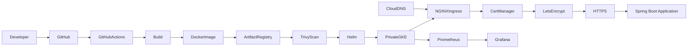

# End-to-End Platform Engineering Project on Google Kubernetes Engine (GKE)

## Project Overview

This repository demonstrates how to build a production-style Platform Engineering environment on Google Cloud Platform (GCP) using modern DevOps and cloud-native technologies.

The platform is fully automated using Infrastructure as Code (Terraform), GitHub Actions, Workload Identity Federation (OIDC), Google Artifact Registry, Helm, and a private Google Kubernetes Engine (GKE) cluster. It also includes production-grade networking, HTTPS using Let's Encrypt, centralized monitoring with Prometheus and Grafana, and automated container security scanning.

The primary objective is to automate the complete software delivery lifecycle—from infrastructure provisioning to secure application deployment—without relying on long-lived service account keys or manual deployment steps.

This project has been developed incrementally to simulate how Platform Engineering and DevOps teams design, build, secure, and operate Kubernetes platforms in enterprise environments.

---

# Project Objectives

This project demonstrates how to:

* Provision cloud infrastructure using Terraform
* Deploy a private Google Kubernetes Engine (GKE) cluster
* Build and package Spring Boot applications
* Containerize applications using Docker
* Store container images in Google Artifact Registry
* Scan container images for vulnerabilities using Trivy
* Enforce security checks before deployment
* Deploy applications using Helm
* Expose workloads through NGINX Ingress
* Secure applications using cert-manager and Let's Encrypt
* Manage DNS using Google Cloud DNS with a custom domain
* Authenticate GitHub Actions using Workload Identity Federation (OIDC)
* Execute automated unit and functional tests
* Monitor workloads using Prometheus and Grafana
* Build a reusable, production-ready CI/CD pipeline that is GitOps-ready

---

# Technologies Used

| Category               | Technology                                             |
| ---------------------- | ------------------------------------------------------ |
| Cloud Platform         | Google Cloud Platform (GCP)                            |
| Infrastructure as Code | Terraform                                              |
| Kubernetes             | Google Kubernetes Engine (Private GKE)                 |
| Container Runtime      | Docker                                                 |
| Container Registry     | Google Artifact Registry                               |
| CI/CD                  | GitHub Actions                                         |
| Authentication         | Workload Identity Federation (OIDC)                    |
| Deployment             | Helm                                                   |
| Networking             | VPC, Cloud NAT, Cloud Router, NGINX Ingress Controller |
| DNS                    | Google Cloud DNS                                       |
| SSL/TLS                | cert-manager, Let's Encrypt                            |
| Monitoring             | Prometheus, Grafana                                    |
| Security               | Trivy, Workload Identity Federation                    |
| Programming            | Java 17, Spring Boot                                   |
| Build Tool             | Maven                                                  |
| Testing                | JUnit, Newman                                          |
| Source Control         | Git, GitHub                                            |

---

# High-Level Architecture

