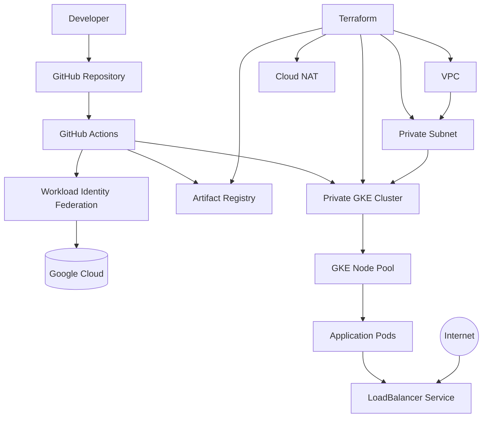

# Project Architecture

## Overview

This project demonstrates the implementation of a production-style Platform Engineering environment on Google Cloud Platform (GCP). The infrastructure is provisioned using Infrastructure as Code (Terraform), application delivery is automated through GitHub Actions with Workload Identity Federation, and workloads are deployed to a private Google Kubernetes Engine (GKE) cluster.

The architecture follows cloud-native security principles by eliminating long-lived service account keys, using private networking, and automating deployments through a secure CI/CD pipeline.

---

# High-Level Architecture



---

# Architecture Components

## Google Cloud Platform

Google Cloud Platform hosts the complete platform infrastructure including networking, container orchestration, container registry, IAM, and security services.

Primary services include:

- Virtual Private Cloud (VPC)
- Google Kubernetes Engine (GKE)
- Artifact Registry
- IAM
- Workload Identity Federation
- Cloud NAT

---

## Infrastructure as Code

All cloud resources are provisioned using Terraform.

Terraform manages:

- APIs
- Networking
- VPC
- Subnets
- Firewall rules
- Cloud Router
- Cloud NAT
- Private GKE Cluster
- Node Pools
- Artifact Registry
- IAM resources

This ensures repeatable, version-controlled infrastructure deployments.

---

## Networking

The environment uses a custom VPC with private networking.

Key characteristics:

- Custom VPC
- Private subnet
- Private Google Access enabled
- Cloud NAT for outbound internet access
- No public IPs assigned to worker nodes

This design minimizes the attack surface while allowing secure outbound connectivity.

---

## Private GKE Cluster

The Kubernetes cluster is deployed as a private cluster.

Features include:

- Private worker nodes
- Private control plane
- Dedicated node pool
- IP aliasing
- VPC-native cluster
- Managed Kubernetes control plane

Applications are deployed onto the node pool through Kubernetes Deployments.

---

## Artifact Registry

Container images are stored in Artifact Registry.

Benefits include:

- Secure image storage
- Versioned container images
- Native integration with GKE
- IAM-controlled access

GitHub Actions automatically pushes newly built Docker images after every successful build.

---

## GitHub Actions

GitHub Actions provides CI/CD automation.

Pipeline responsibilities:

- Build Java application
- Build Docker image
- Push image to Artifact Registry
- Authenticate to Google Cloud
- Retrieve GKE credentials
- Deploy application using kubectl

---

## Workload Identity Federation

GitHub Actions authenticates to Google Cloud using Workload Identity Federation.

Advantages:

- No service account keys
- Short-lived credentials
- OIDC authentication
- Improved security posture
- Reduced credential management

---

## Kubernetes Workloads

Application deployment consists of:

- Deployment
- ReplicaSet
- Pods
- Service

The Deployment ensures application availability while the Service exposes the application through a cloud load balancer.

---

# Deployment Flow

```text
Developer

      │

      ▼

Push Code to GitHub

      │

      ▼

GitHub Actions Pipeline

      │

      ▼

Authenticate using Workload Identity Federation

      │

      ▼

Build Docker Image

      │

      ▼

Push Image to Artifact Registry

      │

      ▼

Connect to Private GKE Cluster

      │

      ▼

Deploy Updated Kubernetes Resources

      │

      ▼

Pods Running Inside GKE

      │

      ▼

Application Accessible via LoadBalancer
```

---

# Security Highlights

The platform incorporates several cloud security best practices:

- Private Kubernetes cluster
- No long-lived service account keys
- Workload Identity Federation
- IAM least privilege access
- Private Google Access
- Cloud NAT for controlled outbound connectivity
- Infrastructure managed as code
- Version-controlled CI/CD pipeline

---

# Technologies Used

| Category | Technology |
|-----------|------------|
| Cloud Provider | Google Cloud Platform |
| Infrastructure as Code | Terraform |
| Container Platform | Google Kubernetes Engine |
| CI/CD | GitHub Actions |
| Authentication | Workload Identity Federation |
| Container Registry | Artifact Registry |
| Containerization | Docker |
| Orchestration | Kubernetes |
| Programming Language | Java |
| Build Tool | Maven |
| Version Control | GitHub |

---

# Next Section

The next document explains how the infrastructure is provisioned using Terraform and the rationale behind the Infrastructure as Code design.

➡ **03-terraform-infrastructure.md**
