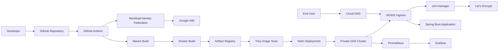

# Project Architecture

## Architecture Overview

This project implements a production-style Platform Engineering environment on Google Cloud Platform (GCP). It demonstrates how modern DevOps teams automate infrastructure provisioning, application delivery, container security, Kubernetes deployments, DNS management, HTTPS certificate provisioning, and platform monitoring while following cloud security best practices.

The platform is fully automated using Terraform, GitHub Actions, Workload Identity Federation (OIDC), Helm, and a Private Google Kubernetes Engine (GKE) cluster. Applications are securely exposed through a custom domain using Cloud DNS, NGINX Ingress Controller, cert-manager, and Let's Encrypt.

---

# High-Level Architecture



---

# Architecture Components

## Developer

The software development lifecycle begins with a developer making changes to the application source code.

After validating the changes locally, the developer pushes code to the GitHub repository.

---

## GitHub Repository

GitHub serves as the single source of truth for the project.

The repository contains:

- Spring Boot application
- Terraform infrastructure
- Helm chart
- Kubernetes manifests
- GitHub Actions workflows
- Project documentation

Every push to the main branch automatically triggers the CI/CD pipeline.

---

## GitHub Actions

GitHub Actions orchestrates the complete CI/CD pipeline.

Responsibilities include:

- Building the application
- Running unit tests
- Building Docker images
- Publishing images to Artifact Registry
- Running Trivy vulnerability scans
- Deploying applications using Helm
- Running functional tests

---

## Workload Identity Federation

Instead of storing Google Cloud service account keys inside GitHub Secrets, GitHub Actions authenticates using OpenID Connect (OIDC).

Authentication flow:

Developer

↓

GitHub Actions

↓

OIDC Token

↓

Workload Identity Federation

↓

Google Service Account

↓

Google Cloud APIs

Benefits:

- No long-lived credentials
- Short-lived access tokens
- Improved security posture
- Google recommended authentication method

---

## Google Cloud Platform

Google Cloud provides the complete infrastructure platform.

Services used include:

- Google Kubernetes Engine (Private Cluster)
- Compute Engine
- Artifact Registry
- IAM
- Cloud DNS
- Virtual Private Cloud (VPC)
- Cloud Router
- Cloud NAT

---

## Maven Build

The application is compiled using Maven.

Pipeline stages include:

- Dependency resolution
- Unit testing
- Packaging
- JAR generation

Output:

```text
hello-gke.jar
```

---

## Docker Build

The packaged Spring Boot application is converted into a Docker image.

The container image includes:

- Java Runtime
- Spring Boot application
- Runtime dependencies

---

## Artifact Registry

Artifact Registry stores container images securely.

Each deployment generates a unique image tag based on the Git commit SHA.

Example:

```text
hello-gke:3ab91df
```

---

## Container Security

Every Docker image is scanned using Trivy before deployment.

The deployment pipeline blocks releases if:

- Critical vulnerabilities exist
- High vulnerabilities exceed the configured threshold

This prevents vulnerable container images from reaching the Kubernetes cluster.

---

## Helm

Helm is used as the Kubernetes package manager.

Benefits include:

- Versioned deployments
- Parameterized configuration
- Easy upgrades
- Rollbacks
- Reusable charts

Deployment command:

```bash
helm upgrade --install hello-gke ./helm/hello-gke
```

---

## Private Google Kubernetes Engine

Applications run inside a private Google Kubernetes Engine cluster.

Platform features include:

- Private nodes
- Private control plane
- Managed node pools
- Workload Identity
- Cluster Autoscaler
- Private networking

---

## Kubernetes Resources

The application deployment consists of the following resources.

### Deployment

Responsible for:

- Rolling updates
- Replica management
- Self-healing

---

### ReplicaSet

Ensures the desired number of application replicas remain available.

---

### Pods

Pods host the Spring Boot application containers.

---

### ClusterIP Service

The application is exposed internally using a ClusterIP Service.

Responsibilities include:

- Internal load balancing
- Stable service endpoint
- Pod abstraction

Traffic flow:

Ingress

↓

ClusterIP Service

↓

Pods

---

## NGINX Ingress Controller

The NGINX Ingress Controller exposes applications to the internet.

Responsibilities include:

- HTTP routing
- HTTPS routing
- Reverse proxy
- Load balancing
- TLS termination
- Host-based routing
- Path-based routing

Applications are exposed using a single external Load Balancer.

---

## Cloud DNS

Cloud DNS hosts the public DNS zone.

Configured records include:

- app.devopswithsachin.in
- grafana.devopswithsachin.in

These records point to the external IP address of the NGINX Ingress Controller.

---

## cert-manager

cert-manager automates TLS certificate management.

Responsibilities include:

- Requesting certificates
- Renewing certificates automatically
- Managing Kubernetes TLS Secrets

Certificates are issued automatically from Let's Encrypt.

---

## Let's Encrypt

Let's Encrypt provides trusted SSL/TLS certificates for all public applications.

Benefits include:

- Free certificates
- Automatic renewal
- Trusted by all major browsers

---

## Prometheus

Prometheus collects metrics from Kubernetes workloads.

It monitors:

- Cluster health
- Node metrics
- Pod metrics
- Application metrics

---

## Grafana

Grafana visualizes metrics collected by Prometheus.

Dashboards provide visibility into:

- Kubernetes cluster
- Node utilization
- Application performance
- Resource consumption

---

## End User

Users access applications securely using HTTPS.

Examples:

- https://app.devopswithsachin.in
- https://grafana.devopswithsachin.in

---

# Request Flow

The following diagram illustrates how requests reach the application.

```text
Client

↓

Cloud DNS

↓

Google Cloud Load Balancer

↓

NGINX Ingress Controller

↓

TLS Termination

↓

ClusterIP Service

↓

Deployment

↓

ReplicaSet

↓

Pod

↓

Spring Boot Application
```

---

# CI/CD Flow

The deployment pipeline follows the sequence below.

```text
Developer

↓

Git Push

↓

GitHub Actions

↓

Authenticate using Workload Identity Federation

↓

Build Application

↓

Run Unit Tests

↓

Build Docker Image

↓

Push to Artifact Registry

↓

Run Trivy Scan

↓

Security Gate

↓

Helm Deployment

↓

Rolling Update

↓

Functional Testing

↓

Application Available via HTTPS
```

---

# Security Architecture

Security has been implemented throughout the platform.

Implemented controls include:

- Private GKE Cluster
- Private Nodes
- Workload Identity Federation
- No long-lived service account keys
- Artifact Registry
- Trivy vulnerability scanning
- ClusterIP backend services
- NGINX Ingress Controller
- Automatic TLS certificates
- HTTPS enforcement
- Security gates before deployment

---

# Future Enhancements

The platform will continue evolving with additional production-grade capabilities.

Planned improvements include:

- Argo CD GitOps
- Horizontal Pod Autoscaler (HPA)
- KEDA
- Service Mesh (Istio)
- Blue/Green deployments
- Canary deployments
- Loki for centralized logging
- OpenTelemetry
- Gatekeeper / Kyverno
- External Secrets Operator
- Multi-environment deployments
