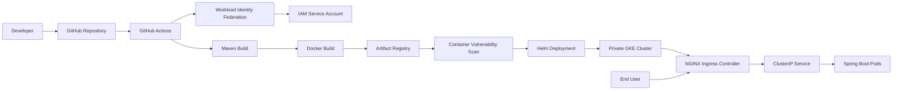

# Project Architecture

## Architecture Overview

This project implements a production-style GitOps CI/CD platform on Google Cloud Platform (GCP). The architecture demonstrates how modern Platform Engineering teams automate infrastructure provisioning, application delivery, container security, and Kubernetes deployments while following cloud security best practices.

The entire deployment lifecycle is automated using GitHub Actions and Google Workload Identity Federation, eliminating the need for long-lived service account keys.

---

## High-Level Architecture



---

# Architecture Components

## Developer

The software development lifecycle begins with a developer making changes to the application source code.

After validating the changes locally, the developer pushes code to the GitHub repository.

---

## GitHub Repository

GitHub serves as the single source of truth for the project.

The repository contains:

- Spring Boot application
- Terraform infrastructure
- Helm chart
- Kubernetes manifests
- GitHub Actions workflows
- Project documentation

Every push to the main branch automatically triggers the CI/CD pipeline.

---

## GitHub Actions

GitHub Actions orchestrates the complete deployment pipeline.

Pipeline responsibilities include:

- Building the application
- Running unit tests
- Performing code quality analysis
- Building Docker images
- Publishing container images
- Performing vulnerability scanning
- Deploying to GKE
- Running functional tests

---

## Workload Identity Federation

Instead of storing Google Cloud service account keys inside GitHub Secrets, the pipeline authenticates using OpenID Connect (OIDC).

Benefits include:

- No long-lived credentials
- Short-lived access tokens
- Improved security posture
- Google-recommended authentication method

Authentication flow:

GitHub Actions

↓

OIDC Token

↓

Workload Identity Federation

↓

Google Service Account

↓

Google Cloud APIs

---

## Google Cloud Platform

Google Cloud provides the infrastructure platform.

Services used include:

- Google Kubernetes Engine
- Artifact Registry
- Cloud Build
- IAM
- Compute Engine
- VPC
- Cloud Router
- Cloud NAT
- Container Analysis

---

## Maven Build

The application is compiled using Maven.

Pipeline tasks include:

- Dependency resolution
- Unit testing
- Packaging
- JAR generation

Output:

```
hello-gke.jar
```

---

## Docker Build

The packaged Spring Boot application is converted into a container image.

Docker image contains:

- Java Runtime
- Spring Boot application
- Runtime dependencies

---

## Artifact Registry

Docker images are stored securely inside Google Artifact Registry.

Each deployment generates a unique image tag based on the Git commit SHA.

Example:

```
hello-gke:3ab91df
```

Artifact Registry serves as the central image repository for Kubernetes deployments.

---

## Container Vulnerability Scanning

Every container image is automatically scanned before deployment.

The pipeline blocks deployment when:

- Critical vulnerabilities exist
- High severity vulnerabilities exist

Only secure images are promoted to the Kubernetes cluster.

---

## Helm Deployment

Helm is used as the Kubernetes package manager.

Benefits:

- Parameterized deployments
- Version control
- Easy upgrades
- Easy rollback
- Environment-specific configuration

Deployment command:

```bash
helm upgrade --install hello-gke ./helm/hello-gke
```

---

## Google Kubernetes Engine

The application is deployed to a private Google Kubernetes Engine cluster.

Key characteristics:

- Private nodes
- Private control plane
- Managed node pool
- Workload Identity enabled
- Cluster Autoscaler enabled

The cluster hosts all application workloads.

---

## Kubernetes Objects

The application deployment consists of several Kubernetes resources.

### Deployment

Manages application rollout and updates.

Responsibilities:

- Replica management
- Rolling updates
- Self healing

---

### ReplicaSet

Maintains the desired number of application replicas.

If a Pod fails, ReplicaSet automatically creates a replacement.

---

### Pods

Pods run the Spring Boot application.

Each Pod contains:

- Spring Boot container
- Application runtime
- Network identity

---

### ClusterIP Service

The application is exposed internally using a ClusterIP Service.

Responsibilities:

- Internal load balancing
- Stable service endpoint
- Pod abstraction

Traffic flow:

```
Ingress

↓

ClusterIP Service

↓

Pods
```

---

## NGINX Ingress Controller

NGINX Ingress Controller acts as the external entry point into the Kubernetes cluster.

Responsibilities include:

- HTTP routing
- Reverse proxy
- Load balancing
- SSL termination (future)
- Path-based routing

Example:

```
http://Ingress-IP

↓

NGINX

↓

ClusterIP Service

↓

Pods
```

---

## End User

Users access the deployed application through the public Ingress endpoint.

Example:

```
http://<Ingress-IP>
```

Response:

```json
{
  "environment":"dev",
  "message":"Hello from Ingress"
}
```

---

# Request Flow

The following diagram illustrates how an HTTP request reaches the application.

```text
Client

↓

NGINX Ingress

↓

ClusterIP Service

↓

Deployment

↓

ReplicaSet

↓

Pod

↓

Spring Boot Application
```

---

# CI/CD Flow

The deployment pipeline follows the sequence below.

```text
Developer

↓

Git Push

↓

GitHub Actions

↓

Authenticate using Workload Identity Federation

↓

Build Application

↓

Run Unit Tests

↓

Build Docker Image

↓

Push to Artifact Registry

↓

Container Vulnerability Scan

↓

Security Gate

↓

Helm Deployment

↓

Rolling Update

↓

Functional Testing

↓

Production Ready Application
```

---

# Security Architecture

Security has been implemented throughout the platform.

Implemented controls include:

- Workload Identity Federation
- Private GKE Cluster
- No service account keys
- Artifact Registry
- Automated vulnerability scanning
- ClusterIP backend services
- NGINX reverse proxy
- Security gate before deployment

---

# Future Enhancements

The platform will continue to evolve with additional production-grade capabilities.

Planned improvements include:

- TLS/SSL certificates
- Prometheus monitoring
- Grafana dashboards
- Horizontal Pod Autoscaler
- Service Mesh (Istio)
- Canary deployments
- GitOps with ArgoCD
- Policy enforcement using Gatekeeper
