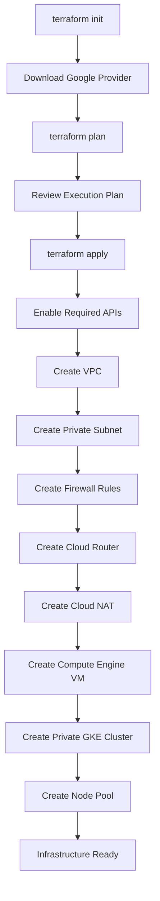

# Terraform Infrastructure

## Overview

The infrastructure for this project is fully provisioned using **Terraform**, enabling Infrastructure as Code (IaC) for consistent, repeatable, and version-controlled deployments.

Terraform automates the creation of the networking components, compute resources, and the private Google Kubernetes Engine (GKE) cluster, eliminating manual infrastructure provisioning through the Google Cloud Console.

By managing infrastructure as code, every change is tracked in Git, making deployments reproducible, auditable, and easier to maintain.

---

# Infrastructure Provisioned

Terraform provisions the following Google Cloud resources:

| Resource | Purpose |
|----------|---------|
| Google Cloud APIs | Enables required GCP services |
| Virtual Private Cloud (VPC) | Provides network isolation |
| Private Subnet | Hosts Compute Engine and GKE resources |
| Firewall Rules | Controls network access |
| Cloud Router | Supports Cloud NAT |
| Cloud NAT | Enables outbound internet access for private resources |
| Private GKE Cluster | Hosts Kubernetes workloads |
| GKE Node Pool | Provides compute capacity for containerized applications |
| Compute Engine VM | Administrative host within the private network |
| Google Service Accounts | Provides secure identity for Google Cloud resources |

---

# Terraform Project Structure

The Terraform configuration is organized into dedicated files based on resource type. This modular approach improves readability, maintainability, and scalability.

```text
terraform/
│
├── provider.tf      # Google Cloud provider configuration
├── variables.tf     # Input variables
├── vpc.tf           # VPC, subnet, and firewall rules
├── router.tf        # Cloud Router
├── nat.tf           # Cloud NAT
├── gke.tf           # Private GKE cluster and node pool
├── gce.tf           # Compute Engine VM
├── gsa.tf           # Google Service Accounts and IAM
├── outputs.tf       # Terraform outputs
```

---

# Infrastructure Deployment Flow



---

# Provider Configuration

The Google Cloud provider authenticates Terraform with the target project and defines the deployment region.

The provider configuration includes:

- Project ID
- Region
- Zone

Centralizing these settings allows the infrastructure to be deployed consistently across different environments.

---

# Google Cloud APIs

Terraform enables the required Google Cloud APIs before provisioning infrastructure.

Examples include:

- Compute Engine API
- Kubernetes Engine API
- Cloud Resource Manager API

Automating API enablement ensures deployments remain fully reproducible without manual preparation.

---

# Networking

Terraform provisions a custom Virtual Private Cloud (VPC) designed for secure, private communication between infrastructure components.

The networking layer includes:

- Custom VPC
- Private subnet
- Private Google Access
- Firewall rules
- Cloud Router
- Cloud NAT

Cloud NAT allows private resources to access the internet for software updates and container image downloads without exposing them to inbound public traffic.

---

# Compute Engine

A Compute Engine virtual machine is deployed within the private subnet.

The VM serves as an administrative host for interacting with resources inside the private network, such as the private GKE cluster.

---

# Private GKE Cluster

Terraform provisions a private Google Kubernetes Engine cluster using VPC-native networking.

Key characteristics include:

- Private worker nodes
- Private control plane access
- IP aliasing
- Dedicated node pool
- Google-managed Kubernetes control plane

This architecture aligns with production security best practices by minimizing public exposure.

---

# Node Pool

The worker nodes are provisioned in a dedicated node pool separate from the cluster.

Benefits include:

- Independent scaling
- Simplified upgrades
- Flexible machine type selection
- Better operational management

---

# Google Service Accounts

Terraform creates Google Service Accounts required by the platform and assigns the necessary IAM permissions.

Managing service accounts through Terraform ensures that identity and access configurations remain version-controlled and reproducible.

---

# Terraform State

Terraform stores the current infrastructure state in a local state file (`terraform.tfstate`).

The state file enables Terraform to:

- Track managed resources
- Detect infrastructure drift
- Generate accurate execution plans
- Apply only the required changes

> **Note:** For production environments, a remote backend (such as a Google Cloud Storage bucket) should be used to support team collaboration, state locking, and secure state management.

---

# Terraform Workflow

The infrastructure is provisioned using the standard Terraform workflow.

```bash
terraform init
terraform plan
terraform apply
```

To remove all managed infrastructure:

```bash
terraform destroy
```

---

# Best Practices Followed

- Infrastructure managed as code
- Version-controlled Terraform configuration
- Modular file organization
- Private networking
- Dedicated node pools
- Automated API enablement
- Principle of least privilege for IAM
- Repeatable and consistent deployments

---

# Next Section

The next document explains the networking architecture, including the Virtual Private Cloud (VPC), subnet design, firewall rules, Cloud Router, and Cloud NAT configuration.

➡ **04-networking.md**
