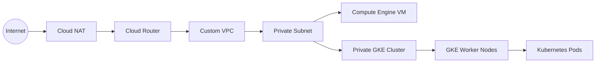

# Networking

## Overview

A secure and well-designed network is the foundation of any production Kubernetes platform.

This project uses a **custom Virtual Private Cloud (VPC)** to provide network isolation and secure communication between Google Cloud resources. The networking architecture follows Google Cloud best practices by deploying workloads in private subnets, enabling Private Google Access, and using Cloud NAT for controlled outbound internet connectivity.

The networking components are provisioned using Terraform, ensuring repeatable and version-controlled deployments.

---

# Network Architecture



---

# Networking Components

## Virtual Private Cloud (VPC)

A custom Virtual Private Cloud (VPC) provides network isolation for all infrastructure components.

The VPC serves as the primary network boundary for:

- Compute Engine VM
- Private GKE Cluster
- Kubernetes worker nodes
- Internal communication between cloud resources

Using a custom VPC provides greater flexibility and control compared to the default VPC.

---

## Private Subnet

A dedicated private subnet hosts the Compute Engine VM and GKE worker nodes.

Key characteristics include:

- RFC1918 private IP address range
- Private Google Access enabled
- No public IP addresses assigned to GKE worker nodes
- Controlled network communication within the VPC

This design reduces the attack surface by preventing direct internet access to compute resources.

---

## Firewall Rules

Firewall rules are configured to control inbound and outbound traffic within the VPC.

The firewall configuration is designed to:

- Allow administrative access where required
- Permit communication between GKE nodes
- Restrict unnecessary inbound traffic
- Follow the principle of least privilege

Proper firewall configuration is critical to maintaining a secure production environment.

---

## Private Google Access

Private Google Access enables resources without public IP addresses to communicate with Google Cloud services.

This allows private resources to access services such as:

- Google Kubernetes Engine
- Cloud Storage
- Google APIs

without requiring public internet connectivity.

---

## Cloud Router

Cloud Router dynamically exchanges routing information with Cloud NAT.

Although Cloud Router is commonly associated with hybrid networking, it is also a required component when configuring Cloud NAT.

---

## Cloud NAT

Cloud NAT provides outbound internet access for resources without public IP addresses.

This enables:

- Operating system updates
- Package downloads
- Container image pulls
- Access to external repositories

while preventing unsolicited inbound internet connections.

Using Cloud NAT allows workloads to remain private while still accessing external services when required.

---

# Network Traffic Flow

The following diagram illustrates how traffic flows through the platform.

```text
                 Internet
                     │
                     ▼
               Cloud NAT
                     │
                     ▼
               Cloud Router
                     │
                     ▼
               Custom VPC
                     │
        ┌────────────┴────────────┐
        │                         │
        ▼                         ▼
Private Compute VM        Private GKE Cluster
                                  │
                                  ▼
                          Kubernetes Nodes
                                  │
                                  ▼
                           Application Pods
```

---

# Design Considerations

The networking architecture was designed with security, scalability, and operational simplicity in mind.

Key design decisions include:

- Custom VPC instead of the default network
- Private subnet for compute resources
- Private GKE worker nodes
- Private Google Access enabled
- Cloud NAT for outbound connectivity
- Infrastructure managed through Terraform
- Network isolation between platform components

These design choices closely align with production environments running Kubernetes workloads on Google Cloud.

---

# Benefits

This networking design provides several advantages:

- Improved security through private networking
- Reduced public attack surface
- Controlled outbound internet connectivity
- Scalable architecture
- Infrastructure as Code (IaC)
- Easier maintenance and auditing
- Alignment with Google Cloud networking best practices

---

# Next Section

The next document explains the private Google Kubernetes Engine (GKE) cluster, including cluster configuration, node pools, networking, and deployment architecture.

➡ **05-private-gke-cluster.md**
