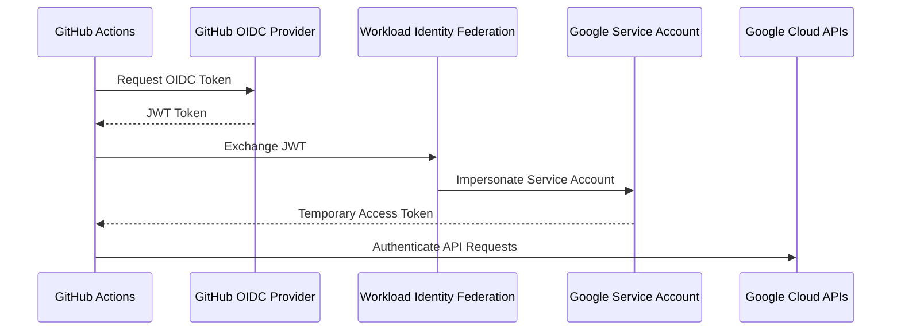

# 05 - Workload Identity Federation (WIF)

## Overview

This project uses **Google Cloud Workload Identity Federation (WIF)** to securely authenticate GitHub Actions with Google Cloud Platform without storing long-lived Service Account keys.

Instead of downloading and storing a JSON key in GitHub Secrets, GitHub Actions exchanges its OpenID Connect (OIDC) token for a temporary Google Cloud access token during each workflow execution.

This is Google's recommended authentication mechanism for CI/CD pipelines because it removes the operational and security risks associated with managing static credentials.

---

# Why Workload Identity Federation?

Traditional CI/CD pipelines authenticate using Service Account JSON keys.

```text
GitHub Actions
       │
Service Account Key
       │
Google Cloud APIs
```

Although this approach works, it introduces several security concerns:

- Long-lived credentials
- Secret rotation overhead
- Risk of accidental key exposure
- Larger attack surface
- Difficult credential management

With Workload Identity Federation, no credentials are stored in GitHub.

```text
GitHub Actions
       │
OIDC Token
       │
Workload Identity Federation
       │
Temporary Google Credential
       │
Google Cloud APIs
```

The temporary credential expires automatically after the workflow completes.

---

# Authentication Flow



---

# Components Configured

The following resources were created in Google Cloud.

## Workload Identity Pool

A Workload Identity Pool establishes the trust relationship between GitHub and Google Cloud.

Example:

```text
github-action
```

---

## OIDC Provider

An OIDC Provider was configured inside the Workload Identity Pool.

Issuer URI:

```text
https://token.actions.githubusercontent.com
```

Only GitHub-issued OIDC tokens are trusted.

---

## Attribute Mapping

GitHub claims are mapped to Google Cloud attributes.

| GitHub Claim | Google Attribute |
|--------------|------------------|
| assertion.sub | google.subject |
| assertion.repository | attribute.repository |

These mappings allow IAM policies to authorize only the intended GitHub repository.

---

## Attribute Condition

Authentication is restricted to a single GitHub repository.

Example:

```text
assertion.repository == "ssavaniya/gke-wif-deployment"
```

This prevents other repositories from impersonating the Google Cloud service account.

---

## Google Cloud Service Account

A dedicated deployment service account is used by the CI/CD pipeline.

Example:

```text
github-action-wif@PROJECT_ID.iam.gserviceaccount.com
```

GitHub Actions impersonates this service account after successful authentication.

---

# IAM Roles

The deployment service account follows the principle of least privilege and has only the permissions required for deployments.

Assigned roles include:

- Kubernetes Engine Developer
- Kubernetes Engine Cluster Viewer
- Artifact Registry Writer
- Service Account User
- Workload Identity User

These permissions allow the pipeline to:

- Authenticate with Google Cloud
- Retrieve GKE credentials
- Push container images
- Deploy Helm releases
- Interact with Kubernetes resources

---

# GitHub Actions Authentication

Authentication is performed using the official Google GitHub Action.

```yaml
- name: Authenticate to Google Cloud
  uses: google-github-actions/auth@v2
  with:
    workload_identity_provider: ${{ secrets.WORKLOAD_IDENTITY_PROVIDER }}
    service_account: ${{ secrets.SERVICE_ACCOUNT }}
```

No JSON key files are stored in GitHub.

---

# Deployment Workflow

The authentication sequence is shown below.

```text
Developer

↓

Git Push

↓

GitHub Actions

↓

Request OIDC Token

↓

Workload Identity Federation

↓

Temporary Google Credential

↓

Google Cloud APIs

↓

Artifact Registry

↓

Private GKE Cluster

↓

Helm Deployment
```

---

# Security Benefits

Workload Identity Federation significantly improves the security of the deployment pipeline.

Benefits include:

- No Service Account JSON keys
- Temporary credentials
- Automatic credential expiration
- Reduced secret management
- Native IAM integration
- Repository-level authorization
- Google's recommended authentication mechanism

---

# Validation

Authentication can be verified during a GitHub Actions workflow.

List authenticated accounts:

```bash
gcloud auth list
```

Example output:

```text
Credentialed Accounts

ACTIVE  ACCOUNT

* github-action-wif@PROJECT_ID.iam.gserviceaccount.com
```

Verify cluster access:

```bash
kubectl get nodes
```

Successful execution confirms that GitHub Actions has authenticated correctly using Workload Identity Federation.

---

# Troubleshooting

## unauthorized_client

Possible causes:

- Incorrect Workload Identity Provider
- Invalid OIDC Provider
- Incorrect Service Account
- Incorrect issuer URI

---

## Permission Denied

Verify:

- IAM roles
- Service Account permissions
- Artifact Registry permissions
- Kubernetes Engine permissions

---

## Invalid Principal Set

Usually caused by:

- Incorrect repository name
- Incorrect attribute mapping
- Invalid IAM binding
- Incorrect Workload Identity Pool

---

## Failed to Retrieve GKE Credentials

Verify:

- Kubernetes Engine Developer role
- Kubernetes Engine Cluster Viewer role
- Correct cluster name
- Correct region or zone

---

# Best Practices

- Never use Service Account JSON keys.
- Use dedicated deployment service accounts.
- Grant only the minimum required IAM permissions.
- Restrict authentication to approved repositories.
- Use temporary credentials.
- Rotate IAM permissions regularly.
- Audit Workload Identity bindings periodically.

---

# Key Takeaways

Workload Identity Federation enables GitHub Actions to securely access Google Cloud resources without storing static credentials.

By using OpenID Connect (OIDC) and temporary IAM credentials, the deployment pipeline follows Google's security best practices while reducing operational overhead and significantly improving the overall security posture of the platform.
