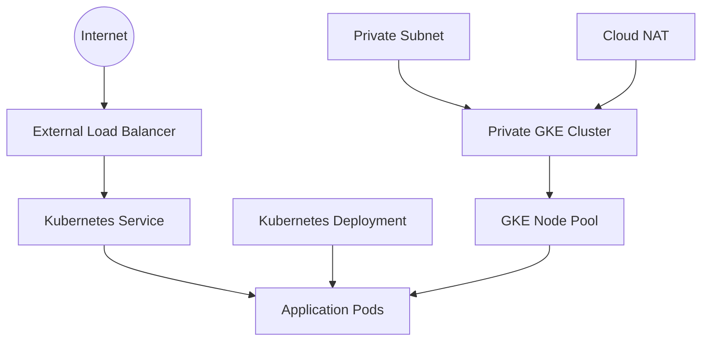

# Private Google Kubernetes Engine (GKE) Cluster

## Overview

Google Kubernetes Engine (GKE) is Google Cloud's managed Kubernetes service that simplifies the deployment, management, and scaling of containerized applications.

This project deploys a **private GKE Standard cluster**, where worker nodes are provisioned without public IP addresses and communicate within a custom Virtual Private Cloud (VPC). The cluster is managed using Terraform and follows production-oriented networking and security best practices.

---

# Cluster Architecture



---

# Cluster Configuration

The cluster is configured with the following characteristics:

| Feature | Configuration |
|----------|---------------|
| Cluster Type | Standard GKE Cluster |
| Networking | VPC Native |
| Cluster Visibility | Private |
| Worker Nodes | Private |
| Node Pool | Dedicated |
| IP Allocation | Alias IP Ranges |
| Infrastructure | Terraform Managed |

---

# Why a Private Cluster?

Unlike a public cluster, a private GKE cluster keeps worker nodes isolated from the public internet.

Benefits include:

- Reduced attack surface
- Private communication within the VPC
- Improved security posture
- Production-ready architecture
- Better compliance with enterprise security requirements

Only authorized systems within the network can communicate directly with the cluster nodes.

---

# Cluster Components

## Control Plane

The Kubernetes control plane is fully managed by Google Cloud.

It is responsible for:

- Scheduling workloads
- Managing cluster state
- Monitoring node health
- Orchestrating deployments
- Exposing the Kubernetes API

Because GKE is a managed service, Google handles upgrades, availability, and maintenance of the control plane.

---

## Node Pool

The cluster uses a dedicated node pool to host application workloads.

Separating the node pool from the cluster provides:

- Independent scaling
- Simplified upgrades
- Flexible machine type selection
- Better resource management

Each node runs:

- kubelet
- Container runtime
- Kubernetes networking components

---

## Kubernetes Nodes

Worker nodes execute containerized workloads.

Responsibilities include:

- Running application Pods
- Pulling container images
- Reporting status to the control plane
- Managing Pod lifecycle

The nodes communicate internally using private IP addresses.

---

## Pods

Pods are the smallest deployable unit in Kubernetes.

Each Pod contains one or more containers that share:

- Network namespace
- Storage volumes
- IP address

The sample Java application is deployed as Kubernetes Pods managed by a Deployment.

---

## Deployment

The application is deployed using a Kubernetes Deployment.

The Deployment provides:

- Declarative configuration
- Rolling updates
- Rollback capability
- Replica management
- Self-healing

If a Pod becomes unavailable, Kubernetes automatically creates a replacement.

---

## Service

A Kubernetes Service exposes the application running inside the cluster.

This project uses a **LoadBalancer** Service, allowing external users to access the application while Kubernetes automatically distributes traffic across healthy Pods.

---

# Cluster Networking

The cluster uses **VPC-native networking** with Alias IP ranges.

This provides:

- Dedicated IP ranges for Pods
- Dedicated IP ranges for Services
- Efficient routing
- Better scalability
- Native Google Cloud networking integration

All worker nodes communicate over the custom VPC created with Terraform.

---

# Deployment Workflow

```text
Developer
      │
      ▼
GitHub Repository
      │
      ▼
GitHub Actions
      │
      ▼
Build Docker Image
      │
      ▼
Push Image to Artifact Registry
      │
      ▼
Authenticate to Google Cloud
      │
      ▼
Retrieve GKE Credentials
      │
      ▼
kubectl apply
      │
      ▼
Deployment
      │
      ▼
Pods
      │
      ▼
LoadBalancer Service
      │
      ▼
Application
```

---

# Security Features

The cluster incorporates several production-oriented security practices:

- Private worker nodes
- Custom VPC
- Private subnet
- Cloud NAT for outbound connectivity
- Infrastructure as Code using Terraform
- IAM-based access control
- GitHub Actions authentication using Workload Identity Federation
- No long-lived service account keys

---

# Operational Benefits

Deploying the platform on a private GKE cluster provides:

- Managed Kubernetes control plane
- High availability
- Automated node management
- Rolling updates
- Self-healing workloads
- Horizontal scalability
- Secure networking
- Reduced operational overhead

---

# Best Practices Followed

- Private cluster deployment
- Dedicated node pool
- Infrastructure as Code
- VPC-native networking
- Alias IP ranges
- Declarative Kubernetes deployments
- Secure CI/CD authentication
- Least privilege IAM

---

# Next Section

The next document explains the CI/CD pipeline, including GitHub Actions, Docker image build, authentication using Workload Identity Federation, and automated deployment to the private GKE cluster.

➡ **06-github-actions-cicd.md**
