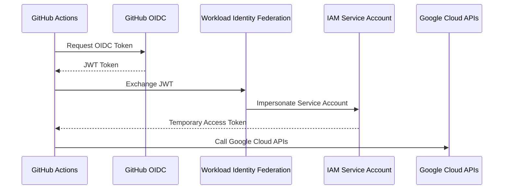

# 05 - Workload Identity Federation

## Objective

This project uses Google Cloud Workload Identity Federation (WIF) to securely authenticate GitHub Actions with Google Cloud Platform without storing or managing long-lived service account keys.

Instead of downloading JSON key files, GitHub Actions exchanges its OpenID Connect (OIDC) token for temporary Google Cloud credentials during each workflow execution.

This is Google's recommended authentication method for CI/CD pipelines.

---

## Why Workload Identity Federation?

Traditional CI/CD pipelines often authenticate using downloaded Service Account JSON keys.

```
GitHub Actions
        │
JSON Key File
        │
Google Cloud
```

Although functional, this approach introduces several security risks:

- Long-lived credentials
- Secret rotation overhead
- Risk of accidental key exposure
- Increased attack surface

Workload Identity Federation eliminates these issues by issuing short-lived credentials only when the workflow runs.

```
GitHub Actions
       │
OIDC Token
       │
Workload Identity Federation
       │
Temporary Credential
       │
Google Cloud APIs
```

---

## Authentication Flow



---

## Components Created

The following Google Cloud resources were configured.

### Workload Identity Pool

Acts as the trust boundary between GitHub and Google Cloud.

Example

```
github-action
```

---

### OIDC Provider

Configured to trust GitHub's OIDC endpoint.

Issuer

```
https://token.actions.githubusercontent.com
```

---

### Attribute Mapping

The following attributes were mapped.

| GitHub Claim | Google Attribute |
|--------------|------------------|
| assertion.sub | google.subject |
| assertion.repository | attribute.repository |

These mappings allow IAM policies to restrict authentication to a specific GitHub repository.

---

### IAM Service Account

A dedicated deployment service account was created.

Example

```
github-gke-deployer@PROJECT_ID.iam.gserviceaccount.com
```

This service account is impersonated by GitHub Actions after successful authentication.

---

## IAM Roles Assigned

The deployment service account was granted only the permissions required by the CI/CD pipeline.

Examples include:

- Kubernetes Engine Developer
- Kubernetes Engine Cluster Viewer
- Artifact Registry Writer
- Service Account User
- Workload Identity User

Following the principle of least privilege helps reduce security risk.

---

## GitHub Actions Configuration

Authentication is performed using the official Google GitHub Action.

```yaml
- name: Authenticate to Google Cloud
  uses: google-github-actions/auth@v2
  with:
    workload_identity_provider: projects/PROJECT_NUMBER/locations/global/workloadIdentityPools/github-action/providers/github-action
    service_account: github-gke-deployer@PROJECT_ID.iam.gserviceaccount.com
```

No credentials are stored inside GitHub Secrets.

---

## Benefits

Using Workload Identity Federation provides several advantages.

- No Service Account JSON keys
- Temporary credentials
- Automatic credential rotation
- Reduced secret management
- Better compliance
- Recommended by Google Cloud
- Safer CI/CD pipelines

---

## Validation

Authentication can be verified within GitHub Actions.

```bash
gcloud auth list
```

Example output

```
Credentialed Accounts

ACTIVE  ACCOUNT

*       github-gke-deployer@PROJECT_ID.iam.gserviceaccount.com
```

Cluster access can also be verified.

```bash
kubectl get nodes
```

Successful execution confirms that GitHub Actions has authenticated correctly using Workload Identity Federation.

---

## Troubleshooting

### Unauthorized Client

Possible causes:

- Incorrect Workload Identity Provider
- Wrong Service Account
- Missing Workload Identity User role

---

### Permission Denied

Verify IAM roles assigned to the deployment service account.

---

### Invalid Principal Set

Usually caused by incorrect attribute mapping or repository restrictions.

Verify:

- Repository name
- Branch conditions
- Attribute mappings
- IAM bindings

---

## Best Practices

- Never download Service Account keys.
- Use dedicated deployment service accounts.
- Grant minimum required IAM permissions.
- Restrict authentication to approved repositories.
- Use short-lived credentials whenever possible.

---

## Outcome

The project authenticates GitHub Actions securely using Google's recommended Workload Identity Federation mechanism.

No static credentials are stored, significantly improving the security posture of the CI/CD pipeline.
