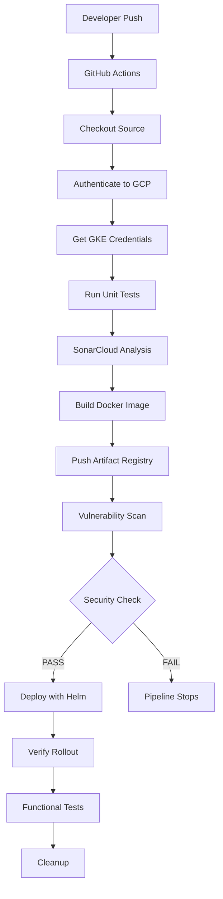

# GitHub Actions CI/CD Pipeline

## Overview

GitHub Actions is used to automate the complete Continuous Integration and Continuous Deployment (CI/CD) process for this project.

Every change pushed to the **main** branch automatically triggers a deployment pipeline that builds, tests, scans, and deploys the application to Google Kubernetes Engine (GKE).

The pipeline follows modern DevSecOps practices by integrating automated testing, vulnerability scanning, and secure authentication before deployment.

---

# Pipeline Objectives

The CI/CD pipeline automates the following tasks:

- Source code checkout
- Google Cloud authentication
- Maven dependency caching
- Unit testing
- Code coverage generation
- SonarCloud analysis
- Docker image build
- Artifact Registry image push
- Container vulnerability scanning
- Security policy enforcement
- Helm deployment
- Kubernetes rollout verification
- Functional API testing
- Environment cleanup

---

# High-Level Pipeline Flow



---

# Workflow Trigger

The workflow is configured to execute whenever code is pushed to the **main** branch.

```yaml
on:
  push:
    branches:
      - main
```

This enables fully automated deployments without manual intervention.

---

# Pipeline Stages

## 1. Checkout Source Code

The first stage downloads the latest application source code from GitHub.

```yaml
uses: actions/checkout@v4
```

Purpose:

- Retrieve project files
- Access Helm chart
- Access Terraform
- Access Kubernetes manifests

---

## 2. Authenticate to Google Cloud

Authentication is performed using Workload Identity Federation.

```yaml
google-github-actions/auth
```

Benefits:

- No service account keys
- Temporary credentials
- Secure authentication
- IAM integration

---

## 3. Configure Google Cloud SDK

The Google Cloud SDK is installed along with the Kubernetes authentication plugin.

Purpose:

- gcloud commands
- kubectl authentication
- Artifact Registry access

---

## 4. Get GKE Credentials

The workflow retrieves Kubernetes credentials.

```bash
gcloud container clusters get-credentials
```

This allows GitHub Actions to communicate securely with the private GKE cluster.

---

## 5. Verify Environment

Basic validation is performed before deployment.

Examples:

```bash
kubectl get nodes

gcloud auth list
```

Purpose:

- Verify authentication
- Verify cluster connectivity

---

## 6. Maven Dependency Cache

GitHub Actions caches Maven dependencies to reduce build time.

Benefits:

- Faster builds
- Reduced network usage
- Improved pipeline performance

---

## 7. Unit Testing

JUnit tests are executed.

```bash
./mvnw clean test
```

If any unit test fails:

- Pipeline stops
- Deployment is blocked

---

## 8. Code Coverage

JaCoCo generates code coverage reports.

Reports are uploaded as workflow artifacts.

Purpose:

- Coverage visibility
- SonarCloud integration

---

## 9. SonarCloud Analysis

Static code analysis is performed.

Checks include:

- Code smells
- Bugs
- Vulnerabilities
- Maintainability
- Coverage

Poor quality code is detected before deployment.

---

## 10. Build Application

The Spring Boot application is packaged.

```bash
./mvnw package
```

Output:

```
hello-gke.jar
```

---

## 11. Docker Build

The packaged application is converted into a Docker image.

```bash
docker build
```

The image is tagged using the Git commit SHA.

Example:

```
hello-gke:<commit-sha>
```

---

## 12. Push to Artifact Registry

The container image is pushed into Artifact Registry.

Artifact Registry becomes the single source of truth for Kubernetes deployments.

---

## 13. Vulnerability Scanning

Google Artifact Analysis scans every image.

The workflow exports a vulnerability report.

Checks include:

- Critical vulnerabilities
- High vulnerabilities
- Medium vulnerabilities
- Low vulnerabilities

---

## 14. Security Gate

Before deployment, the workflow verifies the scan report.

Policy:

| Severity | Action |
|----------|--------|
| Critical | Block deployment |
| High | Block deployment |
| Medium | Warning |
| Low | Allow |

Only secure images are deployed.

---

## 15. Deploy using Helm

Deployment is performed using Helm.

```bash
helm upgrade --install
```

Benefits:

- Versioned deployments
- Parameterized configuration
- Easy rollback
- Repeatable releases

---

## 16. Verify Rollout

The workflow waits for Kubernetes to complete the deployment.

```bash
kubectl rollout status
```

If rollout fails, the pipeline exits with an error.

---

## 17. Functional Testing

After deployment, API validation is performed.

Current implementation uses:

- Newman
- Postman Collection

Tests verify:

- HTTP status
- JSON response
- Environment
- Application message

---

## 18. Deployment Verification

Additional validation commands execute.

Examples:

```bash
kubectl get pods

kubectl get svc

kubectl get ingress

helm list
```

Purpose:

- Verify healthy deployment
- Verify Kubernetes resources
- Verify Helm release

---

## 19. Cleanup

Temporary resources are removed.

Examples:

- Docker cache
- Temporary files
- Runner workspace cleanup

Cleanup reduces disk usage on the self-hosted runner.

---

# Pipeline Security

Several security controls are implemented.

- Workload Identity Federation
- No service account keys
- Artifact Registry
- Vulnerability scanning
- Security gate before deployment
- Private GKE cluster
- Least privilege IAM

---

# Pipeline Benefits

The automated pipeline provides:

- Consistent deployments
- Faster releases
- Automated testing
- Improved security
- Reduced manual effort
- Reproducible deployments
- Better software quality

---

# Current Pipeline Status

The CI/CD pipeline successfully automates:

- Build
- Test
- Code analysis
- Docker image creation
- Artifact Registry publishing
- Vulnerability scanning
- Security enforcement
- Helm deployment
- Kubernetes rollout verification
- Functional API validation

The project now follows a modern GitOps-style deployment workflow suitable for production environments.
