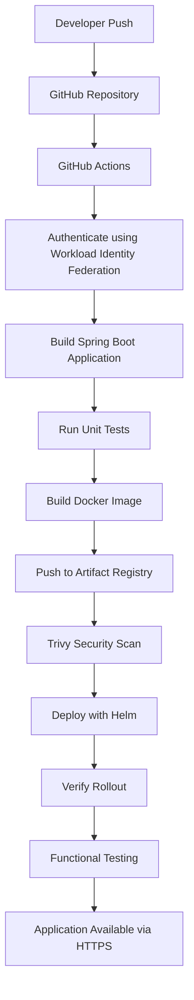

# 06 - GitHub Actions CI/CD Pipeline

## Overview

GitHub Actions automates the complete Continuous Integration and Continuous Deployment (CI/CD) workflow for this project.

Every push to the **main** branch automatically builds, tests, scans, and deploys the application to the private Google Kubernetes Engine (GKE) cluster.

The pipeline authenticates securely using **Google Cloud Workload Identity Federation**, eliminating the need to store long-lived Service Account keys inside GitHub.

The deployment process is fully automated and follows modern DevOps and Platform Engineering practices.

---

# Pipeline Objectives

The pipeline automates the following tasks:

- Source code checkout
- Authenticate with Google Cloud
- Build the Spring Boot application
- Execute unit tests
- Build Docker image
- Push image to Artifact Registry
- Perform Trivy vulnerability scan
- Deploy application using Helm
- Verify Kubernetes rollout
- Perform functional API testing

---

# Pipeline Architecture



---

# Workflow Trigger

The workflow executes automatically whenever code is pushed to the **main** branch.

```yaml
on:
  push:
    branches:
      - main
```

This enables continuous deployment without manual intervention.

---

# Pipeline Stages

## 1. Checkout Source Code

The workflow downloads the latest version of the repository.

```yaml
uses: actions/checkout@v4
```

This provides access to:

- Spring Boot source code
- Helm chart
- Kubernetes manifests
- Documentation

---

## 2. Authenticate with Google Cloud

Authentication is performed using Google's official GitHub Action.

```yaml
uses: google-github-actions/auth@v2
```

Authentication uses:

- GitHub OIDC
- Workload Identity Federation
- Temporary Google Cloud credentials

No Service Account JSON keys are stored in GitHub.

---

## 3. Configure Google Cloud SDK

The workflow installs the Google Cloud SDK and Kubernetes authentication plugin.

This allows GitHub Actions to execute commands such as:

```bash
gcloud
kubectl
helm
```

---

## 4. Retrieve GKE Credentials

The workflow retrieves Kubernetes credentials for the private cluster.

```bash
gcloud container clusters get-credentials
```

This enables GitHub Actions to communicate securely with the GKE cluster.

---

## 5. Verify Environment

Basic validation commands ensure authentication and cluster connectivity.

Examples:

```bash
gcloud auth list

kubectl get nodes
```

---

## 6. Build the Application

The Spring Boot application is compiled using Maven.

```bash
./mvnw clean package
```

This step also executes all unit tests.

The build produces:

```text
hello-gke.jar
```

---

## 7. Build Docker Image

The packaged application is converted into a Docker image.

Example:

```bash
docker build
```

Each image is tagged using the Git commit SHA.

Example:

```text
hello-gke:3ab91df
```

---

## 8. Push to Artifact Registry

The Docker image is pushed to Google Artifact Registry.

Artifact Registry serves as the central image repository for Kubernetes deployments.

---

## 9. Container Security Scan

Before deployment, the image is scanned using **Trivy**.

The scan checks for:

- Critical vulnerabilities
- High vulnerabilities
- Medium vulnerabilities
- Low vulnerabilities

This helps identify security issues before deploying the application.

---

## 10. Deploy with Helm

The application is deployed using Helm.

```bash
helm upgrade --install hello-gke ./helm/hello-gke
```

Helm provides:

- Versioned releases
- Repeatable deployments
- Parameterized configuration
- Easy upgrades
- Rollback capability

---

## 11. Verify Deployment

The workflow waits for Kubernetes to complete the rolling update.

Example:

```bash
kubectl rollout status deployment/hello-gke
```

Additional verification commands include:

```bash
kubectl get pods

kubectl get svc

kubectl get ingress

helm list
```

---

## 12. Functional Testing

Once deployment completes successfully, the application endpoint is verified.

Example:

```bash
curl https://app.devopswithsachin.in
```

Expected response:

```json
{
  "message":"Hello from Ingress",
  "environment":"dev"
}
```

This confirms that:

- HTTPS is working
- Ingress routing is functioning
- TLS certificate is valid
- Application is healthy

---

# Deployment Flow

```text
Developer

↓

Git Push

↓

GitHub Actions

↓

Authenticate with Google Cloud

↓

Build Spring Boot Application

↓

Run Unit Tests

↓

Build Docker Image

↓

Push Image to Artifact Registry

↓

Trivy Security Scan

↓

Deploy with Helm

↓

Verify Rollout

↓

Functional Testing

↓

Application Available
```

---

# Security Features

The pipeline incorporates several security best practices.

- Workload Identity Federation
- No Service Account JSON keys
- Temporary Google Cloud credentials
- Private GKE Cluster
- Trivy container image scanning
- HTTPS with Let's Encrypt
- Least privilege IAM permissions

---

# Pipeline Benefits

The automated CI/CD pipeline provides:

- Consistent deployments
- Automated builds
- Automated testing
- Secure authentication
- Container security scanning
- Version-controlled releases
- Faster software delivery
- Reduced manual effort

---

# Key Takeaways

GitHub Actions serves as the automation engine for this project, orchestrating the complete software delivery lifecycle from source code to production deployment.

By integrating Workload Identity Federation, Artifact Registry, Trivy, Helm, and Google Kubernetes Engine, the pipeline delivers a secure, repeatable, and production-oriented deployment process with minimal manual intervention.
