# GitHub Actions CI/CD

## Overview

This project uses **GitHub Actions** to implement a Continuous Integration and Continuous Deployment (CI/CD) pipeline for the sample Java application.

Every code change pushed to the repository automatically triggers the pipeline, which builds the application, creates a Docker image, authenticates to Google Cloud using Workload Identity Federation (WIF), pushes the image to Artifact Registry, and deploys the latest version to the private Google Kubernetes Engine (GKE) cluster.

The pipeline eliminates manual deployment steps and provides a secure, repeatable deployment process.

---

# CI/CD Architecture

```mermaid
flowchart LR

Developer --> GitHub

GitHub --> GitHubActions

GitHubActions --> Build[Build Java Application]

Build --> Docker[Build Docker Image]

Docker --> ArtifactRegistry[Push Image to Artifact Registry]

ArtifactRegistry --> Authenticate

Authenticate[Authenticate using Workload Identity Federation]

Authenticate --> GKE[Private GKE Cluster]

GKE --> Deployment[Kubernetes Deployment]

Deployment --> Pods[Application Pods]

Pods --> Service[LoadBalancer Service]
```



---

# Pipeline Workflow

The deployment process follows these steps:

1. Developer pushes code to GitHub.
2. GitHub Actions workflow is triggered.
3. The Java application is built using Maven.
4. A Docker image is created.
5. The image is pushed to Google Artifact Registry.
6. GitHub Actions authenticates to Google Cloud using Workload Identity Federation.
7. Kubernetes credentials are retrieved.
8. Kubernetes manifests are applied to the private GKE cluster.
9. Kubernetes performs a rolling update.
10. The latest application version becomes available through the LoadBalancer Service.

---

# Workflow Components

## Source Control

GitHub hosts:

- Application source code
- Kubernetes manifests
- Terraform configuration
- GitHub Actions workflow definitions
- Project documentation

Version control provides collaboration, traceability, and change history.

---

## Continuous Integration

The CI stage validates every code change before deployment.

Tasks include:

- Checking out source code
- Building the Java application
- Packaging the application
- Building the Docker image

Automating these steps reduces manual effort and helps identify issues early in the development lifecycle.

---

## Container Image Build

The application is containerized using Docker.

The pipeline:

- Builds a new image
- Applies the appropriate image tag
- Prepares the image for deployment

Containerization ensures consistency across development, testing, and production environments.

---

## Artifact Registry

Successfully built images are pushed to Google Artifact Registry.

Artifact Registry provides:

- Secure image storage
- Image versioning
- Native integration with Google Kubernetes Engine
- IAM-based access control

The GKE cluster pulls images directly from Artifact Registry during deployment.

---

## Authentication

GitHub Actions authenticates to Google Cloud using **Workload Identity Federation (WIF)**.

This approach removes the need to store long-lived service account keys inside the repository.

Authentication is based on:

- OpenID Connect (OIDC)
- Short-lived credentials
- IAM trust relationships

This follows Google's recommended authentication model for GitHub Actions.

---

# Deployment

After authentication, the pipeline:

- Retrieves GKE cluster credentials
- Connects to the Kubernetes API server
- Applies Kubernetes manifests
- Updates the running Deployment

Kubernetes automatically performs a rolling update, ensuring minimal application downtime.

---

# Deployment Flow

```text
Developer

      │

      ▼

Push Code to GitHub

      │

      ▼

GitHub Actions

      │

      ▼

Build Java Application

      │

      ▼

Build Docker Image

      │

      ▼

Push Image to Artifact Registry

      │

      ▼

Authenticate using Workload Identity Federation

      │

      ▼

Retrieve GKE Credentials

      │

      ▼

kubectl apply

      │

      ▼

Rolling Update

      │

      ▼

Application Available
```

---

# Security Considerations

The CI/CD pipeline incorporates several security best practices:

- No service account keys stored in GitHub
- Authentication using OpenID Connect (OIDC)
- Short-lived credentials
- IAM least privilege access
- Automated deployments
- Version-controlled workflow definitions

These practices reduce credential management overhead while improving the overall security posture of the deployment pipeline.

---

# Benefits

Implementing CI/CD with GitHub Actions provides several advantages:

- Automated deployments
- Consistent build process
- Faster software delivery
- Reduced manual errors
- Repeatable deployments
- Integrated version control
- Improved collaboration
- Secure authentication with Google Cloud

---

# Technologies Used

| Category | Technology |
|----------|------------|
| Source Control | GitHub |
| CI/CD Platform | GitHub Actions |
| Build Tool | Maven |
| Containerization | Docker |
| Container Registry | Google Artifact Registry |
| Authentication | Workload Identity Federation (OIDC) |
| Container Orchestration | Google Kubernetes Engine |
| Deployment Tool | kubectl |

---

# Best Practices Followed

- Infrastructure and application code stored in Git
- Automated build and deployment pipeline
- Secure authentication using Workload Identity Federation
- No long-lived service account keys
- Version-controlled workflow definitions
- Automated rolling deployments
- Immutable container images

---

# Next Section

The next document explains how Workload Identity Federation (WIF) enables secure authentication between GitHub Actions and Google Cloud without the use of service account keys.

➡ **07-workload-identity-federation.md**
