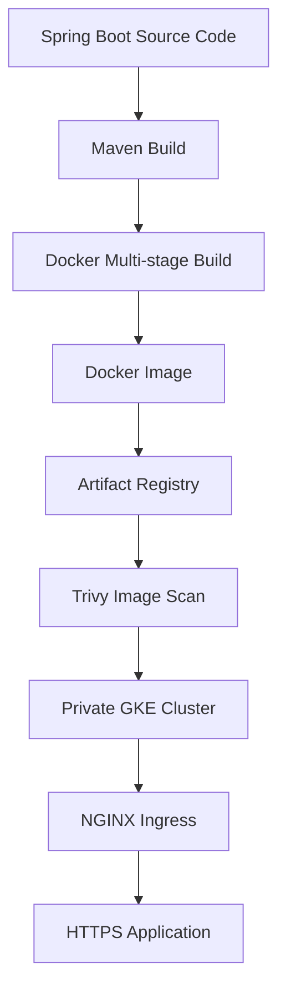

# 07 - Docker

## Overview

Docker is used to package the Spring Boot application into a lightweight, portable container image that can run consistently across development, testing, and production environments.

Instead of deploying application source code directly, Kubernetes deploys immutable Docker images stored in Google Artifact Registry.

The project uses a **multi-stage Docker build** to create a small, production-ready runtime image while keeping the build process efficient and secure.

This ensures that the exact same application package is built, scanned, stored, and deployed throughout the CI/CD pipeline.

---

# Why Docker?

Traditional application deployment requires installing runtime dependencies on every server.

```text
Application

↓

Java Installation

↓

Operating System

↓

Server
```

This approach often leads to:

- Dependency conflicts
- Environment inconsistencies
- Difficult deployments
- "Works on my machine" problems

Docker solves these issues by packaging everything required to run the application into a single container image.

```text
Docker Image

├── Spring Boot Application
├── Java Runtime
├── Required Libraries
└── Application Configuration
```

The same Docker image is used in development, testing, and production, ensuring consistent behavior across environments.

---

# Containerization Workflow



---

# Multi-stage Docker Build

The project uses a multi-stage Docker build.

The first stage compiles the application, while the second stage creates a lightweight runtime image containing only the files required to run the application.

Benefits include:

- Smaller image size
- Faster deployments
- Reduced attack surface
- Cleaner production images
- Separation of build and runtime environments

---

# Dockerfile

```dockerfile
# Build Stage
FROM maven:3.9.9-eclipse-temurin-17 AS builder

WORKDIR /app

COPY . .

RUN ./mvnw clean package -DskipTests

# Runtime Stage
FROM eclipse-temurin:17-jre

WORKDIR /app

COPY --from=builder /app/target/*.jar app.jar

EXPOSE 8080

ENTRYPOINT ["java","-jar","app.jar"]
```

---

# Dockerfile Explanation

## Build Stage

The build stage compiles the Spring Boot application.

Responsibilities include:

- Download Maven dependencies
- Compile source code
- Execute Maven build
- Generate executable JAR

The generated artifact is:

```text
hello-gke.jar
```

---

## Runtime Stage

The runtime stage creates a lightweight production image.

Only the compiled application JAR is copied from the build stage.

This keeps the final image free from:

- Maven
- Source code
- Build cache
- Temporary files

Resulting in a smaller and more secure container image.

---

## Base Images

### Builder Image

```dockerfile
maven:3.9.9-eclipse-temurin-17
```

Provides:

- Maven
- Java 17
- Build tools

---

### Runtime Image

```dockerfile
eclipse-temurin:17-jre
```

Provides:

- Java 17 Runtime
- Lightweight production image
- Optimized JVM

---

# Building the Docker Image

The application can be built locally.

```bash
docker build -t hello-gke:v1 .
```

Docker performs the following operations:

1. Download base images
2. Compile the application
3. Package the JAR
4. Create runtime image
5. Generate final Docker image

---

# Verify Local Images

List locally available images.

```bash
docker images
```

Example:

```text
REPOSITORY      TAG

hello-gke       v1
```

---

# Local Testing

The application can be tested locally before deployment.

```bash
docker run -p 8080:8080 hello-gke:v1
```

Verify the application:

```bash
curl http://localhost:8080
```

Expected response:

```json
{
  "message":"Hello from Ingress",
  "environment":"dev"
}
```

---

# Image Tagging Strategy

The CI/CD pipeline tags every image using the Git commit SHA.

Example:

```text
hello-gke:4f6e9b2
```

Benefits include:

- Immutable deployments
- Version traceability
- Easy rollback
- Unique application versions

---

# Docker in the CI/CD Pipeline

The GitHub Actions workflow performs the following tasks.

```text
Source Code

↓

Build Application

↓

Docker Build

↓

Push Image

↓

Artifact Registry

↓

Trivy Image Scan

↓

Helm Deployment

↓

Private GKE Cluster
```

Example image build:

```bash
docker build \
-t us-central1-docker.pkg.dev/PROJECT_ID/REPOSITORY/hello-gke:${GITHUB_SHA} .
```

Push image:

```bash
docker push \
us-central1-docker.pkg.dev/PROJECT_ID/REPOSITORY/hello-gke:${GITHUB_SHA}
```

---

# Artifact Registry

Docker images are stored in Google Artifact Registry.

Benefits include:

- Secure image storage
- Image versioning
- Regional repositories
- Integration with GKE
- Central image management

Kubernetes always pulls container images from Artifact Registry during deployment.

---

# Security

Every image is scanned using **Trivy** before deployment.

The scan checks for:

- Critical vulnerabilities
- High vulnerabilities
- Medium vulnerabilities
- Low vulnerabilities

This helps identify security issues before the application is deployed.

---

# Best Practices Implemented

The project follows Docker best practices, including:

- Multi-stage Docker builds
- Official Eclipse Temurin base images
- Lightweight runtime image
- Immutable image tags
- One application per container
- Build once, deploy everywhere
- Container image vulnerability scanning
- Centralized image storage in Artifact Registry

---

# End-to-End Deployment Flow

```text
Developer

↓

GitHub Repository

↓

GitHub Actions

↓

Workload Identity Federation

↓

Build Spring Boot Application

↓

Docker Multi-stage Build

↓

Artifact Registry

↓

Trivy Image Scan

↓

Helm Deployment

↓

Private GKE Cluster

↓

NGINX Ingress

↓

HTTPS (Let's Encrypt)

↓

End User
```

---

# Key Takeaways

Docker provides a consistent, portable, and reproducible deployment package for the application.

By combining multi-stage Docker builds, Artifact Registry, Trivy image scanning, Helm, and Google Kubernetes Engine, the project follows modern cloud-native deployment practices and demonstrates a production-oriented containerization workflow suitable for enterprise Kubernetes environments.
