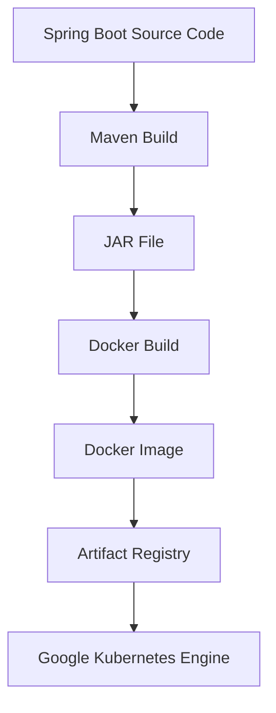

# Docker

## Overview

Docker is used to package the Spring Boot application into a lightweight, portable container image that can run consistently across development, testing, and production environments.

Instead of deploying application source code directly, Kubernetes deploys immutable Docker images stored in Google Artifact Registry.

This ensures that the exact same application package is tested, scanned, and deployed throughout the CI/CD pipeline.

---

# Why Docker?

Traditional application deployment requires installing runtime dependencies on every server.

Example:

```
Application
↓

Java Installation

↓

Operating System

↓

Server
```

This approach often leads to:

- Dependency conflicts
- Environment inconsistencies
- Difficult deployments
- "Works on my machine" problems

Docker solves these issues by packaging everything required to run the application into a single container image.

```
Docker Image

├── Spring Boot Application
├── Java Runtime
├── Required Libraries
└── Configuration
```

---

# Containerization Workflow



---

# Dockerfile

The project uses a simple production-ready Dockerfile.

```dockerfile
FROM eclipse-temurin:17-jre

WORKDIR /app

COPY target/*.jar app.jar

EXPOSE 8080

ENTRYPOINT ["java","-jar","app.jar"]
```

---

# Dockerfile Explanation

## Base Image

```dockerfile
FROM eclipse-temurin:17-jre
```

Provides:

- Java 17 Runtime
- Lightweight Linux image
- Production-ready JVM

---

## Working Directory

```dockerfile
WORKDIR /app
```

Creates the application working directory inside the container.

---

## Copy Application

```dockerfile
COPY target/*.jar app.jar
```

Copies the compiled Spring Boot application into the container.

---

## Expose Port

```dockerfile
EXPOSE 8080
```

Documents that the application listens on port **8080**.

---

## Container Startup

```dockerfile
ENTRYPOINT ["java","-jar","app.jar"]
```

Starts the Spring Boot application when the container launches.

---

# Building the Docker Image

After Maven packaging completes:

```bash
./mvnw clean package
```

Docker builds the container image.

```bash
docker build \
-t hello-gke:v1 .
```

Docker performs:

1. Read Dockerfile
2. Download base image
3. Copy application
4. Create image layers
5. Produce final image

---

# Verify Image

List locally available images.

```bash
docker images
```

Example:

```
REPOSITORY      TAG

hello-gke       v1
```

---

# Running the Container Locally

The application can be tested before deployment.

```bash
docker run -p 8080:8080 hello-gke:v1
```

Validate:

```bash
curl http://localhost:8080
```

Expected response:

```json
{
  "message":"Hello from Ingress",
  "environment":"dev"
}
```

---

# Image Tagging Strategy

During CI/CD the image is tagged using the Git commit SHA.

Example:

```
hello-gke:4f6e9b2
```

Benefits:

- Immutable deployments
- Easy rollback
- Version traceability
- Unique image versions

---

# Docker in the CI/CD Pipeline

The GitHub Actions workflow performs the following steps.

```text
Source Code

↓

Maven Build

↓

Docker Build

↓

Artifact Registry

↓

Vulnerability Scan

↓

Helm Deployment
```

Image build:

```bash
docker build \
-t us-central1-docker.pkg.dev/PROJECT_ID/REPOSITORY/hello-gke:${GITHUB_SHA} .
```

Push:

```bash
docker push \
us-central1-docker.pkg.dev/PROJECT_ID/REPOSITORY/hello-gke:${GITHUB_SHA}
```

---

# Why Docker Images are Stored in Artifact Registry

Instead of deploying directly from GitHub, images are stored in Artifact Registry.

Benefits:

- Central image repository
- Version management
- Secure image storage
- Vulnerability scanning
- Kubernetes integration

Google Kubernetes Engine always pulls images from Artifact Registry.

---

# Best Practices Followed

The project follows several Docker best practices.

- Official Java runtime image
- Small runtime-only image
- Immutable image tags
- One application per container
- Build once, deploy everywhere
- Images scanned before deployment

---

# Current Deployment Flow

```text
Developer

↓

GitHub

↓

GitHub Actions

↓

Maven Package

↓

Docker Build

↓

Artifact Registry

↓

Security Scan

↓

Helm

↓

Google Kubernetes Engine
```

---

# Key Takeaways

Docker provides a consistent and reproducible deployment package that eliminates environment-specific issues.

By integrating Docker into the CI/CD pipeline, every application version is:

- Built automatically
- Versioned
- Stored securely
- Vulnerability scanned
- Deployed consistently to Kubernetes

This approach aligns with modern cloud-native application delivery practices.
