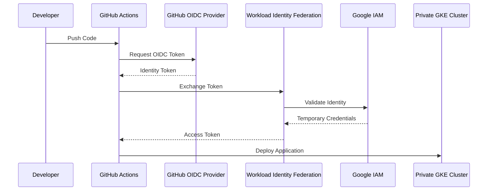

# Workload Identity Federation

## Overview

Workload Identity Federation (WIF) enables external workloads to securely authenticate with Google Cloud without requiring long-lived service account keys.

In this project, GitHub Actions authenticates to Google Cloud using **OpenID Connect (OIDC)** and exchanges the GitHub-issued identity token for temporary Google Cloud credentials. This approach follows Google's recommended security best practices for CI/CD authentication.

---

# Why Workload Identity Federation?

Traditionally, CI/CD pipelines authenticate to cloud providers using downloaded service account key files.

While functional, service account keys introduce several security challenges:

- Long-lived credentials
- Risk of accidental exposure
- Manual key rotation
- Difficult credential management

Workload Identity Federation eliminates these issues by using temporary credentials issued only when a workflow executes.

---

# Authentication Architecture



---

# Components

## GitHub Actions

GitHub Actions executes the CI/CD workflow and requests an OpenID Connect (OIDC) token during each workflow run.

The token represents the identity of the GitHub repository and workflow.

---

## OpenID Connect (OIDC)

GitHub acts as the identity provider by issuing signed OIDC tokens.

These tokens contain claims such as:

- Repository
- Branch
- Workflow
- Actor

Google Cloud validates these claims before granting access.

---

## Workload Identity Pool

A Workload Identity Pool acts as the trust boundary between Google Cloud and external identity providers.

The pool receives identity tokens from GitHub and allows trusted identities to request temporary Google Cloud credentials.

---

## Workload Identity Provider

The Workload Identity Provider defines:

- Trusted identity provider (GitHub)
- OIDC issuer
- Attribute mappings
- Attribute conditions

Only workflows matching the configured conditions are allowed to authenticate.

---

## Service Account

GitHub Actions impersonates a Google Cloud Service Account after successful authentication.

The Service Account is granted only the permissions required to:

- Access the GKE cluster
- Retrieve cluster credentials
- Deploy Kubernetes resources

This follows the Principle of Least Privilege.

---

# Authentication Flow

```text
Developer
      │
      ▼
Push Code
      │
      ▼
GitHub Actions
      │
      ▼
Request OIDC Token
      │
      ▼
GitHub OIDC Provider
      │
      ▼
Workload Identity Provider
      │
      ▼
Google IAM
      │
      ▼
Temporary Access Token
      │
      ▼
Authenticate to GKE
      │
      ▼
Deploy Application
```

---

# Configuration Overview

The implementation includes:

- Workload Identity Pool
- OIDC Provider
- Attribute Mapping
- Attribute Conditions
- Google Service Account
- IAM Role Bindings
- GitHub Actions Authentication

Together, these components establish a secure trust relationship between GitHub and Google Cloud.

---

# Security Benefits

Using Workload Identity Federation provides several security advantages:

- No downloaded service account keys
- Short-lived credentials
- Automatic credential rotation
- Fine-grained IAM control
- Repository-level trust
- Improved auditability
- Reduced credential management

---

# Challenges Encountered

During implementation, several authentication issues were encountered and resolved, including:

- Invalid IAM principal bindings
- Incorrect attribute mappings
- Repository attribute mismatches
- OIDC authentication failures
- GitHub Actions authentication errors

Troubleshooting these issues provided a deeper understanding of Google Cloud IAM and Workload Identity Federation.

---

# Best Practices Followed

- No long-lived credentials
- Principle of Least Privilege
- Repository-specific trust configuration
- IAM role separation
- OIDC-based authentication
- Secure CI/CD integration

---

# Technologies Used

| Component | Technology |
|----------|------------|
| Identity Provider | GitHub OIDC |
| Federation | Google Workload Identity Federation |
| Authentication | OpenID Connect (OIDC) |
| IAM | Google Cloud IAM |
| CI/CD | GitHub Actions |

---

# Next Section

The next document explains how Docker was used to containerize the Java application before deployment to Google Kubernetes Engine.

➡ **08-docker.md**
