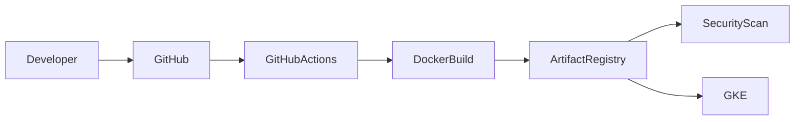

# Artifact Registry

## Overview

Google Artifact Registry is used as the centralized container image repository for this project.

Every Docker image built by the GitHub Actions pipeline is pushed to Artifact Registry before deployment to Google Kubernetes Engine (GKE).

Artifact Registry serves as the single source of truth for all application images deployed across environments.

---

# Why Artifact Registry?

Instead of deploying images directly from a developer machine or GitHub runner, the project stores all images in a managed container registry.

Benefits include:

- Centralized image management
- Secure image storage
- Version control
- IAM integration
- Vulnerability scanning
- Native Kubernetes support

---

# Architecture



---

# Repository Configuration

The project uses a Docker repository hosted in Google Artifact Registry.

Example:

```
Project

proserv-task02

Region

us-central1

Repository

springboot-repo
```

Docker image path:

```
us-central1-docker.pkg.dev/proserv-task02/springboot-repo/hello-gke
```

---

# Repository Structure

```
Artifact Registry

└── springboot-repo
      │
      ├── hello-gke:v1
      ├── hello-gke:latest
      ├── hello-gke:4f6e9b2
      ├── hello-gke:ab51e73
      └── ...
```

Each Git commit produces a new immutable image.

---

# Authentication

Before pushing images, Docker must authenticate with Artifact Registry.

The pipeline performs:

```bash
gcloud auth configure-docker us-central1-docker.pkg.dev
```

This configures Docker to use Google Cloud credentials when communicating with Artifact Registry.

Authentication itself is provided through Workload Identity Federation.

No Docker credentials or service account keys are stored in GitHub.

---

# Image Tagging Strategy

Images are tagged using the Git commit SHA.

Example:

```
hello-gke:8c9b27e
```

Benefits:

- Immutable deployments
- Easy rollback
- Full deployment traceability
- Version history

---

# Docker Build

The pipeline builds the container image.

Example:

```bash
docker build \
-t us-central1-docker.pkg.dev/${PROJECT_ID}/${REPOSITORY}/${IMAGE}:${GITHUB_SHA} .
```

---

# Image Push

After a successful build, the image is uploaded to Artifact Registry.

Example:

```bash
docker push \
us-central1-docker.pkg.dev/${PROJECT_ID}/${REPOSITORY}/${IMAGE}:${GITHUB_SHA}
```

Once uploaded, the image becomes available for Kubernetes deployments.

---

# Verifying Images

List all stored images.

```bash
gcloud artifacts docker images list \
us-central1-docker.pkg.dev/proserv-task02/springboot-repo
```

Example output:

```
hello-gke

hello-gke:v1

hello-gke:8c9b27e

hello-gke:f6d30ab
```

---

# Image Deployment

Google Kubernetes Engine never builds application images.

Instead, Kubernetes pulls images directly from Artifact Registry.

Deployment flow:

```text
GitHub Actions

↓

Docker Image

↓

Artifact Registry

↓

Kubernetes Deployment

↓

Running Pods
```

---

# IAM Permissions

The deployment service account requires permission to push images.

Typical IAM role:

- Artifact Registry Writer

Kubernetes nodes require permission to pull images.

These permissions are handled automatically through the node service account.

---

# Integration with Vulnerability Scanning

Artifact Registry integrates with Google Artifact Analysis.

After each image upload:

```
Docker Push

↓

Artifact Registry

↓

Automatic Vulnerability Scan

↓

Security Report

↓

Deployment Decision
```

This allows the pipeline to reject insecure images before deployment.

---

# Advantages

Artifact Registry provides several benefits.

- Fully managed by Google Cloud
- Native IAM integration
- Regional repositories
- Secure image storage
- Built-in vulnerability scanning
- Supports Docker and OCI images
- Easy integration with GKE

---

# Best Practices Followed

This project follows several Artifact Registry best practices.

- Regional repository
- Immutable image tags
- Git commit versioning
- Private repository
- IAM-based authentication
- Automatic vulnerability scanning
- Images deployed only from Artifact Registry

---

# Key Takeaways

Artifact Registry acts as the secure container repository for the entire deployment pipeline.

Every image built by GitHub Actions is:

- Versioned
- Stored securely
- Automatically scanned
- Retrieved by Kubernetes during deployment

Using Artifact Registry ensures consistent, secure, and repeatable application deployments across environments.
