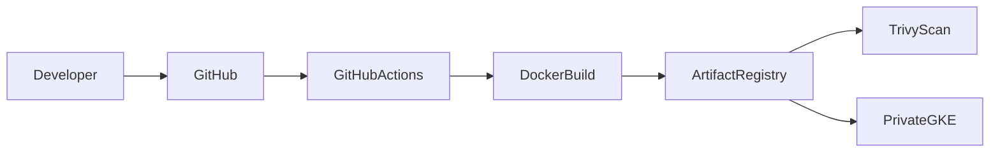

# 08 - Artifact Registry

## Overview

Google Artifact Registry is used as the centralized container image repository for this project.

Every Docker image built by the GitHub Actions pipeline is pushed to Artifact Registry before being deployed to the private Google Kubernetes Engine (GKE) cluster.

Artifact Registry acts as the single source of truth for all container images used throughout the deployment lifecycle.

The repository was created manually using the Google Cloud Console and is integrated with the CI/CD pipeline through Workload Identity Federation.

---

# Why Artifact Registry?

Instead of deploying images directly from a developer workstation or GitHub Actions runner, all application images are stored in a secure, managed container registry.

Benefits include:

- Centralized image management
- Secure image storage
- Version control
- IAM-based access control
- Native integration with GKE
- Reliable image distribution

---

# Architecture



---

# Repository Configuration

The project uses a Docker repository hosted in Google Artifact Registry.

Current configuration:

| Property | Value |
|----------|-------|
| Project | proserv-task01 |
| Region | us-central1 |
| Repository | my-repo |
| Format | Docker |

Docker image path:

```text
us-central1-docker.pkg.dev/proserv-task01/my-repo/hello-gke
```

---

# Repository Structure

```text
Artifact Registry

└── my-repo

      ├── hello-gke:latest

      ├── hello-gke:a73f9d2

      ├── hello-gke:cb4518e

      ├── hello-gke:f9e6c11

      └── ...
```

Each Git commit generates a new immutable Docker image.

---

# Authentication

The GitHub Actions pipeline authenticates to Google Cloud using **Workload Identity Federation (WIF)**.

After authentication, Docker is configured to communicate with Artifact Registry.

```bash
gcloud auth configure-docker us-central1-docker.pkg.dev
```

This allows Docker to push images securely without storing service account keys or Docker credentials.

---

# Building the Image

After the Spring Boot application is packaged, GitHub Actions builds the Docker image.

Example:

```bash
docker build \
-t us-central1-docker.pkg.dev/${PROJECT_ID}/my-repo/hello-gke:${GITHUB_SHA} .
```

The image is tagged using the Git commit SHA to ensure each deployment is uniquely versioned.

---

# Pushing Images

Once the build completes successfully, the image is uploaded to Artifact Registry.

```bash
docker push \
us-central1-docker.pkg.dev/${PROJECT_ID}/my-repo/hello-gke:${GITHUB_SHA}
```

After the push completes, the image becomes available for deployment to the Kubernetes cluster.

---

# Image Versioning

Images are tagged using the Git commit SHA.

Example:

```text
hello-gke:8c9b27e
```

Benefits include:

- Immutable deployments
- Deployment traceability
- Easy rollback
- Version history

---

# Verifying Images

Images stored in Artifact Registry can be listed using:

```bash
gcloud artifacts docker images list \
us-central1-docker.pkg.dev/proserv-task01/my-repo
```

This command displays all available container images and their associated tags.

---

# Image Deployment

Google Kubernetes Engine never builds application images.

Instead, Kubernetes pulls container images directly from Artifact Registry during deployment.

Deployment flow:

```text
GitHub Actions

↓

Docker Build

↓

Artifact Registry

↓

Helm Deployment

↓

Private GKE Cluster

↓

Running Pods
```

---

# IAM Permissions

The GitHub Actions service account requires permission to push images into Artifact Registry.

Required role:

- Artifact Registry Writer

The GKE node service account automatically pulls images from Artifact Registry during application deployment.

---

# Security

After an image is pushed, the CI/CD pipeline performs a **Trivy vulnerability scan** before deployment.

The scan checks for:

- Critical vulnerabilities
- High vulnerabilities
- Medium vulnerabilities
- Low vulnerabilities

If critical or high-severity vulnerabilities are detected, the deployment pipeline can be configured to stop before deployment.

---

# Advantages

Artifact Registry provides several operational benefits:

- Fully managed by Google Cloud
- Secure private repositories
- Native IAM integration
- Regional repositories
- Fast image retrieval
- Seamless integration with GKE
- Centralized container management

---

# Best Practices Implemented

The project follows several Artifact Registry best practices:

- Private Docker repository
- Regional repository
- IAM-based authentication
- Workload Identity Federation
- Immutable image tags
- Git commit-based versioning
- Images deployed only from Artifact Registry
- Container images scanned before deployment

---

# Key Takeaways

Artifact Registry serves as the centralized repository for all container images used by the platform.

Every application image is:

- Built automatically by GitHub Actions
- Authenticated using Workload Identity Federation
- Stored securely in Artifact Registry
- Tagged with the Git commit SHA
- Scanned for vulnerabilities using Trivy
- Pulled by the private GKE cluster during deployment

This approach provides a secure, repeatable, and production-oriented container image management workflow that aligns with modern cloud-native application delivery practices.
