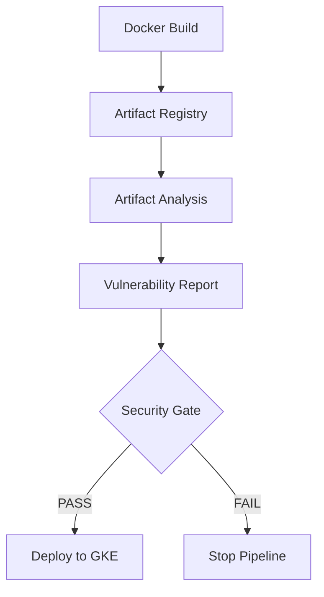

# Container Security

## Overview

Container security is an essential part of any production CI/CD pipeline.

In this project, every Docker image is automatically scanned for known vulnerabilities before deployment to Google Kubernetes Engine (GKE).

Images containing Critical or High severity vulnerabilities are prevented from being deployed.

This ensures that only secure container images reach production.

---

# Why Container Security?

Building a Docker image does not guarantee that it is secure.

A container image may contain:

- Vulnerable operating system packages
- Outdated Java libraries
- Security flaws in application dependencies
- Known CVEs (Common Vulnerabilities and Exposures)

Without security scanning, vulnerable software could be deployed into production.

---

# Security Workflow



---

# Vulnerability Scanning

After a Docker image is pushed into Artifact Registry, Google Artifact Analysis automatically scans the image.

The scan detects vulnerabilities in:

- Operating system packages
- Java runtime
- Spring Boot dependencies
- Third-party libraries

---

# Generate Vulnerability Report

The pipeline exports a vulnerability report using:

```bash
gcloud artifacts docker images describe \
IMAGE \
--show-package-vulnerability
```

The report is saved as:

```
vulnerability-report.txt
```

This report is uploaded as a GitHub Actions artifact for review.

---

# Security Policy

The project enforces the following deployment policy.

| Severity | Deployment |
|----------|------------|
| Critical | Block |
| High | Block |
| Medium | Warning |
| Low | Allowed |

Only images that satisfy the security policy are deployed.

---

# Security Gate

The GitHub Actions workflow checks the generated report before deployment.

Example:

```bash
if grep -q "CRITICAL:" vulnerability-report.txt; then
    echo "Deployment blocked"
    exit 1
fi

if grep -q "HIGH:" vulnerability-report.txt; then
    echo "Deployment blocked"
    exit 1
fi
```

If either Critical or High vulnerabilities are detected, the pipeline terminates immediately.

---

# Vulnerabilities Identified

During development, multiple vulnerabilities were discovered.

Examples included:

- Outdated Tomcat packages
- Jackson library vulnerabilities
- OpenSSL operating system packages
- Linux package updates

These findings demonstrated the importance of scanning every container image.

---

# Remediation Example 1

## Apache Tomcat

The initial scan detected Critical vulnerabilities in:

```
tomcat-embed-core
```

Resolution:

Upgrade the Tomcat version in the project.

Example:

```xml
<tomcat.version>11.0.22</tomcat.version>
```

After rebuilding the image, the Critical findings were eliminated.

---

# Remediation Example 2

## Jackson Libraries

The scan also reported High severity vulnerabilities affecting:

```
jackson-databind
```

Resolution:

Upgrade the affected dependency to the latest secure release.

After rebuilding the application, the vulnerability disappeared.

---

# Remediation Example 3

## Operating System Packages

Some High severity findings originated from Linux packages inside the Docker base image.

To update these packages, the Dockerfile was modified.

Example:

```dockerfile
RUN apt-get update && \
    apt-get upgrade -y && \
    apt-get autoremove -y && \
    apt-get clean && \
    rm -rf /var/lib/apt/lists/*
```

This ensured the latest security patches were included in the image.

---

# Secure Deployment Flow

```text
Source Code

↓

Docker Build

↓

Artifact Registry

↓

Automatic Vulnerability Scan

↓

Security Gate

↓

Helm Deployment

↓

Google Kubernetes Engine
```

Only secure images proceed to deployment.

---

# Benefits

Integrating security scanning into the CI/CD pipeline provides several advantages.

- Prevents vulnerable software from reaching production
- Detects outdated dependencies
- Encourages regular dependency updates
- Reduces security risks
- Improves compliance
- Supports DevSecOps practices

---

# Best Practices Followed

This project implements several container security best practices.

- Scan every image
- Fail pipeline on Critical vulnerabilities
- Fail pipeline on High vulnerabilities
- Use official base images
- Keep dependencies updated
- Store reports as build artifacts
- Deploy only scanned images
- Use immutable image tags

---

# Future Improvements

Potential enhancements include:

- Integrate Trivy
- Integrate Grype
- Generate Software Bill of Materials (SBOM)
- Image signing using Cosign
- Admission Controller policy enforcement
- Binary Authorization
- Runtime container security

---

# Key Takeaways

Container security is integrated directly into the deployment pipeline rather than being treated as a separate activity.

Every container image is:

- Built automatically
- Stored securely
- Scanned for vulnerabilities
- Evaluated against a security policy
- Approved before deployment

This approach aligns with modern DevSecOps practices and helps ensure that production environments run only trusted and secure container images.
