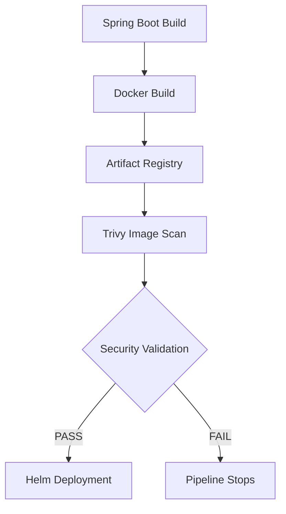

# 09 - Container Security

## Overview

Container security is an essential part of any modern CI/CD pipeline.

In this project, every Docker image is scanned for known vulnerabilities before it is deployed to the private Google Kubernetes Engine (GKE) cluster.

Container security helps ensure that vulnerable operating system packages, application libraries, and third-party dependencies are identified early in the software delivery lifecycle.

By integrating security into the CI/CD pipeline, the project follows a DevSecOps approach where security validation is performed automatically rather than after deployment.

---

# Why Container Security?

Building a Docker image does not guarantee that it is secure.

A container image may contain:

- Vulnerable operating system packages
- Outdated Java libraries
- Spring Boot dependency vulnerabilities
- Third-party package vulnerabilities
- Known CVEs (Common Vulnerabilities and Exposures)

Without automated security scanning, vulnerable software could be deployed into production.

---

# Security Workflow



---

# Container Security Strategy

The project follows a layered approach to container security.

Security controls include:

- Official base images
- Multi-stage Docker builds
- Dependency updates
- Container vulnerability scanning
- Immutable Docker images
- Private Artifact Registry
- Secure image deployment through Helm

Together, these controls reduce the attack surface of deployed applications.

---

# Vulnerability Scanning

Container images are scanned using **Trivy** as part of the GitHub Actions pipeline.

Trivy analyzes:

- Operating system packages
- Java dependencies
- Spring Boot libraries
- Third-party packages
- Known CVEs

The scan is performed before deployment, ensuring that vulnerabilities are detected early.

---

# Security Validation

After the image scan completes, the pipeline evaluates the scan results.

The deployment policy is:

| Severity | Action |
|----------|--------|
| Critical | Block Deployment |
| High | Block Deployment |
| Medium | Review |
| Low | Allow |

Only images that satisfy the security policy are deployed to Kubernetes.

---

# Common Vulnerabilities

During development, vulnerability scanning helped identify outdated dependencies.

Examples included:

- Spring Boot dependencies
- Java libraries
- Operating system packages
- Third-party open-source components

Updating these dependencies reduced the overall security risk of the application.

---

# Remediation Process

When vulnerabilities are detected, remediation typically involves:

- Updating Maven dependencies
- Using newer base Docker images
- Rebuilding the Docker image
- Re-running the vulnerability scan

Only after the scan passes does the image proceed to deployment.

---

# Secure Deployment Flow

```text
Developer

↓

GitHub

↓

GitHub Actions

↓

Docker Build

↓

Artifact Registry

↓

Trivy Image Scan

↓

Security Validation

↓

Helm Deployment

↓

Private GKE Cluster
```

---

# Benefits

Integrating container security into the CI/CD pipeline provides several advantages:

- Prevents vulnerable images from being deployed
- Detects outdated dependencies early
- Encourages regular dependency updates
- Improves software quality
- Supports DevSecOps practices
- Reduces operational security risks

---

# Best Practices Implemented

The project follows container security best practices, including:

- Multi-stage Docker builds
- Official base images
- Regular dependency updates
- Immutable image tags
- Private Artifact Registry
- Automated vulnerability scanning
- Security validation before deployment
- Secure CI/CD authentication using Workload Identity Federation

---

# Future Improvements

The platform can be further enhanced with:

- Software Bill of Materials (SBOM)
- Image signing using Cosign
- Binary Authorization
- Kubernetes Admission Controllers
- Runtime container security
- Policy enforcement using Kyverno or Gatekeeper

---

# Related Documentation

This document explains the overall container security strategy.

Detailed implementation of Trivy image scanning is covered in:

**16-trivy-image-scanning.md**

---

# Key Takeaways

Container security is integrated directly into the CI/CD pipeline rather than being treated as a separate activity.

Every container image is:

- Built automatically
- Stored securely in Artifact Registry
- Scanned using Trivy
- Validated against the project's security policy
- Approved before deployment to Kubernetes

This approach aligns with modern DevSecOps practices and helps ensure that only trusted and secure container images are deployed to the Kubernetes platform.
