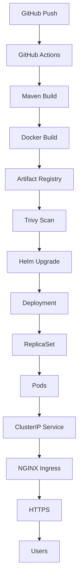

# 10 - Kubernetes Deployment

## Overview

After the application is successfully built, tested, scanned, and published to Google Artifact Registry, GitHub Actions deploys the latest version to a private Google Kubernetes Engine (GKE) cluster.

Application deployment is managed using Helm, allowing Kubernetes resources to be version-controlled, parameterized, and updated consistently across deployments.

The deployed application is exposed externally through an NGINX Ingress Controller secured with a Let's Encrypt TLS certificate and accessible using the custom domain:

```
https://app.devopswithsachin.in
```

---

# Deployment Workflow



---

# Deployment Architecture

```text
Internet

↓

HTTPS

↓

NGINX Ingress Controller

↓

ClusterIP Service

↓

Deployment

↓

ReplicaSet

↓

Spring Boot Pods
```

---

# Kubernetes Resources

The application is deployed using the following Kubernetes resources.

| Resource | Purpose |
|----------|---------|
| Namespace | Logical isolation (default namespace in this project) |
| Deployment | Manages application Pods |
| ReplicaSet | Maintains desired replica count |
| Pod | Runs the Spring Boot container |
| ClusterIP Service | Internal load balancing |
| Ingress | External HTTPS access |
| TLS Secret | Stores Let's Encrypt certificate |

---

# Helm Deployment

The application is deployed using Helm.

GitHub Actions executes:

```bash
helm upgrade --install hello-gke ./helm/hello-gke \
  --set image.repository=$IMAGE_REPOSITORY \
  --set image.tag=$IMAGE_TAG
```

Using Helm provides:

- Version-controlled deployments
- Reusable templates
- Easy upgrades
- Rollback capability
- Environment-specific configuration

---

# Deployment

The Deployment resource defines the desired state of the application.

Responsibilities include:

- Creating Pods
- Maintaining replica count
- Rolling updates
- Automatic recovery
- Scaling

Example:

```yaml
kind: Deployment
```

The Deployment continuously ensures that the required number of Pods remain available.

---

# ReplicaSet

The Deployment automatically creates and manages a ReplicaSet.

Responsibilities include:

- Maintaining the desired number of Pods
- Replacing failed Pods
- Supporting rolling updates

ReplicaSets are managed automatically by Kubernetes and are not modified directly.

---

# Pods

Pods are the smallest deployable unit in Kubernetes.

Each Pod contains:

- Spring Boot application
- Java 17 runtime
- Docker container

Useful commands:

```bash
kubectl get pods
```

```bash
kubectl describe pod <POD_NAME>
```

```bash
kubectl logs <POD_NAME>
```

---

# ClusterIP Service

The application is exposed internally through a ClusterIP Service.

Responsibilities include:

- Stable internal endpoint
- Load balancing across Pods
- Service discovery

Verify:

```bash
kubectl get svc
```

Endpoints:

```bash
kubectl get endpoints
```

Application traffic always flows through the Service rather than directly to Pods.

---

# NGINX Ingress

The application is exposed externally using the NGINX Ingress Controller.

The Ingress performs:

- HTTP routing
- Reverse proxy
- Load balancing
- TLS termination
- Host-based routing

Current host:

```
app.devopswithsachin.in
```

Verify:

```bash
kubectl get ingress
```

---

# HTTPS with Let's Encrypt

TLS certificates are automatically managed using cert-manager.

Benefits include:

- Automated certificate issuance
- Automatic renewal
- Trusted public certificates
- Secure HTTPS communication

The Ingress references a Kubernetes TLS Secret that stores the certificate issued by Let's Encrypt.

---

# Rolling Updates

Whenever a new image is published, Helm updates the Deployment.

Kubernetes performs a rolling update by:

1. Creating new Pods
2. Waiting for them to become Ready
3. Gradually redirecting traffic
4. Removing old Pods

This minimizes downtime during deployments.

Verify rollout:

```bash
kubectl rollout status deployment/hello-gke
```

Restart deployment:

```bash
kubectl rollout restart deployment hello-gke
```

---

# Image Updates

Each Git commit generates a uniquely tagged Docker image.

GitHub Actions automatically updates the Helm deployment with:

```
image.repository

image.tag
```

Example:

```
hello-gke:cb4518e
```

This ensures every deployment uses an immutable container image.

---

# Deployment Verification

Useful verification commands:

```bash
kubectl get deployments
```

```bash
kubectl get pods
```

```bash
kubectl get svc
```

```bash
kubectl get ingress
```

```bash
kubectl get certificates
```

```bash
kubectl get certificaterequests
```

```bash
kubectl get challenges
```

Helm release:

```bash
helm list
```

---

# Self-Healing

If a Pod crashes:

```text
Pod Failure

↓

ReplicaSet

↓

Create Replacement Pod
```

If a node becomes unavailable:

```text
Node Failure

↓

Kubernetes Scheduler

↓

Pod Scheduled on Healthy Node
```

These self-healing capabilities improve application availability.

---

# End-to-End Request Flow

```text
User

↓

https://app.devopswithsachin.in

↓

NGINX Ingress Controller

↓

ClusterIP Service

↓

Deployment

↓

ReplicaSet

↓

Spring Boot Pods
```

---

# Best Practices Implemented

This project follows Kubernetes deployment best practices:

- Private GKE cluster
- Helm-based deployments
- Rolling updates
- Immutable Docker images
- ClusterIP networking
- NGINX Ingress Controller
- HTTPS using Let's Encrypt
- Automated TLS renewal
- Self-healing Deployments
- Version-controlled Kubernetes manifests

---

# Key Takeaways

The application is deployed to a private Google Kubernetes Engine cluster using Helm and GitHub Actions.

Each deployment is fully automated and includes:

- Automated image deployment
- Rolling updates
- Self-healing workloads
- Secure HTTPS access
- Custom domain integration
- Automated TLS certificate management

This deployment model closely resembles the Kubernetes application deployment strategy used in modern production environments.
