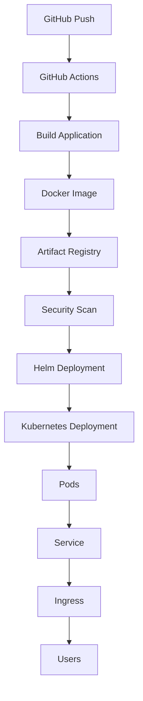

# Kubernetes Deployment

## Overview

After a successful build, security scan, and image upload, the application is deployed to Google Kubernetes Engine (GKE).

The deployment process is fully automated through GitHub Actions and uses Helm to manage Kubernetes resources.

The application runs inside a private GKE cluster while being securely exposed to users through Kubernetes Ingress.

---

# Deployment Workflow



---

# Deployment Architecture

```text
Internet

↓

NGINX Ingress

↓

ClusterIP Service

↓

Deployment

↓

ReplicaSet

↓

Pods
```

---

# Kubernetes Resources

The application consists of the following Kubernetes resources.

| Resource | Purpose |
|----------|---------|
| Deployment | Manages application Pods |
| ReplicaSet | Maintains desired number of Pods |
| Pod | Runs the Spring Boot application |
| ClusterIP Service | Internal load balancing |
| Ingress | External HTTP access |

---

# Deployment

The Deployment resource defines the desired application state.

Responsibilities include:

- Creating Pods
- Maintaining replicas
- Performing rolling updates
- Recovering failed Pods
- Supporting scaling

Example:

```yaml
kind: Deployment
```

Deployment ensures that the desired number of application instances are always available.

---

# ReplicaSet

ReplicaSets are automatically created by Deployments.

Responsibilities:

- Maintain the desired replica count
- Replace failed Pods
- Ensure high availability

The ReplicaSet is managed automatically and is not modified directly.

---

# Pods

Pods are the smallest deployable unit in Kubernetes.

Each Pod in this project contains:

- Spring Boot application
- Java 17 runtime
- Docker container

Example verification:

```bash
kubectl get pods
```

Detailed information:

```bash
kubectl describe pod POD_NAME
```

Application logs:

```bash
kubectl logs POD_NAME
```

---

# ClusterIP Service

The application is exposed internally using a ClusterIP Service.

Responsibilities:

- Stable internal IP
- Load balancing
- Service discovery

Verify:

```bash
kubectl get svc
```

Endpoints:

```bash
kubectl get endpoints
```

Pods communicate through the Service rather than directly with individual Pods.

---

# Helm Deployment

Application deployment is performed using Helm.

GitHub Actions executes:

```bash
helm upgrade --install hello-gke ./helm/hello-gke \
  --set image.repository=IMAGE_REPOSITORY \
  --set image.tag=IMAGE_TAG
```

Benefits:

- Declarative deployments
- Easy upgrades
- Rollbacks
- Configuration management
- Reusable templates

---

# Rolling Updates

When a new Docker image is available:

1. Helm updates the Deployment.
2. Kubernetes creates new Pods.
3. Traffic is shifted gradually.
4. Old Pods are terminated.

This process minimizes downtime.

Deployment status:

```bash
kubectl rollout status deployment/hello-gke
```

Restart deployment:

```bash
kubectl rollout restart deployment hello-gke
```

---

# Scaling

The Deployment can be scaled manually.

Example:

```bash
kubectl scale deployment hello-gke --replicas=3
```

Verification:

```bash
kubectl get pods
```

Kubernetes automatically creates additional Pods to match the requested replica count.

---

# Image Updates

Each Git commit produces a new Docker image.

GitHub Actions updates Helm with:

```
image.repository

image.tag
```

Example:

```
hello-gke:8c9b27e
```

Helm deploys the new image without modifying the Kubernetes manifests.

---

# Deployment Verification

The pipeline verifies deployment using:

```bash
kubectl get deployments

kubectl get pods

kubectl get svc

kubectl get ingress
```

Helm release:

```bash
helm list
```

Successful rollout confirms that the application is available.

---

# Failure Recovery

If a Pod crashes:

```text
Pod Failure

↓

ReplicaSet

↓

Create New Pod
```

If a node fails:

```text
Node Failure

↓

Deployment

↓

Schedule Pod on Healthy Node
```

This provides self-healing capabilities.

---

# Current Application Flow

```text
Developer

↓

GitHub

↓

GitHub Actions

↓

Docker Image

↓

Artifact Registry

↓

Helm

↓

Deployment

↓

ReplicaSet

↓

Pods

↓

ClusterIP Service

↓

NGINX Ingress

↓

Users
```

---

# Best Practices Followed

This project follows several Kubernetes deployment best practices.

- Declarative deployments
- Helm package management
- Rolling updates
- Immutable container images
- ClusterIP networking
- Ingress for external access
- Self-healing Deployments
- Version-controlled configuration

---

# Key Takeaways

Kubernetes Deployments provide a reliable and automated mechanism for running containerized applications.

Combined with Helm and GitHub Actions, the deployment process becomes fully automated, repeatable, and production-ready.

Every successful pipeline execution results in a secure, versioned, and highly available application running on Google Kubernetes Engine.
