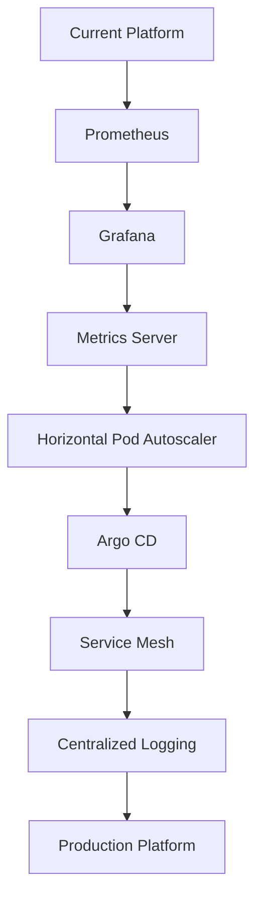

# 15 - Production Improvements

## Overview

This project demonstrates a production-style Kubernetes platform running on Google Kubernetes Engine (GKE).

The platform now includes Infrastructure as Code (Terraform), a private GKE cluster, GitHub Actions CI/CD, Workload Identity Federation, Helm deployments, container image scanning, automated testing, and HTTPS secured using cert-manager and Let's Encrypt.

While the current implementation is suitable for development and learning, there are several enhancements that can further improve scalability, reliability, security, and operational excellence for production environments.

---

# Current Platform Capabilities

The project currently includes:

- Terraform-managed infrastructure
- Private GKE Cluster
- Cloud NAT for outbound internet access
- GitHub Actions CI/CD Pipeline
- Workload Identity Federation
- Docker containerization
- Artifact Registry
- Google Artifact Analysis vulnerability scanning
- Trivy image scanning
- Helm-based deployments
- NGINX Ingress Controller
- Custom Domain
- HTTPS using cert-manager and Let's Encrypt
- Automated Unit Testing
- Automated Functional Testing

---

# Future Roadmap

The following enhancements are planned for future iterations.

| Feature | Status |
|----------|--------|
| Prometheus Monitoring | Planned |
| Grafana Dashboards | Planned |
| Metrics Server | Planned |
| Horizontal Pod Autoscaler | Planned |
| Argo CD (GitOps) | Planned |
| Service Mesh (Istio) | Planned |
| OpenTelemetry | Planned |
| Centralized Logging | Planned |
| Binary Authorization | Planned |
| Policy Enforcement (OPA Gatekeeper) | Planned |
| Secret Management | Planned |
| Multi-Environment Deployments | Planned |

---

# Prometheus Monitoring

Prometheus will be introduced to collect metrics from Kubernetes and application workloads.

Metrics include:

- CPU utilization
- Memory usage
- Pod status
- Node health
- Request count
- Response latency
- JVM metrics

Benefits:

- Infrastructure monitoring
- Application health monitoring
- Alert generation
- Historical metrics

---

# Grafana Dashboards

Grafana will visualize metrics collected by Prometheus.

Example dashboards:

- Kubernetes Cluster
- Node Utilization
- Pod Health
- Spring Boot Metrics
- JVM Metrics
- CI/CD Pipeline Dashboard

Benefits:

- Real-time monitoring
- Capacity planning
- Operational visibility

---

# Metrics Server

The Kubernetes Metrics Server provides CPU and memory utilization required for autoscaling.

Example commands:

```bash
kubectl top nodes

kubectl top pods
```

Benefits:

- Resource monitoring
- HPA support
- Capacity planning

---

# Horizontal Pod Autoscaler (HPA)

Currently the application replica count is managed manually.

Future implementation will automatically scale Pods based on CPU or memory utilization.

Example:

```bash
kubectl autoscale deployment hello-gke \
  --cpu-percent=70 \
  --min=2 \
  --max=10
```

Benefits:

- Improved availability
- Automatic scaling
- Better resource utilization

---

# GitOps using Argo CD

Currently deployments are triggered directly from GitHub Actions.

Future enhancements include adopting Argo CD for GitOps-based continuous delivery.

Benefits:

- Declarative deployments
- Automatic drift detection
- Easy rollbacks
- Improved deployment visibility

Deployment flow:

```text
GitHub Repository

↓

Argo CD

↓

Kubernetes Cluster
```

---

# Service Mesh

A service mesh provides advanced networking capabilities between services.

Possible implementation:

- Istio

Features include:

- Mutual TLS (mTLS)
- Traffic management
- Retry policies
- Circuit breaking
- Traffic splitting
- Request tracing

---

# OpenTelemetry

OpenTelemetry will provide distributed tracing across services.

Potential integrations:

- Jaeger
- Google Cloud Trace

Benefits:

- Request tracing
- Root cause analysis
- Performance optimization

---

# Centralized Logging

Application and Kubernetes logs can be centralized using:

- Google Cloud Logging
- Fluent Bit
- Loki

Benefits:

- Centralized log storage
- Advanced search
- Long-term retention
- Easier troubleshooting

---

# Binary Authorization

Only trusted container images should be deployed.

Binary Authorization verifies:

- Image source
- Image signature
- Deployment policy

Benefits:

- Prevent unauthorized deployments
- Supply-chain security

---

# Policy Enforcement

OPA Gatekeeper can enforce Kubernetes security policies.

Example policies:

- Require resource limits
- Prevent privileged containers
- Restrict latest image tags
- Enforce required labels

Benefits:

- Improved governance
- Standardized deployments
- Security compliance

---

# Secret Management

Instead of storing application secrets in Kubernetes Secrets, production environments should integrate with a dedicated secret management solution.

Possible options:

- Google Secret Manager
- External Secrets Operator

Benefits:

- Secure secret storage
- Automatic rotation
- Reduced operational risk

---

# Multi-Environment Deployments

The platform can be extended to support multiple environments.

Example:

```text
Development

↓

Testing

↓

Staging

↓

Production
```

Each environment can maintain:

- Independent namespaces
- Separate Helm values
- Dedicated CI/CD workflows
- Environment-specific configuration

---

# Platform Evolution



---

# Lessons Learned

Building a production-ready Kubernetes platform involves more than deploying applications.

Key capabilities include:

- Infrastructure automation
- Secure authentication
- Continuous Integration
- Continuous Deployment
- Container Security
- HTTPS and Certificate Management
- Kubernetes Networking
- Automated Testing
- Monitoring
- Observability
- Scalability
- Operational Excellence

---

# Conclusion

The platform now provides a secure, automated, and production-style Kubernetes deployment pipeline with HTTPS enabled using cert-manager and Let's Encrypt.

Future enhancements will focus on observability, autoscaling, GitOps, policy enforcement, and advanced platform engineering capabilities to further align the platform with enterprise Kubernetes environments.
