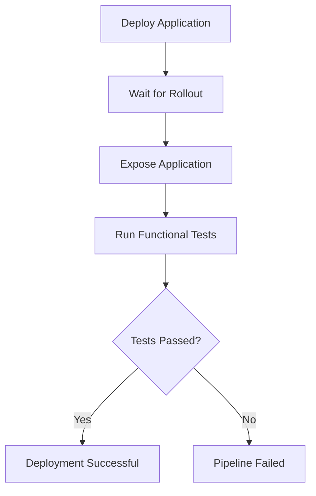

# Functional Testing

## Overview

Functional testing validates the deployed application from an end-user perspective.

Unlike unit tests, which verify individual components, functional tests verify that the complete application behaves correctly after deployment to Google Kubernetes Engine (GKE).

The tests execute automatically after a successful deployment.

---

# Purpose

The objective of functional testing is to verify that:

- The application is reachable
- HTTP requests return successful responses
- API endpoints behave correctly
- Expected JSON responses are returned
- The deployed version is healthy

This provides confidence that the deployment completed successfully.

---

# Testing Workflow



---

# Testing Tool

The project uses **Postman Collections** executed through **Newman**.

| Tool | Purpose |
|------|---------|
| Postman | API collection |
| Newman | Command-line execution |
| GitHub Actions | Pipeline automation |

---

# Test Collection

The repository contains:

```
tests/

└── hello-gke-functional.postman_collection.json
```

The collection validates the application's HTTP API.

---

# Test Scenarios

Current functional tests verify:

- Application responds successfully
- HTTP status code is 200
- Response is valid JSON
- Environment value is correct
- Response contains the expected message

Example expected response:

```json
{
  "environment": "dev",
  "message": "Hello from Ingress"
}
```

---

# Initial Challenge

The application was initially exposed using a **ClusterIP Service**.

ClusterIP services are accessible only from inside the Kubernetes cluster.

GitHub Actions could not directly reach:

```
http://hello-gke
```

This resulted in errors such as:

```
Invalid URI

Can't connect to BASE_URL

Name or service not known
```

---

# Attempt 1

The pipeline attempted to retrieve a LoadBalancer IP.

Example:

```bash
kubectl get svc hello-gke
```

Result:

```
EXTERNAL-IP

<none>
```

Since the service was ClusterIP, no external address existed.

---

# Attempt 2

The application was later exposed through Kubernetes Ingress.

Example:

```bash
kubectl get ingress
```

Result:

```
ADDRESS

136.xxx.xxx.xxx
```

The application became accessible through the Ingress IP.

---

# Local Pipeline Validation

To simplify testing during development, the pipeline uses Kubernetes port forwarding.

Example:

```bash
kubectl port-forward svc/hello-gke 8080:80
```

Application becomes available locally:

```
http://localhost:8080
```

The pipeline then sets:

```bash
BASE_URL=localhost:8080
```

Newman executes against the local endpoint.

---

# Newman Execution

Example:

```bash
npx newman run \
tests/hello-gke-functional.postman_collection.json \
--env-var baseUrl=http://localhost:8080
```

This executes the Postman collection and validates the deployed application.

---

# Pipeline Position

Functional testing occurs after deployment.

Pipeline sequence:

```text
Build

↓

Docker Image

↓

Security Scan

↓

Deploy

↓

Wait for Rollout

↓

Functional Tests

↓

Deployment Complete
```

Only healthy deployments complete successfully.

---

# Benefits

Functional testing provides several advantages.

- Validates deployed application
- Confirms Kubernetes networking
- Verifies API behavior
- Detects deployment failures
- Prevents unhealthy releases

---

# Future Improvements

Future enhancements include:

- Multiple API endpoints
- Authentication testing
- Negative test cases
- Response time validation
- Performance testing
- Load testing
- Integration with monitoring

---

# Best Practices Followed

The project follows several functional testing best practices.

- Automated execution
- Tests executed after deployment
- API validation
- JSON response verification
- HTTP status validation
- Pipeline fails on test failures

---

# Key Takeaways

Functional testing acts as the final quality gate before considering a deployment successful.

While unit tests verify application logic, functional tests validate the deployed application running inside Kubernetes, ensuring that users receive the expected responses after every release.
