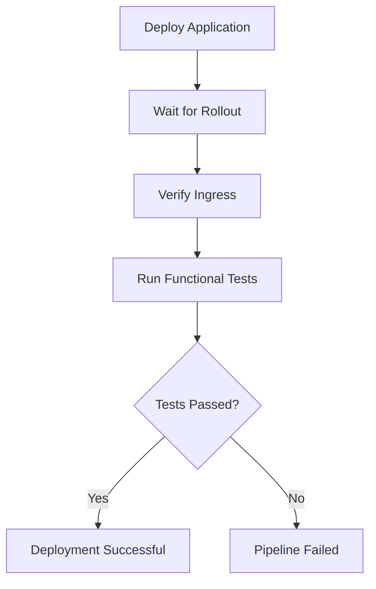

# 13 - Functional Testing

## Overview

Functional testing validates the deployed application from an end-user perspective.

Unlike unit tests, which verify individual components in isolation, functional tests verify that the complete application behaves correctly after being deployed to Google Kubernetes Engine (GKE).

These tests execute automatically after a successful deployment and confirm that the application is accessible over HTTPS using the public domain.

---

# Purpose

The objective of functional testing is to verify that:

- The application is reachable
- HTTPS is working correctly
- DNS resolution is successful
- HTTP requests return successful responses
- API endpoints behave correctly
- Expected JSON responses are returned
- The deployed version is healthy

Successful functional tests provide confidence that the deployment completed successfully.

---

# Testing Workflow



---

# Testing Tools

The project uses the following tools for API validation.

| Tool | Purpose |
|------|---------|
| Postman | API collection |
| Newman | Command-line execution |
| GitHub Actions | Pipeline automation |

---

# Test Collection

The repository contains the Postman collection used for functional testing.

```
tests/

└── hello-gke-functional.postman_collection.json
```

The collection validates the deployed application's REST API.

---

# Test Scenarios

The current functional tests verify:

- Application is reachable
- HTTPS connection succeeds
- HTTP status code is 200
- Response is valid JSON
- Environment value is correct
- Expected application message is returned

Expected response:

```json
{
  "environment": "dev",
  "message": "Hello from GKE"
}
```

---

# Accessing the Application

The application is exposed through the NGINX Ingress Controller using a custom domain.

```
https://app.devopswithsachin.in
```

Traffic flow:

```text
User

↓

HTTPS

↓

NGINX Ingress Controller

↓

ClusterIP Service

↓

Spring Boot Pods
```

This closely resembles how applications are accessed in production Kubernetes environments.

---

# Early Challenges

During development, several approaches were explored before arriving at the final solution.

### ClusterIP Service

Initially, the application was exposed only through a ClusterIP Service.

Because ClusterIP services are internal to the Kubernetes cluster, GitHub Actions could not access the application directly.

Typical errors included:

```
Connection refused

Invalid URI

Name or service not known
```

---

### LoadBalancer Service

A LoadBalancer Service was also evaluated.

Although it exposed the application externally, it required a dedicated public IP address for each application and was not suitable for a scalable ingress architecture.

---

### Final Solution

The final implementation uses:

- NGINX Ingress Controller
- Custom domain
- cert-manager
- Let's Encrypt
- HTTPS

This allows both users and automated tests to access the application through a production-style endpoint.

---

# Newman Execution

The GitHub Actions workflow executes the Postman collection using Newman.

Example:

```bash
npx newman run \
tests/hello-gke-functional.postman_collection.json \
--env-var baseUrl=https://app.devopswithsachin.in
```

Newman validates the application's response and exits with a non-zero status if any test fails.

---

# Pipeline Position

Functional testing is the final validation step of the deployment pipeline.

Pipeline flow:

```text
Checkout Source

↓

Build Application

↓

Run Unit Tests

↓

Docker Build

↓

Push Artifact Registry

↓

Trivy Scan

↓

Helm Deployment

↓

Wait for Rollout

↓

Functional Tests

↓

Deployment Successful
```

Only healthy deployments complete successfully.

---

# Benefits

Automated functional testing provides several advantages:

- Validates deployed application
- Verifies Kubernetes networking
- Confirms HTTPS configuration
- Validates Ingress routing
- Detects deployment failures
- Prevents unhealthy releases

---

# Best Practices Implemented

This project follows several functional testing best practices:

- Automated execution
- Tests executed after deployment
- HTTPS validation
- API response validation
- JSON response verification
- HTTP status validation
- Pipeline fails on test failures
- Production-style endpoint testing

---

# Future Improvements

Potential enhancements include:

- Additional API endpoint testing
- Authentication testing
- Negative test cases
- Response time validation
- Performance testing
- Load testing
- Integration with monitoring and alerting

---

# Key Takeaways

Functional testing serves as the final quality gate in the CI/CD pipeline.

While unit tests validate application logic, functional tests verify the fully deployed application running on Google Kubernetes Engine.

By testing the live application through **https://app.devopswithsachin.in**, the pipeline confirms that Kubernetes deployments, Ingress routing, DNS resolution, HTTPS, and the application itself are all functioning correctly before considering a deployment successful.
