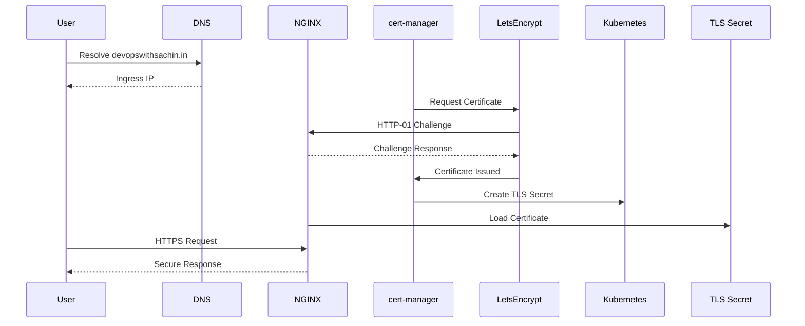
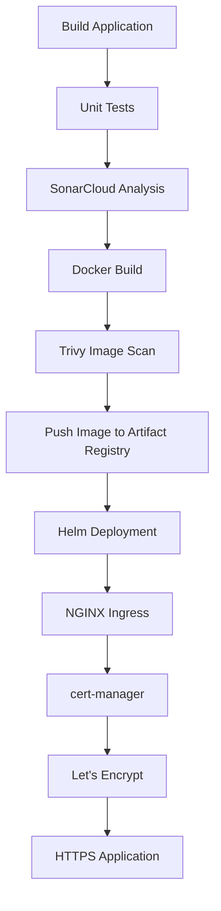

# cert-manager and TLS with Let's Encrypt

## Overview

Securing applications with HTTPS is a fundamental requirement for production Kubernetes environments. HTTPS encrypts communication between clients and servers, protects sensitive information, and establishes trust through publicly trusted Certificate Authorities (CAs).

In this project, HTTPS is implemented using **cert-manager** together with **Let's Encrypt**. Rather than manually creating and renewing TLS certificates, cert-manager automates the complete certificate lifecycle, ensuring certificates remain valid without operational intervention.

The application is exposed through the custom domain:

```
devopswithsachin.in
```

and is secured using a trusted TLS certificate issued by Let's Encrypt.

---

# Why HTTPS?

HTTP transmits data in plain text, making it vulnerable to interception and manipulation.

HTTPS provides:

- End-to-end encryption
- Server identity verification
- Data integrity
- Browser trust
- Compliance with modern security standards

Benefits include:

- Secure communication between clients and the application
- Protection against man-in-the-middle (MITM) attacks
- Trusted browser connection without security warnings
- Improved security for APIs and web applications

---

# Why cert-manager?

Managing certificates manually becomes increasingly difficult as applications and environments grow.

Common challenges include:

- Manual certificate generation
- Tracking certificate expiration dates
- Manual certificate renewal
- Risk of production outages caused by expired certificates
- Complex certificate management across multiple Kubernetes clusters

cert-manager solves these challenges by automating the entire certificate lifecycle.

Key benefits include:

- Automatic certificate requests
- Automatic certificate renewal
- Native Kubernetes integration
- Let's Encrypt integration
- Kubernetes Secret management
- Production-ready certificate automation

---

# Why Let's Encrypt?

Let's Encrypt is a free, automated, and publicly trusted Certificate Authority (CA).

Advantages include:

- Free SSL/TLS certificates
- Trusted by all major browsers
- Automated certificate issuance
- Automated renewal
- ACME protocol support
- Widely adopted in cloud-native environments

Using Let's Encrypt eliminates the need to purchase or manually manage SSL certificates while maintaining production-grade security.

---

# Project Architecture

```text
                Internet
                    │
                    │ HTTPS
                    ▼
        devopswithsachin.in
                    │
                    ▼
      Google Cloud Load Balancer
                    │
                    ▼
      NGINX Ingress Controller
                    │
          TLS Secret (Kubernetes)
                    │
              cert-manager
                    │
            Let's Encrypt CA
                    │
         ACME HTTP-01 Validation
                    │
             Kubernetes Cluster
                    │
                    ▼
          Spring Boot Application
```

---

# Prerequisites

Before enabling HTTPS, the following components were already deployed:

- Private Google Kubernetes Engine (GKE) cluster
- NGINX Ingress Controller
- Public Load Balancer
- Registered domain (`devopswithsachin.in`)
- DNS A record pointing to the Ingress external IP
- Internet-accessible application
- Helm installed on the management VM

---

# Installing cert-manager

The project uses the official **Jetstack Helm Chart** to install cert-manager.

First, add the Helm repository:

```bash
helm repo add jetstack https://charts.jetstack.io

helm repo update
```

Install cert-manager:

```bash
helm install cert-manager jetstack/cert-manager \
  --namespace cert-manager \
  --create-namespace \
  --set crds.enabled=true
```

Enabling `crds.enabled=true` installs the required Custom Resource Definitions (CRDs) used by cert-manager.

---

# Verify Installation

Verify that all cert-manager components are running successfully.

```bash
kubectl get pods -n cert-manager
```

Expected output:

```text
cert-manager

cert-manager-cainjector

cert-manager-webhook
```

Verify the installed CRDs:

```bash
kubectl get crds | grep cert-manager
```

Example:

```text
certificaterequests.cert-manager.io
certificates.cert-manager.io
challenges.acme.cert-manager.io
clusterissuers.cert-manager.io
issuers.cert-manager.io
orders.acme.cert-manager.io
```

---

# Creating the ClusterIssuer

A **ClusterIssuer** is a cluster-wide resource that defines how certificates are obtained.

This project uses Let's Encrypt's production ACME server.

Example:

```yaml
apiVersion: cert-manager.io/v1
kind: ClusterIssuer

metadata:
  name: letsencrypt-prod

spec:
  acme:
    email: your-email@example.com

    server: https://acme-v02.api.letsencrypt.org/directory

    privateKeySecretRef:
      name: letsencrypt-prod

    solvers:
      - http01:
          ingress:
            class: nginx
```

Apply the configuration:

```bash
kubectl apply -f clusterissuer.yaml
```

Verify:

```bash
kubectl get clusterissuer
```

Expected:

```text
NAME                READY   AGE

letsencrypt-prod    True    2m
```

---

# DNS Configuration

A public DNS **A record** was configured for the project domain.

Example:

```text
Host

devopswithsachin.in

↓

Google Cloud Load Balancer External IP
```

Once DNS propagation completed, Let's Encrypt could successfully validate domain ownership using the HTTP-01 challenge.

Verify DNS resolution:

```bash
nslookup devopswithsachin.in
```

or

```bash
dig devopswithsachin.in
```

The resolved IP should match the external IP address of the Kubernetes Ingress.

---

# Configuring the Ingress

The existing NGINX Ingress was updated to request a TLS certificate automatically.

Example:

```yaml
metadata:
  annotations:
    cert-manager.io/cluster-issuer: letsencrypt-prod

spec:

  ingressClassName: nginx

  tls:
    - hosts:
        - devopswithsachin.in
      secretName: hello-gke-tls

  rules:
    - host: devopswithsachin.in

      http:

        paths:
          - path: /
            pathType: Prefix
```

The annotation instructs cert-manager to request a certificate from the configured ClusterIssuer.

Once issued, the certificate is stored inside the Kubernetes Secret:

```text
hello-gke-tls
```

NGINX Ingress automatically loads the certificate from this Secret and begins serving HTTPS traffic.

---

# Certificate Issuance Workflow

The complete certificate lifecycle is fully automated.



This process occurs automatically without manual certificate creation or renewal.

---

# Verification

After applying the Ingress and ClusterIssuer, cert-manager automatically creates several Kubernetes resources during the certificate issuance process.

Verify the ClusterIssuer:

```bash
kubectl get clusterissuer
```

Verify the Certificate:

```bash
kubectl get certificate
```

Describe the Certificate:

```bash
kubectl describe certificate hello-gke-tls
```

Verify the CertificateRequest:

```bash
kubectl get certificaterequest
```

Verify the ACME Order:

```bash
kubectl get order
```

Verify the Challenge:

```bash
kubectl get challenge
```

Verify the generated TLS Secret:

```bash
kubectl get secret hello-gke-tls
```

Once the certificate has been issued successfully, verify HTTPS by opening:

```
https://devopswithsachin.in
```

or

```bash
curl -I https://devopswithsachin.in
```

A successful response confirms that the application is serving traffic over HTTPS using a trusted Let's Encrypt certificate.

---

# Automatic Certificate Renewal

Let's Encrypt certificates are valid for **90 days**.

cert-manager continuously monitors certificate expiration and automatically renews certificates before they expire.

The renewal workflow is fully automated:

```text
Certificate Near Expiry

↓

cert-manager

↓

Let's Encrypt

↓

New Certificate Issued

↓

Kubernetes Secret Updated

↓

NGINX Reloads Certificate

↓

HTTPS Continues Without Downtime
```

No manual intervention is required during the renewal process.

---

# CI/CD Integration

TLS configuration is managed as part of the Kubernetes manifests deployed through Helm.

The deployment workflow is:



This ensures that every deployment is automatically exposed through a secure HTTPS endpoint.

---

# Real Issues Encountered

## Issue 1 — cert-manager-cainjector CrashLoopBackOff

### Problem

The `cert-manager-cainjector` Pod repeatedly entered the `CrashLoopBackOff` state.

### Root Cause

cert-manager was initially installed without the required Custom Resource Definitions (CRDs).

### Resolution

Reinstalled cert-manager using Helm with CRDs enabled:

```bash
helm install cert-manager jetstack/cert-manager \
  --namespace cert-manager \
  --create-namespace \
  --set crds.enabled=true
```

---

## Issue 2 — Webhook Not Available

### Problem

Certificate creation failed because the webhook was unavailable.

Example error:

```
No agent available
```

### Root Cause

The initial installation was incomplete, causing the webhook component to fail.

### Resolution

Completely removed the existing installation and performed a clean Helm installation.

After reinstalling, all cert-manager components became healthy.

---

## Issue 3 — Invalid TLS Host

### Problem

Helm deployment failed with:

```
spec.tls.hosts[0]: Invalid value ""
```

### Root Cause

TLS was enabled in the Ingress manifest, but the hostname value was empty.

### Resolution

Updated the Helm values file to use the correct production domain:

```
devopswithsachin.in
```

The deployment completed successfully after the hostname was configured.

---

## Issue 4 — Certificate Not Issued

### Problem

The Certificate remained in the **Pending** state.

### Root Cause

DNS propagation had not yet completed.

Let's Encrypt could not validate ownership of the domain during the HTTP-01 challenge.

### Resolution

Verified that the DNS A record pointed to the NGINX Ingress external IP and waited for DNS propagation to complete.

After propagation, cert-manager automatically retried the request and the certificate was successfully issued.

---

# Troubleshooting Commands

Verify cert-manager Pods:

```bash
kubectl get pods -n cert-manager
```

View Certificate details:

```bash
kubectl describe certificate hello-gke-tls
```

View CertificateRequest:

```bash
kubectl describe certificaterequest
```

View Challenge:

```bash
kubectl describe challenge
```

View Order:

```bash
kubectl describe order
```

Verify Ingress:

```bash
kubectl describe ingress hello-gke
```

Verify DNS:

```bash
nslookup devopswithsachin.in
```

Check cert-manager logs:

```bash
kubectl logs deployment/cert-manager -n cert-manager
```

---

# Best Practices

This project follows several TLS and certificate management best practices.

- Use publicly trusted certificates from Let's Encrypt
- Automate certificate lifecycle management
- Use ClusterIssuer for cluster-wide certificate management
- Store certificates only as Kubernetes Secrets
- Never commit TLS certificates or private keys to Git
- Monitor certificate status and renewal
- Use HTTPS for all external traffic
- Keep cert-manager updated
- Manage Ingress resources through Helm

---

# Interview Questions

1. Why should production applications use HTTPS?
2. What is TLS?
3. What is the difference between HTTP and HTTPS?
4. What is cert-manager?
5. What problem does cert-manager solve?
6. What is ACME?
7. What is Let's Encrypt?
8. What is the difference between Issuer and ClusterIssuer?
9. How does HTTP-01 validation work?
10. Where are TLS certificates stored in Kubernetes?
11. How does cert-manager automatically renew certificates?
12. What happens when a certificate expires?
13. Why are Kubernetes Secrets used to store certificates?
14. Why is NGINX Ingress required for HTTP-01 validation?
15. How do you troubleshoot a pending Certificate resource?

---

# Key Takeaways

Implementing cert-manager with Let's Encrypt transformed the application from using plain HTTP to a production-ready HTTPS deployment with fully automated certificate management.

The solution now provides:

- Trusted HTTPS using Let's Encrypt
- Automated certificate provisioning
- Automatic certificate renewal
- Secure certificate storage in Kubernetes Secrets
- Seamless integration with NGINX Ingress
- Infrastructure managed declaratively through Kubernetes and Helm

This implementation aligns with modern cloud-native best practices and demonstrates how production Kubernetes environments securely expose applications without requiring manual certificate management.
