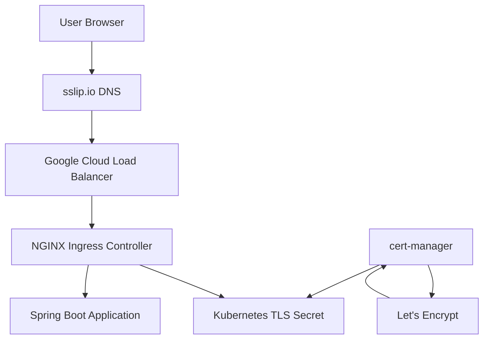
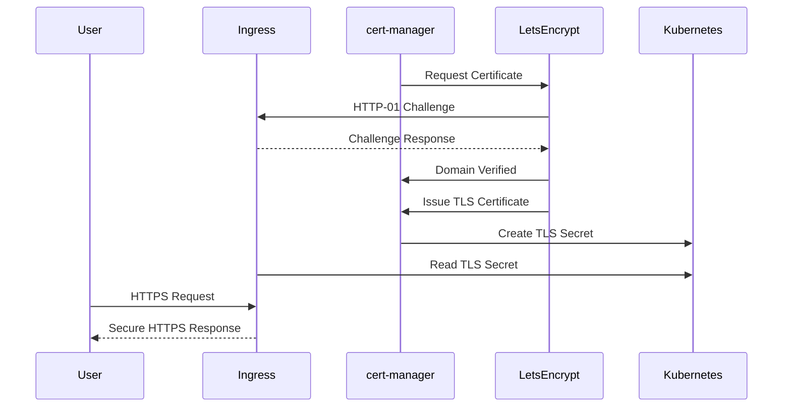
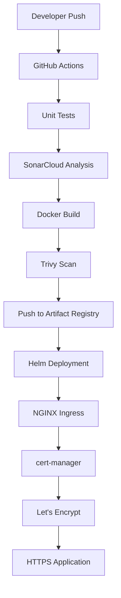

# cert-manager and TLS with Let's Encrypt

## Overview

Modern applications exposed to the Internet should always use **HTTPS** instead of HTTP.

HTTPS encrypts communication between clients and servers, ensuring confidentiality, integrity, and authenticity of the transmitted data.

In Kubernetes, manually creating, distributing, and renewing TLS certificates quickly becomes difficult as the number of applications grows. To simplify certificate management, this project uses **cert-manager** together with **Let's Encrypt** to automatically issue, manage, and renew TLS certificates for applications exposed through the **NGINX Ingress Controller**.

The complete certificate lifecycle is automated, making the solution suitable for production Kubernetes environments.

This implementation is integrated into the overall Platform Engineering project, where the application is deployed to a private Google Kubernetes Engine (GKE) cluster using GitHub Actions and Helm.

---

# Why HTTPS?

HTTP sends data between clients and servers as plain text.

Anyone intercepting network traffic can potentially read:

- User credentials
- Session cookies
- API requests
- Sensitive application data

HTTPS protects against these risks by encrypting all communication using TLS.

Benefits include:

- Encrypted communication
- Data integrity
- Server authentication
- Browser trust
- Improved security posture
- Compliance with industry standards

Modern browsers also flag HTTP websites as **Not Secure**, making HTTPS a production requirement rather than an optional feature.

---

# What is TLS?

**TLS (Transport Layer Security)** is the protocol that secures communication over HTTPS.

TLS provides three important security guarantees:

### Encryption

Ensures that transmitted data cannot be read by unauthorized parties.

### Integrity

Ensures that transmitted data cannot be modified during transit.

### Authentication

Verifies that users are communicating with the legitimate server.

---

# Why cert-manager?

Managing certificates manually becomes increasingly complex as applications grow.

Common operational challenges include:

- Manual certificate requests
- Manual certificate installation
- Manual renewal before expiration
- Risk of expired certificates
- Service outages caused by expired TLS certificates
- Managing certificates across multiple environments

cert-manager automates the complete certificate lifecycle.

Benefits include:

- Automatic certificate issuance
- Automatic certificate renewal
- Native Kubernetes integration
- Secret management
- Integration with multiple Certificate Authorities
- Production-ready HTTPS

Instead of manually tracking certificate expiration dates, Kubernetes automatically renews certificates before they expire.

---

# Why Let's Encrypt?

Let's Encrypt is a free, automated, and widely trusted Certificate Authority (CA).

Rather than purchasing SSL certificates from commercial providers, Let's Encrypt allows applications to obtain trusted certificates automatically using the ACME protocol.

Advantages include:

- Free certificates
- Trusted by all major browsers
- Automatic issuance
- Automatic renewal
- Production-ready
- Native cert-manager integration
- No manual intervention

Because certificates are trusted by browsers, users do not receive certificate warnings when accessing the application.

---

# What is ACME?

**ACME (Automatic Certificate Management Environment)** is the protocol used by Let's Encrypt to automate certificate issuance and renewal.

The certificate issuance process follows these steps:

1. cert-manager requests a certificate.
2. Let's Encrypt verifies domain ownership.
3. Domain validation succeeds.
4. Let's Encrypt issues the certificate.
5. cert-manager stores the certificate in Kubernetes.
6. NGINX Ingress begins serving HTTPS traffic.

The entire process is fully automated.

---

# Why sslip.io?

Let's Encrypt requires a publicly accessible domain to validate certificate requests.

During development, purchasing a custom domain was unnecessary.

Instead, this project used **sslip.io**, a free dynamic DNS service.

sslip.io automatically maps an IP address into a valid DNS hostname.

Example:

```
34.136.210.25
```

becomes

```
hello-gke.34.136.210.25.sslip.io
```

No DNS server configuration is required.

This approach is ideal for:

- Learning Kubernetes
- Development environments
- Demonstration projects
- Temporary deployments

---

# Architecture



---

# TLS Certificate Lifecycle



---

# How HTTPS Works in This Project

The application deployment follows this sequence:

```text
User

↓

HTTPS Request

↓

Google Cloud Load Balancer

↓

NGINX Ingress Controller

↓

TLS Secret

↓

Spring Boot Application
```

When a user opens the application:

1. The browser connects using HTTPS.
2. NGINX presents the TLS certificate stored as a Kubernetes Secret.
3. The browser verifies the certificate against Let's Encrypt.
4. A secure TLS session is established.
5. All subsequent communication is encrypted.

The application itself continues to communicate internally over the Kubernetes network, while external traffic remains protected using HTTPS.

---

# Benefits of Automated TLS

Automating certificate management provides several operational advantages.

- Eliminates manual certificate management
- Prevents certificate expiration outages
- Reduces operational effort
- Simplifies Kubernetes deployments
- Improves application security
- Enables production-ready HTTPS
- Supports automated certificate renewal
- Integrates seamlessly with Kubernetes Ingress

---

# Components

The HTTPS implementation consists of several Kubernetes and cloud-native components working together.

| Component | Purpose |
|-----------|----------|
| NGINX Ingress Controller | Accepts incoming HTTP/HTTPS traffic |
| cert-manager | Automates certificate lifecycle |
| ClusterIssuer | Configures the Certificate Authority |
| Certificate | Requests TLS certificates |
| CertificateRequest | Internal certificate request resource |
| Order | ACME order created with Let's Encrypt |
| Challenge | Proves domain ownership |
| Kubernetes Secret | Stores TLS certificate and private key |
| Let's Encrypt | Trusted public Certificate Authority |
| sslip.io | Dynamic DNS service |

Each component has a specific responsibility within the certificate issuance workflow.

---

# Prerequisites

Before enabling HTTPS, the following components were already configured as part of this project:

- Private Google Kubernetes Engine (GKE) cluster
- NGINX Ingress Controller
- Helm
- kubectl configured to access the cluster
- Public LoadBalancer IP
- Public DNS hostname (sslip.io)
- Internet-accessible application
- Cluster administrator permissions

Verify cluster connectivity:

```bash
kubectl get nodes
```

Verify the Ingress Controller:

```bash
kubectl get pods -n ingress-nginx

kubectl get svc -n ingress-nginx
```

Expected output:

```text
NAME                                 TYPE           EXTERNAL-IP
ingress-nginx-controller             LoadBalancer   34.xxx.xxx.xxx
```

---

# Installing cert-manager

This project installs cert-manager using **Helm**, which is the recommended installation method for production Kubernetes environments.

## Add the Helm Repository

```bash
helm repo add jetstack https://charts.jetstack.io

helm repo update
```

---

## Install cert-manager

```bash
helm install cert-manager jetstack/cert-manager \
  --namespace cert-manager \
  --create-namespace \
  --set crds.enabled=true
```

### Why `crds.enabled=true`?

cert-manager depends on several **Custom Resource Definitions (CRDs)** such as:

- Certificate
- ClusterIssuer
- Issuer
- Challenge
- Order
- CertificateRequest

Without these CRDs, cert-manager components cannot function correctly.

---

# Verify Installation

Confirm that all cert-manager Pods are running.

```bash
kubectl get pods -n cert-manager
```

Example:

```text
NAME                                      READY

cert-manager                              1/1

cert-manager-cainjector                   1/1

cert-manager-webhook                      1/1
```

---

Verify the CRDs.

```bash
kubectl get crds | grep cert-manager
```

Example:

```text
certificates.cert-manager.io

clusterissuers.cert-manager.io

issuers.cert-manager.io

orders.acme.cert-manager.io

challenges.acme.cert-manager.io
```

---

Verify Helm installation.

```bash
helm list -n cert-manager
```

Example:

```text
NAME

cert-manager
```

---

# Creating the ClusterIssuer

A **ClusterIssuer** defines how cert-manager communicates with a Certificate Authority.

Unlike a namespace-scoped Issuer, a ClusterIssuer can be used by applications across the entire Kubernetes cluster.

This project uses Let's Encrypt Production.

Example:

```yaml
apiVersion: cert-manager.io/v1
kind: ClusterIssuer

metadata:
  name: letsencrypt-prod

spec:
  acme:
    email: your-email@example.com

    server: https://acme-v02.api.letsencrypt.org/directory

    privateKeySecretRef:
      name: letsencrypt-prod

    solvers:
      - http01:
          ingress:
            class: nginx
```

Apply the configuration.

```bash
kubectl apply -f clusterissuer.yaml
```

Verify:

```bash
kubectl get clusterissuer
```

Expected output:

```text
NAME               READY

letsencrypt-prod   True
```

---

# Configuring the Ingress

The Ingress resource instructs cert-manager to request a TLS certificate automatically.

Example:

```yaml
metadata:
  annotations:
    cert-manager.io/cluster-issuer: letsencrypt-prod

spec:

  ingressClassName: nginx

  tls:
    - hosts:
        - hello-gke.34.136.210.25.sslip.io
      secretName: hello-gke-tls

  rules:
    - host: hello-gke.34.136.210.25.sslip.io

      http:
        paths:
          - path: /
            pathType: Prefix
```

Important configuration:

- `cluster-issuer` annotation tells cert-manager which Certificate Authority to use.
- `tls.secretName` defines where the issued certificate will be stored.
- `hosts` specifies the hostname that will be protected.

---

# DNS Configuration

For Let's Encrypt HTTP-01 validation to succeed, the hostname must resolve to the public IP of the NGINX Ingress Controller.

This project uses **sslip.io**, eliminating the need to purchase or manage a public domain.

Example:

```text
Ingress External IP

↓

34.136.210.25

↓

hello-gke.34.136.210.25.sslip.io
```

Verify the hostname resolves correctly.

```bash
nslookup hello-gke.34.136.210.25.sslip.io
```

or

```bash
dig hello-gke.34.136.210.25.sslip.io
```

Successful resolution confirms that Let's Encrypt can validate the domain.

---

# Certificate Request Flow

After applying the Ingress resource, the certificate issuance process begins automatically.

```text
Ingress Created

↓

cert-manager Detects TLS Configuration

↓

Certificate Resource Created

↓

CertificateRequest Created

↓

ACME Order Created

↓

HTTP-01 Challenge Created

↓

Let's Encrypt Validates Domain

↓

TLS Certificate Issued

↓

TLS Secret Created

↓

NGINX Reloads Configuration

↓

HTTPS Enabled
```

This process is entirely automated.

No manual certificate generation or installation is required.

---

# Kubernetes Resources Created

During certificate issuance, cert-manager automatically creates several Kubernetes resources.

Verify the Certificate.

```bash
kubectl get certificate
```

Verify CertificateRequest.

```bash
kubectl get certificaterequest
```

Verify ACME Orders.

```bash
kubectl get order
```

Verify Challenges.

```bash
kubectl get challenge
```

Verify TLS Secret.

```bash
kubectl get secret
```

These resources provide complete visibility into the certificate issuance lifecycle and are extremely useful when troubleshooting certificate-related issues.

---

# Verification

After configuring the ClusterIssuer and Ingress, cert-manager automatically begins requesting a TLS certificate from Let's Encrypt.

The following commands can be used to verify each stage of the process.

## Verify ClusterIssuer

```bash
kubectl get clusterissuer
```

Example:

```text
NAME                READY   AGE

letsencrypt-prod    True    5m
```

---

## Verify Certificate

```bash
kubectl get certificate
```

Describe the certificate:

```bash
kubectl describe certificate hello-gke-tls
```

Expected status:

```text
Ready: True
```

---

## Verify CertificateRequest

```bash
kubectl get certificaterequest
```

Describe:

```bash
kubectl describe certificaterequest
```

CertificateRequest represents the request sent by cert-manager to the Certificate Authority.

---

## Verify ACME Order

```bash
kubectl get order
```

Describe:

```bash
kubectl describe order
```

The Order resource represents the certificate order submitted to Let's Encrypt.

---

## Verify HTTP Challenge

```bash
kubectl get challenge
```

Describe:

```bash
kubectl describe challenge
```

Challenge resources indicate whether Let's Encrypt successfully validated domain ownership.

---

## Verify TLS Secret

Once the certificate has been issued, cert-manager automatically creates a Kubernetes Secret.

```bash
kubectl get secret hello-gke-tls
```

Describe:

```bash
kubectl describe secret hello-gke-tls
```

The Secret contains:

- TLS certificate
- Private key

NGINX Ingress automatically loads this Secret and begins serving HTTPS traffic.

---

## Verify Ingress

```bash
kubectl get ingress
```

Example:

```text
NAME          CLASS   HOSTS                                    ADDRESS

hello-gke     nginx   hello-gke.34.xxx.xxx.xxx.sslip.io        34.xxx.xxx.xxx
```

Describe:

```bash
kubectl describe ingress hello-gke
```

Verify:

- Ingress Class
- TLS section
- Secret Name
- Backend Service
- Hostname

---

## Test HTTPS

The application should now be accessible securely.

Example:

```bash
curl https://hello-gke.34.xxx.xxx.xxx.sslip.io
```

Expected response:

```json
{
  "message": "Hello from Ingress",
  "environment": "dev"
}
```

Opening the application in a browser should display a secure HTTPS connection without certificate warnings.

---

# CI/CD Pipeline Integration

TLS configuration is applied automatically during the deployment process.

The deployment workflow now looks like this:



Once Helm deploys the Ingress resource, cert-manager automatically handles certificate provisioning.

No additional pipeline steps are required.

---

# Automatic Certificate Renewal

Let's Encrypt certificates are valid for **90 days**.

One of the biggest advantages of cert-manager is automatic renewal.

Renewal workflow:

```text
Certificate Near Expiration

↓

cert-manager Detects Expiry

↓

Requests New Certificate

↓

Let's Encrypt Validation

↓

New Certificate Issued

↓

TLS Secret Updated

↓

NGINX Automatically Reloads

↓

HTTPS Continues Without Downtime
```

No manual intervention is required.

Applications continue serving HTTPS traffic while certificates are renewed in the background.

---

# Real Issues Encountered

During implementation, several real-world issues were encountered.

These troubleshooting experiences significantly improved understanding of cert-manager and Kubernetes networking.

---

## Issue 1 – cert-manager-cainjector CrashLoopBackOff

### Problem

The `cert-manager-cainjector` Pod continuously restarted.

Example:

```text
CrashLoopBackOff
```

### Root Cause

cert-manager was installed without the required Custom Resource Definitions (CRDs).

Without CRDs, cert-manager components cannot initialize correctly.

### Resolution

Reinstall cert-manager with CRDs enabled.

```bash
helm install cert-manager jetstack/cert-manager \
  --namespace cert-manager \
  --create-namespace \
  --set crds.enabled=true
```

---

## Issue 2 – cert-manager Webhook Failure

### Problem

Certificate creation failed.

Webhook logs reported errors similar to:

```text
No agent available
```

### Root Cause

The webhook component was not functioning correctly because the installation was incomplete.

### Resolution

Remove the existing installation.

```bash
helm uninstall cert-manager -n cert-manager
```

Delete the namespace if necessary.

Reinstall cert-manager using Helm.

After reinstalling, the webhook initialized successfully.

---

## Issue 3 – Helm Upgrade Failed

### Problem

Helm deployment failed.

Example:

```text
spec.tls.hosts[0]: Invalid value ""
```

### Root Cause

TLS was enabled in the Ingress configuration, but no hostname was provided.

Since Let's Encrypt validates hostnames, an empty host prevented certificate creation.

### Resolution

Update Helm values to include the correct hostname.

Example:

```yaml
tls:
  hosts:
    - hello-gke.34.xxx.xxx.xxx.sslip.io
```

Redeploy the Helm release.

---

## Issue 4 – No Public Domain Available

### Problem

Let's Encrypt requires a publicly resolvable domain.

A custom domain had not yet been purchased.

### Resolution

Use **sslip.io**.

Example:

```text
34.136.210.25

↓

hello-gke.34.136.210.25.sslip.io
```

This provided a publicly accessible hostname without requiring DNS configuration.

---

## Issue 5 – Certificate Remained Pending

### Problem

The Certificate resource never reached the Ready state.

### Root Cause

DNS propagation had not completed.

Let's Encrypt could not resolve the hostname.

### Resolution

Verify DNS resolution.

```bash
nslookup hello-gke.34.xxx.xxx.xxx.sslip.io
```

Once the hostname resolved correctly, certificate issuance completed successfully.

---

# Troubleshooting

## Certificate Not Ready

Verify:

```bash
kubectl describe certificate
```

Look for Events that indicate why issuance failed.

---

## CertificateRequest Failed

Verify:

```bash
kubectl describe certificaterequest
```

Common causes include:

- Invalid ClusterIssuer
- Incorrect email address
- ACME communication failures

---

## Challenge Failed

Verify:

```bash
kubectl describe challenge
```

Common causes:

- DNS not propagated
- Incorrect Ingress configuration
- HTTP-01 challenge unreachable

---

## Order Failed

Verify:

```bash
kubectl describe order
```

The Order resource provides detailed information about communication with Let's Encrypt.

---

## TLS Secret Not Created

Verify:

```bash
kubectl get secret
```

If the Secret does not exist:

- Check Certificate status
- Check CertificateRequest
- Check Challenge
- Check Order

---

## HTTPS Not Working

Verify:

```bash
kubectl describe ingress
```

Ensure:

- Ingress Class is `nginx`
- TLS section exists
- Secret name is correct
- Hostname matches DNS
- Backend Service is healthy

---

## cert-manager Logs

View controller logs:

```bash
kubectl logs deployment/cert-manager \
-n cert-manager
```

View webhook logs:

```bash
kubectl logs deployment/cert-manager-webhook \
-n cert-manager
```

View cainjector logs:

```bash
kubectl logs deployment/cert-manager-cainjector \
-n cert-manager
```

These logs are often the quickest way to diagnose certificate issuance problems.

---

# Best Practices

This project follows several Kubernetes and TLS best practices.

## Certificate Management

- Automate certificate issuance using cert-manager.
- Never generate production certificates manually.
- Use ClusterIssuer for cluster-wide certificate management.
- Store certificates as Kubernetes Secrets.
- Allow cert-manager to manage renewals automatically.

---

## Security

- Use trusted Certificate Authorities such as Let's Encrypt.
- Never commit TLS certificates or private keys to Git.
- Restrict access to Kubernetes Secrets using RBAC.
- Use HTTPS for all external endpoints.
- Disable plain HTTP when appropriate by redirecting traffic to HTTPS.

---

## Kubernetes

- Deploy cert-manager using Helm.
- Install CRDs during the initial installation.
- Use a dedicated namespace for cert-manager.
- Monitor certificate expiration.
- Regularly update cert-manager to supported releases.

---

## DNS

- Ensure DNS records correctly point to the Ingress LoadBalancer.
- Verify DNS propagation before troubleshooting certificate issues.
- Use DNS-01 validation for production wildcard certificates.
- Use HTTP-01 validation for simple web applications.

---

## Operations

- Monitor cert-manager Pods.
- Review Challenge and Order resources when troubleshooting.
- Keep backups of Kubernetes manifests.
- Document certificate issuance procedures.
- Regularly test HTTPS after deployments.

---

# Interview Questions

The following questions are commonly asked during Kubernetes, DevOps, and Platform Engineering interviews.

---

## 1. Why is HTTPS important?

HTTPS encrypts communication between clients and servers, preventing eavesdropping, tampering, and impersonation.

---

## 2. What is TLS?

TLS (Transport Layer Security) is the protocol used to secure communication over HTTPS by providing encryption, integrity, and authentication.

---

## 3. What is the difference between HTTP and HTTPS?

| HTTP | HTTPS |
|------|-------|
| Unencrypted | Encrypted |
| Port 80 | Port 443 |
| No identity verification | Uses TLS certificates |
| Less secure | Secure |

---

## 4. What is cert-manager?

cert-manager is a Kubernetes add-on that automates the issuance, renewal, and management of TLS certificates.

---

## 5. Why do we use cert-manager?

It eliminates manual certificate management and automatically renews certificates before they expire.

---

## 6. What is Let's Encrypt?

Let's Encrypt is a free, automated, and trusted Certificate Authority (CA) that issues publicly trusted TLS certificates.

---

## 7. What is ACME?

ACME (Automatic Certificate Management Environment) is the protocol used by Let's Encrypt to automate certificate issuance and renewal.

---

## 8. What is a ClusterIssuer?

A ClusterIssuer is a cluster-scoped resource that defines how cert-manager communicates with a Certificate Authority and can be used by applications across all namespaces.

---

## 9. What is the difference between Issuer and ClusterIssuer?

| Issuer | ClusterIssuer |
|--------|---------------|
| Namespace scoped | Cluster scoped |
| Used within one namespace | Shared across namespaces |

---

## 10. What is HTTP-01 validation?

HTTP-01 validation proves domain ownership by serving a challenge response over HTTP through the Ingress Controller.

---

## 11. What is DNS-01 validation?

DNS-01 validation proves domain ownership by creating a temporary DNS TXT record.

It is commonly used for wildcard certificates.

---

## 12. Where are TLS certificates stored?

TLS certificates are stored as Kubernetes Secrets.

---

## 13. What happens when a certificate expires?

Without automatic renewal, browsers reject HTTPS connections, causing service disruptions.

cert-manager renews certificates before expiration to avoid downtime.

---

## 14. How does cert-manager know when to renew a certificate?

It continuously monitors certificate validity and automatically starts the renewal process before the expiration date.

---

## 15. Why did we use sslip.io?

sslip.io provides a dynamic DNS hostname that maps directly to a public IP address, making it ideal for development and demo environments without purchasing a custom domain.

---

## 16. Why install cert-manager with Helm?

Helm simplifies installation, version management, upgrades, and rollback while ensuring all required components are deployed consistently.

---

## 17. What are CRDs?

Custom Resource Definitions (CRDs) extend the Kubernetes API with new resource types such as:

- Certificate
- ClusterIssuer
- CertificateRequest
- Order
- Challenge

---

## 18. What is the purpose of the Challenge resource?

The Challenge resource manages domain ownership validation with Let's Encrypt during certificate issuance.

---

## 19. What is the purpose of the Order resource?

The Order resource represents an ACME certificate order created with Let's Encrypt and tracks its progress until completion.

---

## 20. How can you troubleshoot certificate issues?

Useful commands include:

```bash
kubectl get certificate

kubectl describe certificate

kubectl get certificaterequest

kubectl get order

kubectl get challenge

kubectl logs deployment/cert-manager -n cert-manager

kubectl describe ingress
```

---

# Key Takeaways

Through this implementation, the project successfully achieved:

- Automated TLS certificate provisioning
- Automated certificate renewal
- Secure HTTPS communication
- Integration with NGINX Ingress Controller
- Production-style certificate lifecycle management
- Kubernetes-native certificate storage
- Trusted certificates issued by Let's Encrypt
- Dynamic DNS using sslip.io
- Helm-based installation and management
- Real-world troubleshooting experience with cert-manager

---

# Lessons Learned

Implementing HTTPS in Kubernetes involves more than simply creating a certificate.

This project provided hands-on experience with:

- Kubernetes networking
- Ingress Controllers
- TLS fundamentals
- Public Key Infrastructure (PKI)
- ACME protocol
- Certificate Authorities
- DNS validation
- Helm package management
- Kubernetes Secrets
- cert-manager internals
- Production troubleshooting

It also demonstrated how multiple Kubernetes components work together to deliver secure applications.

---

# Conclusion

Adding **cert-manager** and **Let's Encrypt** transformed the application from an unsecured HTTP deployment into a production-style HTTPS-enabled platform.

By automating certificate issuance and renewal, the platform eliminates manual operational tasks while ensuring secure communication for end users.

Combined with the private GKE cluster, NGINX Ingress Controller, GitHub Actions CI/CD pipeline, Helm deployments, Workload Identity Federation, Artifact Registry, Trivy image scanning, and automated testing, this implementation represents another key milestone in building a modern cloud-native Platform Engineering solution.

The approach aligns with Kubernetes best practices and provides a scalable, secure, and maintainable foundation for deploying production-ready applications.
