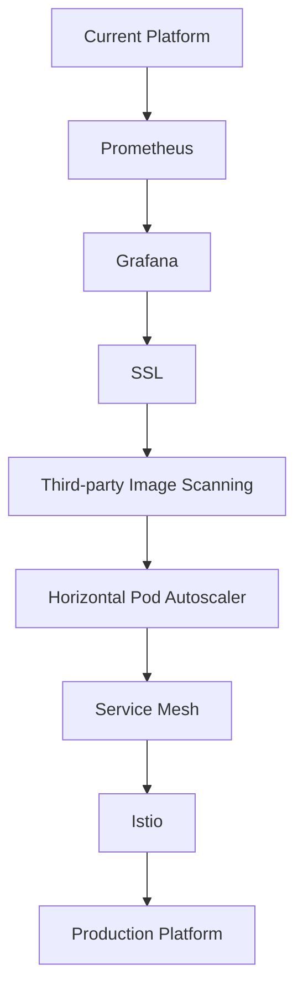

# Production Improvements

## Overview

This project demonstrates a production-style CI/CD platform running on Google Kubernetes Engine (GKE).

While the current implementation provides secure deployments, automated testing, and vulnerability scanning, several enhancements can further improve scalability, reliability, security, and operational visibility.

This document outlines the next steps toward building a complete enterprise-grade Kubernetes platform.

---

# Current Architecture

The project currently includes:

- Terraform-based infrastructure provisioning
- Private GKE cluster
- GitHub Actions CI/CD pipeline
- Workload Identity Federation
- Docker image build and Artifact Registry
- Container vulnerability scanning
- Helm deployments
- NGINX Ingress Controller
- Automated unit testing
- Automated functional testing

These components provide a strong foundation for a modern cloud-native platform.

---

# Planned Enhancements

The following improvements are planned for future iterations.

| Area | Status |
|------|--------|
| Third-party Image Scanning | Planned |
| HTTPS / SSL | Planned |
| Prometheus Monitoring | Planned |
| Grafana Dashboards | Planned |
| Horizontal Pod Autoscaler | Planned |
| Kubernetes Metrics Server | Planned |
| Service Mesh | Planned |
| Istio | Planned |
| Advanced Observability | Planned |
| Production Logging | Planned |

---

# Third-Party Container Scanning

Current implementation relies on Google Artifact Analysis.

Future work includes integrating dedicated container security tools such as:

- Trivy
- Grype
- Snyk

Benefits:

- Faster scanning
- SBOM generation
- Additional vulnerability databases
- Misconfiguration detection
- Secret scanning

---

# HTTPS / SSL

Current environment exposes the application using HTTP.

Future implementation will include:

- TLS encryption
- HTTPS endpoints
- Automatic certificate management
- Custom domains

Possible approaches:

- cert-manager
- Let's Encrypt
- Google Managed Certificates

Benefits:

- Encrypted communication
- Browser trust
- Improved security

---

# Prometheus Monitoring

Prometheus will be introduced as the primary monitoring solution.

Responsibilities:

- Collect metrics
- Monitor application health
- Store time-series data
- Generate alerts

Metrics examples:

- CPU usage
- Memory usage
- Pod health
- Request count
- Error rate
- Response latency

---

# Grafana Dashboards

Grafana will visualize metrics collected by Prometheus.

Planned dashboards include:

- Kubernetes Cluster
- Node Utilization
- Pod Health
- Application Metrics
- JVM Metrics
- Spring Boot Metrics
- CI/CD Dashboard

Benefits:

- Operational visibility
- Trend analysis
- Capacity planning

---

# Horizontal Pod Autoscaler (HPA)

Currently, replicas are managed manually.

Future implementation:

```text
CPU Increases

↓

Horizontal Pod Autoscaler

↓

Create Additional Pods
```

Example:

```bash
kubectl autoscale deployment hello-gke \
--cpu-percent=70 \
--min=2 \
--max=10
```

Benefits:

- Automatic scaling
- Improved availability
- Better resource utilization

---

# Metrics Server

The Metrics Server provides resource usage information required for autoscaling.

Responsibilities:

- CPU metrics
- Memory metrics
- HPA integration

Verification:

```bash
kubectl top nodes

kubectl top pods
```

---

# Service Mesh

Future deployments will introduce a Service Mesh.

Potential options:

- Istio
- Linkerd

Capabilities include:

- Secure service-to-service communication
- Traffic management
- Canary deployments
- Fault injection
- Retry policies
- Observability

---

# Istio

Planned implementation:

```text
Internet

↓

Ingress Gateway

↓

Envoy Proxy

↓

Application Pods
```

Features:

- Mutual TLS
- Traffic routing
- Circuit breaking
- Request tracing
- Authorization policies

---

# Advanced Observability

Future monitoring improvements include:

- Distributed tracing
- OpenTelemetry
- Jaeger
- Cloud Logging integration
- Cloud Monitoring integration

This enables complete visibility across the platform.

---

# Production Logging

Current implementation relies primarily on Kubernetes logs.

Future improvements include:

- Centralized logging
- Log aggregation
- Structured JSON logging
- Log retention policies

Potential solutions:

- Google Cloud Logging
- Elasticsearch
- Fluent Bit
- Loki

---

# Disaster Recovery

Future enhancements include:

- Backup strategies
- Infrastructure recovery
- Multi-region deployments
- Helm rollback procedures
- Automated recovery workflows

---

# Security Enhancements

Future security improvements may include:

- Binary Authorization
- Image signing with Cosign
- Kubernetes Admission Controllers
- Policy enforcement using Gatekeeper
- Secret management
- Runtime container security

---

# CI/CD Enhancements

Future pipeline improvements include:

- Pull Request validation
- Branch protection
- Release tagging
- Automatic versioning
- Progressive delivery
- Blue-Green deployments
- Canary deployments

---

# Platform Engineering Roadmap



---

# Lessons Learned

This project demonstrates that building a production-ready Kubernetes platform involves much more than deploying an application.

Key areas include:

- Infrastructure automation
- Secure authentication
- Continuous Integration
- Continuous Deployment
- Container security
- Kubernetes networking
- Automated testing
- Monitoring
- Scalability
- Operational excellence

Each enhancement builds upon the existing platform and moves it closer to enterprise production standards.

---

# Conclusion

This project successfully demonstrates a complete cloud-native deployment platform on Google Kubernetes Engine.

The current implementation provides a secure, automated, and repeatable deployment workflow using modern DevOps and Platform Engineering practices.

Future enhancements such as Prometheus, Grafana, HTTPS, Service Mesh, and advanced security controls will further strengthen the platform and align it with production environments used in large-scale enterprise organizations.
