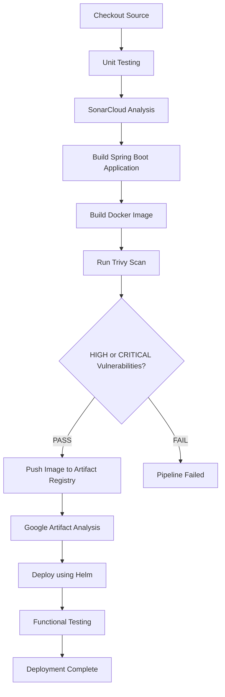

# Trivy Image Scanning

## Overview

Container images contain much more than application source code. Along with the application, they include operating system packages, language runtimes, third-party libraries, and application dependencies. Any of these components may contain publicly disclosed security vulnerabilities (CVEs) that could expose the application to security risks if deployed without validation.

To strengthen the security of this project, **Trivy** was integrated into the GitHub Actions CI/CD pipeline to perform vulnerability scanning immediately after the Docker image is built and before it is pushed to Google Artifact Registry.

By scanning images before publishing them, the CI/CD pipeline ensures that only images meeting the project's security policy are stored in the container registry and deployed to the private Google Kubernetes Engine (GKE) cluster.

This implementation follows modern DevSecOps practices by shifting security checks earlier in the software delivery lifecycle.

---

# Project Context

Initially, this project relied on **Google Artifact Analysis** to scan container images after they had been pushed to Google Artifact Registry.

Although Artifact Analysis provides valuable vulnerability information, the scanning process occurs only after the image has already been uploaded. This means vulnerable images could still exist inside the container registry.

To improve the security posture of the platform, Trivy was introduced into the GitHub Actions workflow.

The updated pipeline now validates container images before they are published, preventing images containing unacceptable vulnerabilities from ever reaching Artifact Registry.

The project therefore uses two complementary security mechanisms:

- **Trivy** for pre-push image validation
- **Google Artifact Analysis** for continuous post-push vulnerability monitoring

Together, these provide multiple layers of container image security.

---

# Objectives

The primary objectives of integrating Trivy into the CI/CD pipeline are:

- Detect known vulnerabilities before deployment
- Prevent insecure images from being published
- Enforce automated security policies
- Generate vulnerability reports for auditing
- Integrate findings with GitHub Security
- Reduce manual security verification
- Follow Shift Left Security principles

---

# Why Trivy?

Trivy is an open-source vulnerability scanner developed by Aqua Security.

It supports scanning multiple artifact types including:

- Container Images
- Filesystems
- Git repositories
- Kubernetes manifests
- Infrastructure as Code
- Software Bill of Materials (SBOM)
- Secrets (optional)

For this project, Trivy was selected because it is lightweight, fast, actively maintained, and integrates seamlessly with GitHub Actions.

Unlike cloud-native scanners that operate after an image is published, Trivy enables security validation directly within the build pipeline.

---

# Why Trivy Was Selected

Several container security solutions were evaluated before implementation.

Trivy was selected because it satisfies all project requirements.

| Requirement | Trivy |
|------------|--------|
| Open Source | ✅ |
| GitHub Actions Integration | ✅ |
| Fast Execution | ✅ |
| Local Image Scanning | ✅ |
| SARIF Support | ✅ |
| JSON Reports | ✅ |
| Active Community | ✅ |
| Production Adoption | ✅ |

These capabilities make Trivy well suited for modern DevSecOps pipelines.

---

# Shift Left Security

Traditionally, security validation occurred after software had already been deployed.

Modern DevSecOps practices encourage moving security earlier into the software development lifecycle.

This concept is known as **Shift Left Security**.

Instead of identifying vulnerabilities after deployment, security validation occurs during the build pipeline.

```text
Developer

↓

Source Code

↓

Build Docker Image

↓

Trivy Scan

↓

Security Policy

↓

Push Image

↓

Deploy to Kubernetes
```

By identifying vulnerabilities before deployment, operational risk is significantly reduced.

---

# Existing Security Workflow

Before introducing Trivy, the CI/CD workflow followed the sequence below.

```text
Build Docker Image

↓

Push to Artifact Registry

↓

Artifact Analysis Scan

↓

Deploy to Kubernetes
```

Although Google Artifact Analysis scanned every image, vulnerable images had already been uploaded to the registry.

---

# Updated Security Workflow

After integrating Trivy, the deployment workflow became:

```text
Build Docker Image

↓

Trivy Scan

↓

Security Validation

↓

Push to Artifact Registry

↓

Artifact Analysis

↓

Deploy to Kubernetes
```

This additional validation layer prevents vulnerable images from entering the container registry.

---

# CI/CD Pipeline Integration

Trivy is executed immediately after the Docker image is built.

This placement ensures vulnerabilities are identified before the image is published.

The current GitHub Actions pipeline follows the workflow below.



Only images that successfully pass the security policy continue through the deployment pipeline.

---

# Self-Hosted GitHub Actions Runner

The CI/CD pipeline executes on a self-hosted GitHub Actions runner running on a Google Compute Engine virtual machine.

Hosting the runner inside the same Virtual Private Cloud (VPC) as the private GKE cluster provides several advantages:

- Secure communication with the Kubernetes API
- Direct access to Artifact Registry
- Reduced network exposure
- Lower dependency on hosted runners
- Ability to manage private infrastructure

Because Trivy downloads and maintains its vulnerability database locally, the self-hosted runner also serves as the cache location for vulnerability definitions.

---

# Trivy Database

Before each scan, Trivy downloads the latest vulnerability database.

The database includes publicly disclosed vulnerabilities affecting:

- Linux operating systems
- Java dependencies
- Application frameworks
- Common open-source packages

Keeping the vulnerability database up to date ensures scans always use the latest available security information.

---

# Trivy Database Caching

Downloading the vulnerability database before every pipeline execution increases build time and unnecessary network usage.

To optimize performance, the GitHub Actions workflow caches the Trivy database on the self-hosted runner.

Example configuration:

```yaml
- name: Cache Trivy Database
  uses: actions/cache@v4
  with:
    path: ~/.cache/trivy
    key: trivy-db-${{ runner.os }}
    restore-keys: |
      trivy-db-
```

Benefits include:

- Faster pipeline execution
- Reduced internet bandwidth usage
- Reduced load on the Trivy database servers
- Improved performance for self-hosted runners

---

# Multiple Scan Strategy

Instead of performing a single scan, the pipeline executes Trivy multiple times for different purposes.

| Scan | Purpose | Pipeline Failure |
|------|---------|------------------|
| SARIF | GitHub Security Integration | No |
| JSON | Audit Report | No |
| Policy Enforcement | Block Vulnerable Images | Yes |

Separating these scans allows security reports to be generated while independently enforcing deployment policies.

---

# SARIF Report Generation

The first scan generates a **SARIF (Static Analysis Results Interchange Format)** report.

Example configuration:

```yaml
- name: Run Trivy Scan (SARIF)
  uses: aquasecurity/trivy-action@master
  with:
    image-ref: ${{ env.IMAGE_URI }}
    format: sarif
    output: trivy-results.sarif
    severity: HIGH,CRITICAL
    ignore-unfixed: true
    scanners: vuln
```

The SARIF report contains:

- Vulnerability ID
- Package Name
- Installed Version
- Fixed Version
- Severity
- Description

This scan does **not** stop the pipeline.

Its primary purpose is security reporting.

---

# GitHub Security Integration

After generating the SARIF report, GitHub automatically imports the findings into the repository Security tab.

Example workflow step:

```yaml
- name: Upload SARIF Report
  uses: github/codeql-action/upload-sarif@v3
  with:
    sarif_file: trivy-results.sarif
```

Benefits include:

- Centralized vulnerability management
- Security dashboard integration
- Historical vulnerability tracking
- Easy review of security findings

This allows developers to review vulnerabilities directly within GitHub.

---

# JSON Report Generation

A second Trivy scan generates a JSON report.

Example configuration:

```yaml
- name: Generate Trivy JSON Report
  uses: aquasecurity/trivy-action@master
  with:
    image-ref: ${{ env.IMAGE_URI }}
    format: json
    output: trivy-report.json
```

Unlike the SARIF report, the JSON report is primarily intended for:

- Auditing
- Automation
- Compliance
- Future integrations

The report is uploaded as a GitHub Actions artifact for later review.

---

# Uploading Security Reports

The generated JSON report is preserved as a workflow artifact.

Example:

```yaml
- name: Upload Trivy Report
  uses: actions/upload-artifact@v4
  with:
    name: trivy-report
    path: trivy-report.json
```

Storing reports provides several advantages:

- Security audit trail
- Historical comparison
- Offline analysis
- Compliance documentation

---

# Security Policy Enforcement

The final Trivy execution enforces the project's deployment policy.

Unlike the reporting scans, this execution determines whether deployment should continue.

Example:

```yaml
- name: Enforce Security Policy
  uses: aquasecurity/trivy-action@master
  with:
    image-ref: ${{ env.IMAGE_URI }}
    severity: HIGH,CRITICAL
    ignore-unfixed: true
    scanners: vuln
    exit-code: "1"
```

If HIGH or CRITICAL vulnerabilities are detected:

- The step returns a non-zero exit code.
- GitHub Actions marks the workflow as failed.
- The Docker image is not pushed.
- Helm deployment does not execute.

This creates an automated security gate within the CI/CD pipeline.

---

# Deployment Policy

The project follows the security policy below.

| Severity | Pipeline Action |
|----------|-----------------|
| Critical | Block Deployment |
| High | Block Deployment |
| Medium | Warning |
| Low | Warning |
| Unknown | Review Required |

This policy provides a balance between application security and developer productivity.

---

# Vulnerabilities Detected During Development

During implementation, Trivy identified vulnerabilities in both the operating system packages and Java dependencies used by the application.

Examples included:

### Operating System Packages

- glibc
- util-linux
- ncurses
- p11-kit
- libpng

These vulnerabilities originated from the underlying Docker base image.

---

### Java Dependencies

Trivy also detected vulnerabilities within application dependencies.

Example:

```
logback-core
```

Although the severity was low, updating dependencies remains a recommended security practice.

---

# Vulnerability Remediation

When vulnerabilities were detected, remediation involved:

- Updating the Docker base image
- Installing the latest operating system packages
- Upgrading affected Maven dependencies
- Rebuilding the Docker image
- Rerunning the pipeline

Only after successfully passing the security policy was the image published to Artifact Registry.

---

# Why Ignore Unfixed Vulnerabilities?

Some published vulnerabilities do not yet have vendor patches.

Blocking every build because of these findings would unnecessarily delay deployments.

The workflow therefore uses:

```yaml
ignore-unfixed: true
```

This focuses the pipeline on vulnerabilities that can actually be remediated.

---

# Issues Encountered

## GitHub Action Version

### Error

```
Unable to resolve action aquasecurity/trivy-action@0.28.0
```

### Cause

The specified GitHub Action version was no longer available.

### Resolution

Updated the workflow to use:

```yaml
uses: aquasecurity/trivy-action@master
```

---

## Self-Hosted Runner Disk Space

### Error

```
no space left on device
```

### Cause

The self-hosted GitHub Actions runner was deployed on a Google Compute Engine virtual machine with a 10 GB boot disk.

The Trivy vulnerability database requires several gigabytes of storage.

As the pipeline executed additional builds, the filesystem became full.

### Diagnosis

Disk usage was verified using:

```bash
df -h
```

### Resolution

The Compute Engine boot disk was increased.

After resizing the disk, the Linux filesystem was expanded.

Once additional storage became available, the Trivy database downloaded successfully and subsequent scans completed without issues.

This highlighted an important operational consideration when hosting CI/CD runners.

---

# Trivy vs Google Artifact Analysis

Although both tools perform vulnerability scanning, they operate at different stages of the deployment pipeline.

| Capability | Trivy | Artifact Analysis |
|------------|--------|------------------|
| Scan before image push | ✅ | ❌ |
| Scan after image push | ❌ | ✅ |
| Local image scanning | ✅ | ❌ |
| GitHub Security Integration | ✅ | ❌ |
| Open Source | ✅ | ❌ |
| Managed by Google Cloud | ❌ | ✅ |
| Registry Independent | ✅ | ❌ |

Rather than replacing Google Artifact Analysis, Trivy complements it by introducing an additional security layer before container images are published.

---

# Supported Report Formats

Trivy supports multiple output formats depending on the intended use case.

| Format | Purpose |
|----------|---------|
| Table | Human-readable output in the pipeline logs |
| JSON | Automation, auditing, and integrations |
| SARIF | GitHub Security integration |
| CycloneDX | Software Bill of Materials (SBOM) |
| SPDX | Industry-standard SBOM generation |

For this project:

- **SARIF** is used to publish vulnerabilities to GitHub Security.
- **JSON** is stored as a pipeline artifact for auditing.
- **Table** output is visible in the GitHub Actions workflow logs.

---

# Security Benefits

Integrating Trivy into the CI/CD pipeline provides several security advantages.

- Detects vulnerabilities before deployment
- Prevents vulnerable images from entering Artifact Registry
- Provides automated security validation
- Reduces manual security reviews
- Improves developer awareness of security issues
- Supports continuous security monitoring
- Encourages regular dependency updates
- Implements Shift Left Security practices

---

# Operational Benefits

Beyond security, Trivy also improves the operational quality of the deployment pipeline.

Benefits include:

- Automated vulnerability reporting
- Faster identification of insecure dependencies
- Consistent security validation across all builds
- Standardized reporting formats
- Easier compliance and auditing
- Improved confidence in production deployments

---

# Best Practices Followed

The following best practices were implemented during this project.

- Scan every Docker image before publishing.
- Use immutable image tags.
- Cache the Trivy vulnerability database.
- Generate SARIF reports for GitHub Security.
- Store JSON reports as build artifacts.
- Block deployments containing HIGH or CRITICAL vulnerabilities.
- Ignore vulnerabilities that do not yet have vendor fixes.
- Keep Docker base images up to date.
- Update application dependencies regularly.
- Perform security scanning as part of every CI/CD execution.

---

# Future Enhancements

The current implementation focuses on container image vulnerability scanning.

Future improvements may include:

## Infrastructure as Code Scanning

Validate Terraform configurations before deployment.

Examples:

- Misconfigured IAM permissions
- Public storage buckets
- Open firewall rules

---

## Kubernetes Manifest Scanning

Scan Kubernetes YAML files for security issues before deployment.

Examples:

- Containers running as root
- Privileged containers
- Missing resource limits
- Insecure capabilities

---

## Secret Detection

Enable Trivy secret scanning to detect accidentally committed credentials such as:

- API keys
- Tokens
- Passwords
- Service Account keys

---

## Software Bill of Materials (SBOM)

Generate a Software Bill of Materials (SBOM) for every build.

Benefits include:

- Improved software supply chain visibility
- Easier vulnerability tracking
- Compliance reporting

Supported formats include:

- CycloneDX
- SPDX

---

## Image Signing

Integrate **Cosign** to digitally sign container images before publication.

This would allow Kubernetes clusters to verify image authenticity before deployment.

---

## Binary Authorization

Integrate Google Cloud Binary Authorization to ensure that only trusted and signed container images can be deployed to the Kubernetes cluster.

---

## Policy Enforcement

Introduce policy-based security controls using:

- Open Policy Agent (OPA)
- Gatekeeper
- Kyverno

These tools can enforce organization-wide Kubernetes security standards.

---

# Lessons Learned

Implementing Trivy provided valuable hands-on experience with container security and DevSecOps practices.

Key lessons include:

- Container images should always be scanned before deployment.
- Security validation should be integrated into the CI/CD pipeline rather than performed manually.
- Open-source security tools can be effectively combined with managed cloud security services.
- Self-hosted CI/CD runners require adequate compute and storage resources.
- Security reports should be preserved for future auditing and compliance purposes.
- Security gates help prevent vulnerable software from reaching production environments.
- Shift Left Security significantly reduces operational risk.

---

# Project Outcome

By integrating Trivy into the GitHub Actions pipeline, the project now validates container security before publishing images to Artifact Registry.

The final deployment workflow performs the following steps:

```text
Developer

↓

GitHub Repository

↓

GitHub Actions

↓

Build Spring Boot Application

↓

Build Docker Image

↓

Trivy Vulnerability Scan

↓

Security Policy Validation

↓

Push to Artifact Registry

↓

Google Artifact Analysis

↓

Helm Deployment

↓

Private Google Kubernetes Engine

↓

Functional Testing

↓

Deployment Complete
```

This workflow ensures that security validation is performed automatically during every deployment.

---

# Key Takeaways

The integration of Trivy significantly strengthened the overall security posture of the platform by introducing automated vulnerability scanning before container images are published.

The implementation demonstrates practical experience with:

- Docker image vulnerability scanning
- GitHub Actions security automation
- Shift Left Security
- SARIF reporting
- GitHub Security integration
- JSON report generation
- Automated security gates
- DevSecOps best practices
- Self-hosted CI/CD runners
- Google Cloud Platform container security

Combined with Google Artifact Analysis, Workload Identity Federation, Helm, and Private GKE, Trivy provides an additional layer of defense that helps ensure only trusted and secure container images are deployed.

This implementation reflects modern enterprise DevSecOps practices and forms an important part of the overall Platform Engineering solution developed in this project.
