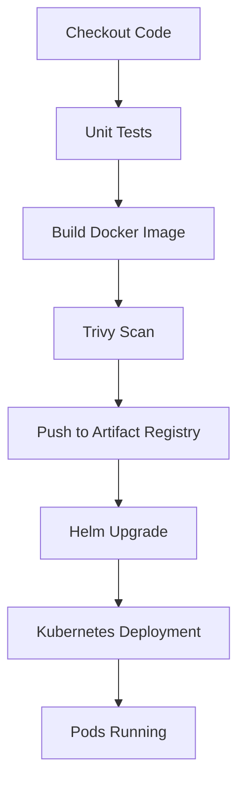

# Helm Package Manager

## Overview

Helm is the package manager for Kubernetes, similar to how `apt` is used for Ubuntu or `yum` for Red Hat.

Instead of managing dozens of Kubernetes YAML manifests manually, Helm packages Kubernetes resources into reusable, version-controlled templates called **Charts**.

In this project, Helm is used to automate application deployments to Google Kubernetes Engine (GKE). The GitHub Actions pipeline installs or upgrades the application using a Helm chart, enabling repeatable, consistent, and production-ready deployments.

---

# Why Helm?

Managing Kubernetes applications using plain YAML files becomes increasingly difficult as applications grow.

For example, a typical application may contain:

- Deployment
- Service
- Ingress
- ConfigMap
- Secret
- Horizontal Pod Autoscaler
- NetworkPolicy
- ServiceAccount
- PersistentVolumeClaim

Updating each manifest manually is time-consuming and error-prone.

Helm solves this problem by grouping all Kubernetes resources into a single deployable package.

Benefits include:

- Reusable templates
- Centralized configuration
- Version-controlled releases
- Simplified upgrades
- Easy rollback
- Environment-specific values
- Consistent deployments

---

# Helm Architecture

```text
             Developer
                  │
                  ▼
            Helm Chart
                  │
        (Templates + Values)
                  │
                  ▼
          helm install / upgrade
                  │
                  ▼
         Kubernetes API Server
                  │
                  ▼
        Kubernetes Resources

     Deployment
     Service
     Ingress
     ConfigMap
     Secret
```

---

# What is a Helm Chart?

A Helm Chart is a collection of files that describe a Kubernetes application.

Typical structure:

```text
hello-gke/

├── Chart.yaml
├── values.yaml
├── charts/
└── templates/
    ├── deployment.yaml
    ├── service.yaml
    ├── ingress.yaml
    ├── _helpers.tpl
    └── NOTES.txt
```

Every Helm chart contains:

- Metadata
- Templates
- Default configuration
- Optional dependencies

---

# Chart.yaml

`Chart.yaml` contains metadata about the application.

Example:

```yaml
apiVersion: v2
name: hello-gke
description: Spring Boot application
type: application
version: 0.1.0
appVersion: "1.0"
```

Fields:

| Field | Purpose |
|--------|----------|
| apiVersion | Helm chart API version |
| name | Chart name |
| description | Chart description |
| type | Application or library |
| version | Chart version |
| appVersion | Application version |

---

# values.yaml

`values.yaml` stores configurable parameters used by templates.

Example:

```yaml
replicaCount: 2

image:
  repository: us-central1-docker.pkg.dev/project-id/springboot-repo/hello-gke
  tag: latest
  pullPolicy: IfNotPresent

service:
  type: ClusterIP
  port: 80

ingress:
  enabled: true
  className: nginx
```

Instead of editing Kubernetes manifests directly, configuration changes are made in `values.yaml`.

---

# Templates

The `templates` directory contains Kubernetes manifests written using Helm's Go templating language.

Example:

```yaml
image:

  repository: {{ .Values.image.repository }}

  tag: {{ .Values.image.tag }}
```

During deployment, Helm replaces these placeholders with actual values from `values.yaml` or values provided through the command line.

---

# Helm Rendering Process

```text
Chart Templates

        +

values.yaml

        +

CLI Overrides

        │

        ▼

Rendered Kubernetes YAML

        │

        ▼

Kubernetes API

        │

        ▼

Resources Created
```

Helm renders templates locally before sending the final manifests to the Kubernetes API server.

---

# Why We Used Helm in This Project

Initially, the application could have been deployed using static Kubernetes YAML files.

However, every deployment would require manually updating:

- Docker image tag
- Replica count
- Environment variables
- Ingress configuration

Helm eliminates this manual work.

During the GitHub Actions pipeline, only the Docker image tag changes while the deployment templates remain unchanged.

This significantly simplifies continuous deployment.

---

# Helm in the CI/CD Pipeline

Helm is executed after:

- Source code checkout
- Unit testing
- Docker image build
- Trivy vulnerability scanning
- Docker image push to Artifact Registry

Deployment workflow:



Helm acts as the deployment engine for the application.
