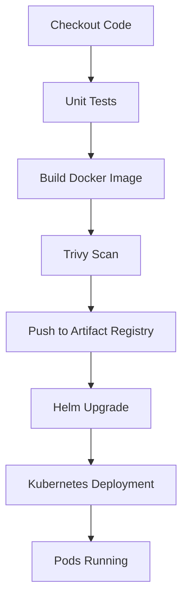

# Helm Package Manager

## Overview

Helm is the package manager for Kubernetes, similar to how `apt` is used for Ubuntu or `yum` for Red Hat.

Instead of managing dozens of Kubernetes YAML manifests manually, Helm packages Kubernetes resources into reusable, version-controlled templates called **Charts**.

In this project, Helm is used to automate application deployments to Google Kubernetes Engine (GKE). The GitHub Actions pipeline installs or upgrades the application using a Helm chart, enabling repeatable, consistent, and production-ready deployments.

---

# Why Helm?

Managing Kubernetes applications using plain YAML files becomes increasingly difficult as applications grow.

For example, a typical application may contain:

- Deployment
- Service
- Ingress
- ConfigMap
- Secret
- Horizontal Pod Autoscaler
- NetworkPolicy
- ServiceAccount
- PersistentVolumeClaim

Updating each manifest manually is time-consuming and error-prone.

Helm solves this problem by grouping all Kubernetes resources into a single deployable package.

Benefits include:

- Reusable templates
- Centralized configuration
- Version-controlled releases
- Simplified upgrades
- Easy rollback
- Environment-specific values
- Consistent deployments

---

# Helm Architecture

```text
             Developer
                  │
                  ▼
            Helm Chart
                  │
        (Templates + Values)
                  │
                  ▼
          helm install / upgrade
                  │
                  ▼
         Kubernetes API Server
                  │
                  ▼
        Kubernetes Resources

     Deployment
     Service
     Ingress
     ConfigMap
     Secret
```

---

# What is a Helm Chart?

A Helm Chart is a collection of files that describe a Kubernetes application.

Typical structure:

```text
hello-gke/

├── Chart.yaml
├── values.yaml
├── charts/
└── templates/
    ├── deployment.yaml
    ├── service.yaml
    ├── ingress.yaml
    ├── _helpers.tpl
    └── NOTES.txt
```

Every Helm chart contains:

- Metadata
- Templates
- Default configuration
- Optional dependencies

---

# Chart.yaml

`Chart.yaml` contains metadata about the application.

Example:

```yaml
apiVersion: v2
name: hello-gke
description: Spring Boot application
type: application
version: 0.1.0
appVersion: "1.0"
```

Fields:

| Field | Purpose |
|--------|----------|
| apiVersion | Helm chart API version |
| name | Chart name |
| description | Chart description |
| type | Application or library |
| version | Chart version |
| appVersion | Application version |

---

# values.yaml

`values.yaml` stores configurable parameters used by templates.

Example:

```yaml
replicaCount: 2

image:
  repository: us-central1-docker.pkg.dev/project-id/springboot-repo/hello-gke
  tag: latest
  pullPolicy: IfNotPresent

service:
  type: ClusterIP
  port: 80

ingress:
  enabled: true
  className: nginx
```

Instead of editing Kubernetes manifests directly, configuration changes are made in `values.yaml`.

---

# Templates

The `templates` directory contains Kubernetes manifests written using Helm's Go templating language.

Example:

```yaml
image:

  repository: {{ .Values.image.repository }}

  tag: {{ .Values.image.tag }}
```

During deployment, Helm replaces these placeholders with actual values from `values.yaml` or values provided through the command line.

---

# Helm Rendering Process

```text
Chart Templates

        +

values.yaml

        +

CLI Overrides

        │

        ▼

Rendered Kubernetes YAML

        │

        ▼

Kubernetes API

        │

        ▼

Resources Created
```

Helm renders templates locally before sending the final manifests to the Kubernetes API server.

---

# Why We Used Helm in This Project

Initially, the application could have been deployed using static Kubernetes YAML files.

However, every deployment would require manually updating:

- Docker image tag
- Replica count
- Environment variables
- Ingress configuration

Helm eliminates this manual work.

During the GitHub Actions pipeline, only the Docker image tag changes while the deployment templates remain unchanged.

This significantly simplifies continuous deployment.

---

# Helm in the CI/CD Pipeline

Helm is executed after:

- Source code checkout
- Unit testing
- Docker image build
- Trivy vulnerability scanning
- Docker image push to Artifact Registry

Deployment workflow:



Helm acts as the deployment engine for the application

# Helm Release Management

Helm introduces the concept of **Releases**.

A release is a deployed instance of a Helm chart running inside a Kubernetes cluster.

For example:

```text
Helm Chart

hello-gke

        |
        |
        ▼

Helm Release

hello-gke-production

        |
        |
        ▼

Kubernetes Resources

Deployment
Service
Ingress
Pods
```

Each Helm deployment creates a release that Helm tracks internally.

---

# Helm Install

The `helm install` command creates a new deployment.

Example:

```bash
helm install hello-gke ./helm/hello-gke
```

This command:

1. Packages the Helm chart.
2. Renders Kubernetes templates.
3. Sends manifests to the Kubernetes API server.
4. Creates Kubernetes resources.
5. Stores release information.

Verification:

```bash
helm list
```

Example output:

```text
NAME        NAMESPACE   STATUS
hello-gke   default     deployed
```

---

# Helm Upgrade

In a CI/CD environment, applications are updated frequently.

Instead of deleting and recreating resources, Helm performs an upgrade.

Example used in this project:

```bash
helm upgrade --install hello-gke ./helm/hello-gke \
--set image.repository=${IMAGE_REPOSITORY} \
--set image.tag=${IMAGE_TAG}
```

The pipeline updates only the required configuration.

Example:

Before:

```text
hello-gke:v1
```

After:

```text
hello-gke:8c9b27e
```

Helm updates the Deployment automatically.

---

# Why Use Upgrade Instead of Apply?

Traditional Kubernetes deployment:

```bash
kubectl apply -f deployment.yaml
```

works well for simple environments.

However, Helm provides additional capabilities:

| Feature | kubectl apply | Helm |
|---|---|---|
| Template support | ❌ | ✅ |
| Version tracking | ❌ | ✅ |
| Rollback | Limited | ✅ |
| Environment values | Limited | ✅ |
| Release history | ❌ | ✅ |
| Package management | ❌ | ✅ |

For production environments, Helm provides better lifecycle management.

---

# Helm Rollback

A major advantage of Helm is the ability to rollback failed deployments.

Example scenario:

```text
Version 1

hello-gke:v1

        ↓

Deployment

        ↓

Version 2

hello-gke:v2

        ↓

Application Failure
```

Helm can restore the previous version.

Command:

```bash
helm rollback hello-gke 1
```

Verification:

```bash
helm history hello-gke
```

---

# Helm History

Helm stores deployment history for every release.

Command:

```bash
helm history hello-gke
```

Example:

```text
REVISION   STATUS

1          deployed

2          deployed

3          failed
```

This helps during:

- Incident investigation
- Application rollback
- Deployment auditing

---

# Helm Commands Used in This Project

## List Releases

```bash
helm list
```

Shows deployed Helm releases.

---

## Check Release Status

```bash
helm status hello-gke
```

Example:

```text
STATUS: deployed
```

---

## Upgrade Application

```bash
helm upgrade hello-gke ./helm/hello-gke
```

---

## Rollback Deployment

```bash
helm rollback hello-gke REVISION_NUMBER
```

---

## Render Templates Locally

Before deploying, templates can be tested.

```bash
helm template hello-gke ./helm/hello-gke
```

This generates the final Kubernetes YAML.

---

## Validate Chart

Helm provides chart validation.

```bash
helm lint ./helm/hello-gke
```

Example:

```text
1 chart(s) linted, 0 chart(s) failed
```

---

# Helm Values Management

One of the biggest benefits of Helm is separating application configuration from templates.

Example:

```yaml
image:
  repository: hello-gke
  tag: latest
```

The template references these values:

```yaml
containers:

- name: hello-gke

  image:
    {{ .Values.image.repository }}:
    {{ .Values.image.tag }}
```

During deployment, GitHub Actions overrides values dynamically.

Example:

```bash
--set image.tag=${GITHUB_SHA}
```

---

# Environment Management

Helm supports multiple environments using different values files.

Example:

```text
helm/

hello-gke/

├── Chart.yaml

├── values.yaml

├── values-dev.yaml

├── values-test.yaml

└── values-prod.yaml
```

Deployment:

Development:

```bash
helm upgrade hello-gke \
-f values-dev.yaml
```

Production:

```bash
helm upgrade hello-gke \
-f values-prod.yaml
```

This allows the same application chart to be reused across environments.

---

# Helm and GitHub Actions Integration

The CI/CD pipeline uses Helm as the final deployment stage.

Complete flow:

```text
Developer Push

        ↓

GitHub Actions

        ↓

Unit Tests

        ↓

Docker Build

        ↓

Trivy Scan

        ↓

Push Image

        ↓

Helm Upgrade

        ↓

Kubernetes Deployment

        ↓

Application Available
```

---

# Image Tag Automation

A common challenge in Kubernetes deployment is updating image versions.

Without Helm:

```yaml
image:
  hello-gke:v1
```

Every deployment requires modifying YAML files.

With Helm:

```yaml
image:
  repository: hello-gke
  tag: {{ .Values.image.tag }}
```

GitHub Actions updates only the tag:

```bash
--set image.tag=${GITHUB_SHA}
```

Benefits:

- No YAML modification
- Automated releases
- Traceability
- Easy rollback

---

# Helm Security Considerations

Helm deployments should follow security best practices.

Recommended practices:

- Store charts in Git
- Review templates before deployment
- Avoid storing secrets in values files
- Use Kubernetes Secrets
- Use least privilege RBAC
- Validate charts using `helm lint`
- Pin chart versions

---

# Troubleshooting Helm Deployments

## Helm Release Failed

Check status:

```bash
helm status hello-gke
```

---

## Template Rendering Issue

Test templates:

```bash
helm template hello-gke ./helm/hello-gke
```

---

## Deployment Not Updating

Check rollout:

```bash
kubectl rollout status deployment/hello-gke
```

Verify image:

```bash
kubectl describe deployment hello-gke
```

---

## Rollback Required

View history:

```bash
helm history hello-gke
```

Rollback:

```bash
helm rollback hello-gke <revision>
```

# Helm Best Practices

Helm provides powerful deployment capabilities, but following best practices is important for maintaining reliable production environments.

This project follows several Helm best practices.

---

## Version Control Helm Charts

Helm charts should always be stored in source control.

Example repository structure:

```text
repository

├── application-code

├── docker

├── helm

│   └── hello-gke

│       ├── Chart.yaml

│       ├── values.yaml

│       └── templates

└── .github

    └── workflows
```

Benefits:

- Deployment history
- Code review
- Change tracking
- Collaboration

---

# Immutable Container Images

The project follows immutable image deployment practices.

Instead of deploying:

```yaml
image:
  tag: latest
```

The pipeline uses Git commit SHA tags.

Example:

```text
hello-gke:8c9b27e
```

Benefits:

- Exact version identification
- Easy rollback
- No unexpected changes
- Better auditing

---

# Separate Application Code and Deployment Configuration

Application source code and Kubernetes deployment configuration are separated.

Example:

```text
Application Repository

├── src/

├── Dockerfile

├── pom.xml

└── helm/

    └── hello-gke/
```

This allows:

- Independent application development
- Independent deployment changes
- Better DevOps workflow

---

# Avoid Hardcoded Values

Instead of hardcoding:

```yaml
replicas: 2

image: application:v1
```

Helm uses values:

```yaml
replicaCount: 2

image:
  repository: application
  tag: v1
```

This makes charts reusable.

---

# Use Helm Linting

Before deployment, charts should be validated.

Command:

```bash
helm lint ./helm/hello-gke
```

This detects:

- Invalid YAML
- Template issues
- Missing required values

---

# Test Templates Before Deployment

Before applying changes to Kubernetes, render templates locally.

Command:

```bash
helm template hello-gke ./helm/hello-gke
```

This helps identify issues before affecting the cluster.

---

# Manage Secrets Securely

Sensitive information should never be stored directly inside:

```yaml
values.yaml
```

Examples:

Avoid:

```yaml
databasePassword: mypassword
```

Preferred:

```text
Kubernetes Secret

        ↓

Application Pod
```

Possible solutions:

- Kubernetes Secrets
- Google Secret Manager
- External Secrets Operator
- Sealed Secrets

---

# Helm vs Kustomize

Kubernetes provides multiple configuration management approaches.

Two commonly used tools are:

- Helm
- Kustomize

Comparison:

| Feature | Helm | Kustomize |
|-|-|-|
| Template engine | Yes | No |
| Package management | Yes | No |
| Release tracking | Yes | No |
| Rollback support | Yes | Limited |
| Environment overlays | Yes | Yes |
| Kubernetes native | External tool | Built into kubectl |

---

# Why Helm Was Selected

For this project, Helm was selected because:

- Application packaging was required
- CI/CD integration was important
- Image versions change frequently
- Rollback capability was needed
- Release tracking was valuable

The GitHub Actions pipeline can deploy the same Helm chart across environments by changing values.

---

# Helm Deployment Lifecycle

The complete lifecycle:

```text
Developer Commit

        ↓

GitHub Actions

        ↓

Build Docker Image

        ↓

Security Scan

        ↓

Push Image

        ↓

helm upgrade

        ↓

Helm Creates Release

        ↓

Kubernetes Updates Deployment

        ↓

Rolling Update

        ↓

Application Running
```

---

# Helm Failure Recovery

Helm helps recover from failed deployments.

Example:

New deployment:

```text
hello-gke:v2
```

causes:

```text
Pod CrashLoopBackOff
```

Recovery:

Check history:

```bash
helm history hello-gke
```

Rollback:

```bash
helm rollback hello-gke 1
```

Kubernetes restores:

```text
hello-gke:v1
```

---

# Helm and Production Kubernetes

Helm is widely used in production Kubernetes environments.

Common enterprise examples:

Monitoring:

```text
Prometheus Helm Chart
Grafana Helm Chart
```

Ingress:

```text
NGINX Ingress Helm Chart
```

Security:

```text
cert-manager Helm Chart
```

CI/CD:

```text
ArgoCD Helm Applications
```

---

# Helm Components Used in This Project

| Component | Usage |
|---|---|
| Chart.yaml | Chart metadata |
| values.yaml | Configuration management |
| Templates | Kubernetes resource generation |
| Helm Release | Application lifecycle |
| Upgrade | Continuous deployment |
| Rollback | Failure recovery |

---

# Interview Questions

## What is Helm?

Helm is a Kubernetes package manager that simplifies application deployment using reusable templates called charts.

---

## What is a Helm Chart?

A Helm chart is a collection of Kubernetes resource templates and configuration files used to deploy an application.

---

## What is values.yaml?

values.yaml contains configurable parameters used by Helm templates.

---

## Difference between Helm install and upgrade?

`helm install` creates a new release.

`helm upgrade` updates an existing release.

---

## How does Helm rollback work?

Helm stores release history and can restore a previous revision using the rollback command.

---

## Why use Helm instead of Kubernetes YAML?

Helm provides:

- Templates
- Versioning
- Releases
- Rollbacks
- Configuration management

---

## Where does Helm store release information?

Helm stores release metadata inside Kubernetes Secrets by default.

Example:

```bash
kubectl get secrets
```

---

## How does CI/CD use Helm?

The pipeline builds an image, pushes it to Artifact Registry, then uses Helm to deploy the new image version into Kubernetes.

---

## What is helm upgrade --install?

It performs:

- Install if release does not exist
- Upgrade if release already exists

This is useful in automated pipelines.

---

# Lessons Learned

Through this implementation I learned:

- Kubernetes application packaging using Helm
- Creating reusable deployment templates
- Managing application configuration using values
- Automating deployments through Helm
- Performing release upgrades and rollbacks
- Integrating Helm with GitHub Actions
- Managing Kubernetes lifecycle using Helm
- Understanding production deployment patterns

---

# Key Takeaways

Helm provides a reliable and repeatable way to deploy Kubernetes applications.

In this project, Helm acts as the deployment engine connecting GitHub Actions and Google Kubernetes Engine.

The complete deployment process becomes:

```text
Developer

↓

GitHub

↓

GitHub Actions

↓

Docker Image

↓

Artifact Registry

↓

Helm

↓

GKE Deployment

↓

Running Application
```

By using Helm, the platform achieves:

- Automated deployments
- Version-controlled releases
- Easy rollback
- Environment flexibility
- Production-ready Kubernetes management.
