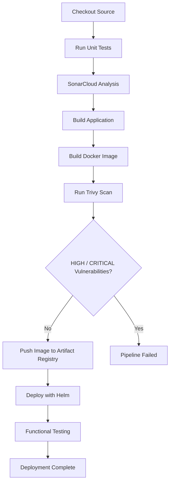

# Docker Image Scanning with Trivy

## Overview

Container images contain far more than application code. They also include operating system packages, language runtimes, and third-party libraries that may contain publicly disclosed security vulnerabilities.

To improve the security of this project, **Trivy** was integrated into the GitHub Actions CI/CD pipeline to scan Docker images immediately after they are built and before they are pushed to Google Artifact Registry.

This ensures that only images meeting the project's security policy are published and deployed to Google Kubernetes Engine (GKE).

---

## Objectives

The objectives of implementing Trivy are:

- Detect known vulnerabilities in Docker images
- Prevent vulnerable images from reaching Artifact Registry
- Enforce security gates during CI/CD
- Generate security reports for auditing
- Integrate scan results with GitHub Security
- Follow Shift Left Security principles

---

## Why Trivy?

Trivy is an open-source vulnerability scanner developed by Aqua Security.

It supports scanning:

- Container Images
- Filesystems
- Git Repositories
- Kubernetes Clusters
- Infrastructure as Code
- SBOMs
- Secrets (optional)

Unlike many commercial scanners, Trivy is lightweight, fast, and easy to integrate into CI/CD pipelines.

---

## Why Trivy Was Selected

For this project we required a scanner that is:

- Open source
- Easy to integrate with GitHub Actions
- Fast enough to run on every commit
- Able to generate multiple report formats
- Widely adopted in production environments

Trivy satisfied all of these requirements while requiring very little pipeline configuration.

---

## Shift Left Security

Scanning container images before deployment is an example of **Shift Left Security**.

Instead of identifying vulnerabilities after deployment, security validation occurs during the build pipeline.

```text
Developer
        │
        ▼
 Build Docker Image
        │
        ▼
   Trivy Scan
        │
        ▼
 Security Policy
        │
        ▼
 Push Image
        │
        ▼
 Deploy to GKE
```

This reduces operational risk and prevents insecure images from reaching production.

---

## CI/CD Security Workflow

The GitHub Actions pipeline performs three independent Trivy scans.

1. Generate a SARIF report for GitHub Security.
2. Generate a JSON report for auditing.
3. Execute a policy enforcement scan that blocks deployment when HIGH or CRITICAL vulnerabilities are detected.

This separation allows reports to be retained while still enforcing deployment security.

---

## Pipeline Integration

Trivy is executed immediately after building the Docker image.



---

## Why Scan Before Pushing?

Initially the project relied on Google Artifact Registry vulnerability scanning.

Workflow:

```
Build
 ↓
Push Image
 ↓
Artifact Registry Scan
 ↓
Deploy
```

This meant vulnerable images were already stored inside the registry.

After integrating Trivy the workflow became:

```
Build
 ↓
Trivy Scan
 ↓
Security Policy
 ↓
Push Image
 ↓
Deploy
```

Only compliant images are uploaded.

---

## Trivy Database Cache

Trivy downloads vulnerability databases before every scan.

To improve pipeline performance, the database is cached.

```yaml
- name: Cache Trivy Database
  uses: actions/cache@v4
  with:
    path: ~/.cache/trivy
    key: trivy-db-${{ runner.os }}
    restore-keys: |
      trivy-db-
```

Caching significantly reduces subsequent scan times.

---

## SARIF Scan

The first scan generates a SARIF report.

```yaml
- name: Run Trivy Scan (SARIF)
  uses: aquasecurity/trivy-action@master
  with:
    image-ref: IMAGE_URI
    format: sarif
    output: trivy-results.sarif
    severity: HIGH,CRITICAL
    ignore-unfixed: true
    scanners: vuln
```

Purpose:

- Integrates with GitHub Security
- Displays vulnerabilities in the Security tab
- Does not fail the pipeline

---

## Upload SARIF Report

```yaml
- name: Upload SARIF Report
  uses: github/codeql-action/upload-sarif@v3
```

GitHub automatically imports the vulnerability findings.

---

## JSON Report

The second scan generates a JSON report.

```yaml
- name: Generate Trivy JSON Report
  uses: aquasecurity/trivy-action@master
  with:
    image-ref: IMAGE_URI
    format: json
    output: trivy-report.json
```

The report is uploaded as a GitHub Actions artifact for auditing purposes.

---

## Security Policy Enforcement

The final Trivy execution enforces the deployment policy.

```yaml
- name: Enforce Security Policy
  uses: aquasecurity/trivy-action@master
  with:
    image-ref: IMAGE_URI
    severity: HIGH,CRITICAL
    ignore-unfixed: true
    scanners: vuln
    exit-code: "1"
```

Unlike the previous scans, this execution returns a non-zero exit code whenever HIGH or CRITICAL vulnerabilities are detected.

GitHub Actions treats the non-zero exit code as a failed step, immediately stopping the deployment.

---

## Supported Output Formats

| Format | Purpose |
|---------|----------|
| Table | Human-readable output |
| JSON | Automation and auditing |
| SARIF | GitHub Security |
| CycloneDX | SBOM generation |
| SPDX | Software Bill of Materials |

---

## Vulnerabilities Identified

During implementation Trivy detected vulnerabilities in two categories.

### Operating System Packages

Examples included:

- glibc
- util-linux
- ncurses
- p11-kit
- libpng

These vulnerabilities originated from the Ubuntu base image.

---

### Java Dependencies

One LOW severity vulnerability was identified in:

```
logback-core
```

A newer patched version was available.

---

## Why Ignore Unfixed Vulnerabilities?

Some vulnerabilities currently have no available vendor patch.

Failing every build because of these issues unnecessarily blocks deployments.

Using:

```yaml
ignore-unfixed: true
```

focuses the pipeline on vulnerabilities that can actually be remediated.

---

## Issues Encountered

### Problem 1

Error:

```
Unable to resolve action aquasecurity/trivy-action@0.28.0
```

Cause:

The specified GitHub Action version no longer existed.

Resolution:

Updated the workflow to use:

```yaml
uses: aquasecurity/trivy-action@master
```

---

### Problem 2

Error:

```
no space left on device
```

Cause:

The self-hosted GitHub Actions runner had only a 10 GB boot disk.

The Trivy Java vulnerability database could not be downloaded.

Diagnosis:

```bash
df -h
```

Resolution:

- Increased the Compute Engine boot disk
- Expanded the filesystem
- Re-ran the pipeline successfully

---

## Trivy vs Artifact Registry Scanning

| Capability | Trivy | Artifact Registry |
|------------|--------|------------------|
| Scan before push | ✅ | ❌ |
| Scan after push | ❌ | ✅ |
| Local scanning | ✅ | ❌ |
| GitHub Security integration | ✅ | ❌ |
| Registry independent | ✅ | ❌ |
| Open source | ✅ | ❌ |
| Managed service | ❌ | ✅ |

---

## Best Practices

- Scan every image build.
- Cache the Trivy database.
- Generate SARIF reports.
- Store JSON reports as pipeline artifacts.
- Fail builds for HIGH and CRITICAL vulnerabilities.
- Keep base images updated.
- Minimize image size.
- Scan Infrastructure as Code and Kubernetes manifests in addition to images.

---

## Interview Questions

### Why is Trivy used?

To identify known vulnerabilities in container images before deployment.

---

### Why scan images before pushing them?

To prevent vulnerable images from entering the container registry.

---

### Why generate SARIF reports?

SARIF integrates directly with GitHub Security and provides standardized vulnerability reporting.

---

### Why generate JSON reports?

JSON reports are useful for auditing, automation, and integration with external tools.

---

### Why fail only on HIGH and CRITICAL vulnerabilities?

Blocking deployments only for HIGH and CRITICAL findings provides a balance between security and developer productivity.

LOW and MEDIUM findings are typically remediated over time.

---

### What is the difference between Trivy and Artifact Registry scanning?

Trivy scans images before they are published, while Artifact Registry scans images after they have already been uploaded.

---

## Key Learnings

Through this implementation I learned:

- Docker image vulnerability scanning using Trivy
- Integrating Trivy into GitHub Actions
- Uploading SARIF reports to GitHub Security
- Generating JSON reports for auditing
- Enforcing deployment policies using exit codes
- Caching Trivy vulnerability databases
- The difference between Trivy and Google Artifact Analysis
- Operational considerations for self-hosted GitHub Actions runners
- Applying Shift Left Security in CI/CD pipelines
