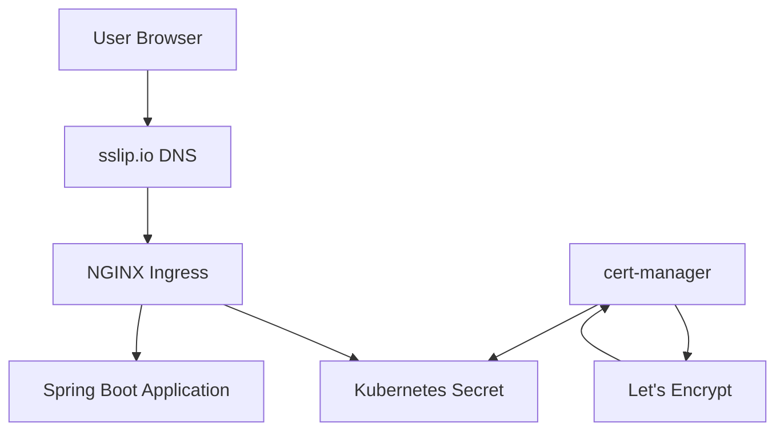
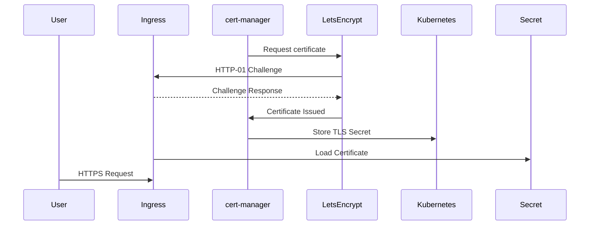
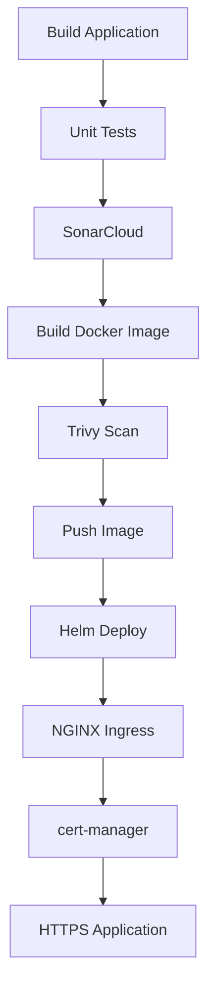

# SSL Certificates with cert-manager and Let's Encrypt

---

# Overview

Applications exposed over the Internet should always use HTTPS instead of HTTP.

HTTPS encrypts communication between clients and servers, protecting data from interception, tampering, and impersonation.

In Kubernetes, TLS certificates can be managed manually, but production environments typically automate certificate issuance and renewal using cert-manager.

In this project, we use:

- NGINX Ingress Controller
- cert-manager
- Let's Encrypt
- sslip.io for DNS

This provides fully automated HTTPS for our application.

---

# Why SSL is Required

Without HTTPS:

- Traffic is transmitted in plain text.
- Credentials can be intercepted.
- Browsers display security warnings.
- Modern APIs often require encrypted connections.

With HTTPS:

- Communication is encrypted.
- Identity is verified.
- Browsers trust the application.
- Industry security standards are met.

---

# Why cert-manager?

Managing certificates manually is difficult because certificates expire every 90 days.

cert-manager automates:

- Certificate requests
- ACME validation
- Certificate renewal
- Secret creation
- Secret updates

This removes operational overhead and reduces downtime caused by expired certificates.

---

# Why Let's Encrypt?

Let's Encrypt is a free Certificate Authority (CA) that automatically issues trusted SSL certificates.

Advantages:

- Free
- Trusted by all major browsers
- Automated renewal
- ACME protocol support
- Widely used in Kubernetes environments

---

# Why sslip.io?

A public domain is required for Let's Encrypt HTTP-01 validation.

Since this project uses a temporary public LoadBalancer IP, purchasing a domain is unnecessary.

sslip.io automatically maps an IP address into a DNS name.

Example:

```
136.65.71.135
```

becomes

```
hello-gke.136.65.71.135.sslip.io
```

No DNS configuration is required.

---

# Architecture



---

# TLS Certificate Flow



---

# Components

| Component | Purpose |
|------------|----------|
| NGINX Ingress | Exposes application |
| cert-manager | Automates certificate lifecycle |
| ClusterIssuer | Defines Let's Encrypt configuration |
| Certificate | Requests certificate |
| Secret | Stores TLS certificate |
| Let's Encrypt | Trusted Certificate Authority |
| sslip.io | Dynamic DNS |

---

# Installation

Install cert-manager using Helm.

```bash
helm repo add jetstack https://charts.jetstack.io

helm repo update

helm install cert-manager jetstack/cert-manager \
  --namespace cert-manager \
  --create-namespace \
  --set crds.enabled=true
```

---

# Create ClusterIssuer

Example:

```yaml
apiVersion: cert-manager.io/v1
kind: ClusterIssuer

metadata:
  name: letsencrypt-prod

spec:

  acme:

    email: <EMAIL_ADDRESS>

    server: https://acme-v02.api.letsencrypt.org/directory

    privateKeySecretRef:
      name: letsencrypt-prod

    solvers:

      - http01:

          ingress:

            class: nginx
```

Apply:

```bash
kubectl apply -f clusterissuer.yaml
```

---

# Configure Ingress

Enable TLS in the Ingress.

Example:

```yaml
annotations:

  cert-manager.io/cluster-issuer: letsencrypt-prod

spec:

  tls:

  - hosts:

      - <APPLICATION_HOST>

    secretName: hello-gke-tls
```

---

# Verification

Verify ClusterIssuer.

```bash
kubectl get clusterissuer
```

Verify Certificate.

```bash
kubectl get certificate
```

Verify CertificateRequest.

```bash
kubectl get certificaterequest
```

Verify Orders.

```bash
kubectl get order
```

Verify Secret.

```bash
kubectl get secret
```

Test HTTPS.

```bash
curl https://<APPLICATION_HOST>
```

Expected response:

```json
{
  "message":"Hello from Ingress",
  "environment":"dev"
}
```

---

# CI/CD Pipeline Position



---

# Real Issues Encountered

## Issue 1

### Problem

cert-manager-cainjector entered CrashLoopBackOff.

### Root Cause

cert-manager was installed without the required CRDs.

### Resolution

Reinstalled cert-manager with:

```bash
--set crds.enabled=true
```

---

## Issue 2

### Problem

Webhook returned:

```
No agent available
```

### Root Cause

Webhook was not functioning correctly because cert-manager installation was incomplete.

### Resolution

Removed cert-manager completely and performed a clean Helm installation.

---

## Issue 3

### Problem

Helm upgrade failed.

```
spec.tls.hosts[0]: Invalid value ""
```

### Root Cause

TLS was enabled but no hostname was configured.

### Resolution

Configured the application hostname in Helm values.

---

## Issue 4

### Problem

Unable to obtain certificates without a public domain.

### Resolution

Used sslip.io dynamic DNS, allowing Let's Encrypt validation without purchasing a domain.

---

# Best Practices

- Never commit TLS secrets to Git.
- Use ClusterIssuer for cluster-wide certificates.
- Automate certificate renewal.
- Prefer DNS-01 validation for production domains.
- Monitor certificate expiration.
- Keep cert-manager updated.
- Store TLS secrets only inside Kubernetes.

---

# Interview Questions

1. Why is HTTPS important?
2. What is TLS?
3. What is the difference between HTTP and HTTPS?
4. Why use cert-manager?
5. What is ACME?
6. What is Let's Encrypt?
7. What is a ClusterIssuer?
8. What is the difference between Issuer and ClusterIssuer?
9. How does HTTP-01 validation work?
10. What is DNS-01 validation?
11. Where are certificates stored in Kubernetes?
12. How does automatic certificate renewal work?
13. Why did we use sslip.io?
14. Why use Helm to install cert-manager?
15. What happens if a certificate expires?
